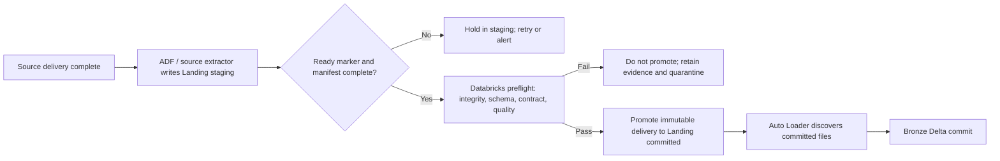
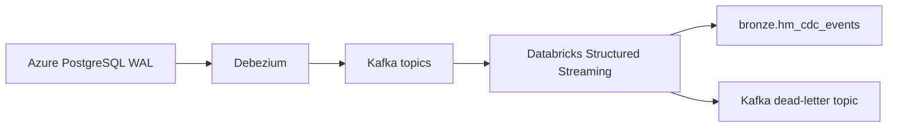
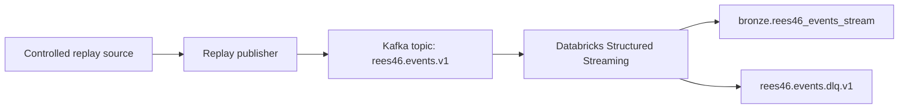

# Dataset and Source-to-Bronze Implementation Record

This is the authoritative project design and progress record for the seven
datasource paths. Current finalized dataset, contract, quality-rule, and
ingestion decisions are recorded here.
The key decision is:
Ingestion type	ADLS Landing required?	Bronze mechanism
SFTP CSV, JSON, Parquet, DAT/TXT	Yes	Auto Loader with AvailableNow
PostgreSQL initial snapshot	Yes	ADF JDBC extract → Landing → Auto Loader
PostgreSQL incremental batch	Yes	ADF JDBC extract → Landing → Auto Loader
API batch	Yes	Persist raw response pages → Landing → Auto Loader
PostgreSQL CDC through Kafka	No	Structured Streaming → Bronze
REES46 streaming replay through Kafka	No	Structured Streaming → Bronze

For CDC and Kafka, Kafka is the durable ingress boundary. Its topic retention, consumer offsets, dead-letter topic, Databricks checkpoint, and Bronze Delta table provide the same recovery capability that Landing provides for batch files.
All public files are historical/static. Their schedules below are project operating contracts, not a claim that the original publisher sends new data at those times.

## Landing promotion boundary — authoritative for file and batch ingestion

ADLS Landing has two controlled zones: `staging` and `committed`. Every
file-backed or batch delivery that uses Landing—including SFTP files,
PostgreSQL snapshot/incremental extracts, and API response pages—must follow
this sequence:

1. ADF or the source-specific extractor writes the complete delivery to the
   delivery-specific `landing/staging/` path. It must not write directly to
   `landing/committed/`.
2. The delivery remains in staging while Databricks preflight verifies the
   ready/manifest contract, expected file inventory, byte counts and checksums,
   record counts where available, parseability, observed schema fingerprint,
   active contract, and applicable quality rules.
3. If preflight passes, the platform promotes the immutable delivery from
   staging to the corresponding `landing/committed/` path. Promotion is
   idempotent by delivery identity and content checksum. The committed path is
   the publication boundary for downstream ingestion.
4. Auto Loader watches only the committed path and loads committed files into
   Bronze. It never watches staging, SFTP upload/ready paths, manifests, or
   quarantine locations.
5. If readiness, integrity, schema, or quality validation fails, the delivery
   is not promoted. Keep the original staged bytes and evidence available for
   investigation, record the failure, and route the delivery to the governed
   quarantine/recovery process. ADF retry or a Databricks restart must not make
   a failed or partially copied delivery visible to Auto Loader.

The landing SLA ends when the validated delivery is present in `committed/`;
the Bronze SLA ends when the corresponding idempotent Bronze commit and
required reconciliation succeed. ADF delivery success alone is not a Landing
success. The PostgreSQL CDC and REES46 Kafka replay paths continue to bypass
ADLS Landing as already specified; this promotion boundary does not change
those streaming paths.

1. H&M relational source: Azure Database for PostgreSQL
Source size and records
File	Expected rows	Source role
articles.csv	105,542	Product/article dimension
customers.csv	1,371,980	Customer dimension
transactions_train.csv	31,788,324	Purchase fact
sample_submission.csv	1,371,980	Static reference/output artifact

The H&M source has 31.8 million transaction rows and 5 transaction columns. Its published data describes articles, customers, and purchase transactions, with the transaction records joining customers and articles. H&M Kaggle dataset, published dataset counts
Controlled PostgreSQL source model
Create an Azure Database for PostgreSQL Flexible Server database with two schemas:
retail_src
├── articles
├── customers
├── transactions
└── sample_submission

retail_ops
└── incremental_outbox
Load order:
1. retail_src.articles
2. retail_src.customers
3. retail_src.transactions
4. retail_src.sample_submission
sample_submission is static and initial-load only. It never receives incremental or CDC processing.
transactions_train.csv has no durable transaction identifier. The controlled source creates:
transaction_id =
SHA-256(source_file_hash + source_row_number)
This is a project-generated source identity. It preserves legitimate duplicate purchase rows because the source row number is included.
articles.article_id and customers.customer_id are the source keys. transactions.transaction_id becomes the controlled primary key.
Initial load
Initial load runs once for the source version.
1. Upload the four source CSVs to the controlled PostgreSQL bootstrap area.
2. Load each file into a PostgreSQL staging table.
3. Validate row count, checksum, encoding, column count, nullability, and candidate keys.
4. Load into the final retail_src tables.
5. Record the source-file checksum, source row count, and initial source schema in the control tables.
6. Pause the project mutation generator.
7. Record a snapshot_id, source file versions, and the highest change_seq.
8. ADF extracts the consistent PostgreSQL snapshot into the delivery-specific
   ADLS Landing `staging/` path.
9. Databricks validates the extract against the manifest, active contract,
   schema baseline, and reconciliation controls; only a passing extract is
   promoted to Landing `committed/`.
10. Auto Loader runs once with AvailableNow against `committed/` and writes the
    raw snapshot to Bronze.
11. Reconcile PostgreSQL count → Landing count → Bronze count.
12. Only after reconciliation, set ops.cursor_state.committed_position_json to the recorded high change_seq.
13. Resume the mutation generator.
Committed Landing paths (the corresponding snapshot is first written under
`staging/dev/postgresql_hm/` and promoted after preflight):
committed/dev/postgresql_hm/articles/extract_type=snapshot/...
committed/dev/postgresql_hm/customers/extract_type=snapshot/...
committed/dev/postgresql_hm/transactions/extract_type=snapshot/...
committed/dev/postgresql_hm/sample_submission/extract_type=snapshot/...
Bronze targets:
bronze.hm_articles
bronze.hm_customers
bronze.hm_transactions
bronze.hm_sample_submission
Incremental batch load
The original Kaggle CSV files do not contain a reliable update timestamp, deletion indicator, global sequence, or CDC marker. You cannot truthfully derive real incremental loads from static CSVs alone.
The controlled PostgreSQL source solves this through an append-only retail_ops.incremental_outbox.
Every project-created insert, update, or delete against retail_src.articles, retail_src.customers, or retail_src.transactions writes an outbox event in the same PostgreSQL transaction.
Each outbox event contains:
change_seq
event_id
entity_name
operation                 -- INSERT, UPDATE, DELETE
source_primary_key_json
after_payload_json
before_payload_json
source_commit_timestamp
source_transaction_id
ADF reads the current committed cursor from ops.cursor_state, finds a bounded high-water mark, and extracts only:
change_seq > committed_change_seq
AND change_seq <= pending_high_change_seq
ADF writes that incremental extract to the delivery-specific Landing
`staging/` path. Databricks validates and promotes it to `committed/`; Auto
Loader reads only the committed extract. The cursor advances only after Bronze
commit and reconciliation succeed.
Entity	Incremental frequency	ADF start	Landing SLA	Bronze SLA
Articles	Daily	00:30 UTC	30 min	15 min
Customers	Daily	00:30 UTC	30 min	15 min
Transactions	Hourly	HH:15 UTC	20 min	10 min
Sample submission	Never	Initial only	N/A	N/A

For retry safety, every incremental extraction rereads the previous 100 change_seq values. Bronze prevents duplicate ingestion by source_id + entity_id + change_seq.
CDC
CDC is a separate path from incremental batch extraction.

Implementation sequence:
1. Create the PostgreSQL publication and replication slot before CDC starts.
2. Set PostgreSQL wal_level = logical.
3. Create a dedicated least-privilege replication role.
4. Configure Debezium to capture the three mutable source tables.
5. Partition Kafka topics by the source primary key.
6. Use a 30-second Structured Streaming microbatch trigger.
7. Write malformed or poison events to the dead-letter topic before committing the Kafka offset.
8. Write raw CDC envelopes to bronze.hm_cdc_events.
9. Store Kafka offsets and Postgres LSNs in ops.cursor_state.
10. Never reset the normal streaming checkpoint. Use an isolated checkpoint for replay.
Azure PostgreSQL supports logical decoding from its WAL and can use logical replication slots with tools such as Debezium. Azure PostgreSQL logical replication documentation
CDC Bronze freshness target: P95 within five minutes of PostgreSQL source commit.
2. REES46 external CSV batch ingestion
The seven monthly files are historical monthly deliveries:
2019-Oct.csv.gz
2019-Nov.csv.gz
2019-Dec.csv.gz
2020-Jan.csv.gz
2020-Feb.csv.gz
2020-Mar.csv.gz
2020-Apr.csv.gz
Keep them compressed as .csv.gz. Do not unzip them merely because they contain CSV. The source contract records:
format = CSV
compression = GZIP
header = true
delimiter = comma
encoding = UTF-8
Controlled source and batch schedule
For initial bootstrap, treat each month as a separate immutable delivery.
SFTP /ready/reese46/events/delivery_id=rees46-2019-10-v1/
SFTP /ready/reese46/events/delivery_id=rees46-2019-11-v1/
...
Each delivery contains:
<month>.csv.gz
manifest.json
_READY
For the operating simulation, use a monthly supplier schedule:
Activity	Time
Supplier opens delivery window	First day of month, 00:00 UTC
Supplier publishes file, manifest, _READY	By 02:00 UTC
ADF polling	Every 5 minutes
Landing completion	Within 30 minutes after _READY
Bronze completion	Within 30 minutes after Landing commit

ADF uses Binary Copy to preserve original source bytes. It does not delete SFTP files after copy. ADF supports SFTP copy, metadata lookup, file lists, and gzip-delimited files. ADF SFTP connector documentation
SFTP /ready
  → ADF Binary Copy
  → staging/dev/sftp_rees46/events/{delivery_id}/
  → Databricks preflight
  → committed/dev/sftp_rees46/events/{delivery_id}/
  → Auto Loader AvailableNow
  → bronze.rees46_events_batch
Committed Landing path (written to `staging/` first and promoted after preflight):
committed/dev/sftp_rees46/events/
  business_month=2019-10/
  delivery_id=rees46-2019-10-v1/
Auto Loader uses one normal checkpoint and schema-location per source/entity:
checkpoints/dev/sftp_rees46/events/
schemas/dev/sftp_rees46/events/
Use:
cloudFiles.format = csv
cloudFiles.schemaEvolutionMode = rescue
rescuedDataColumn = _rescued_data
trigger = AvailableNow
3. Open Food Facts JSON batch ingestion
Use the JSONL dump only as an SFTP file source. MongoDB/Cosmos remains excluded.
Do not split a gzip file by raw byte range. That can split a JSON object or corrupt the gzip stream.
Correct splitting method
1. Keep the original openfoodfacts-products.jsonl.gz as the bootstrap archive.
2. Stream-decompress it locally.
3. Split only at JSON Lines boundaries.
4. Create three valid, independent JSONL files.
5. Compress each part separately if needed.
6. Calculate independent SHA-256, byte count, line count, and schema fingerprint for every part.
7. Publish each part as a separate SFTP delivery.
Example:
off_products_part_001.jsonl.gz
off_products_part_002.jsonl.gz
off_products_part_003.jsonl.gz
Each physical part has its own manifest.json and _READY. All three physical
deliveries are governed by the single logical source contract
`contract_off_products_v1`; a delivery part is not a separate source contract.
The retained schema quality rule is `qr_off_part_001_schema_v1`. Its existing
metadata identifier is retained and the rule governs validation under
`contract_off_products_v1`; do not create separate active rules for parts 002
or 003.
Schedule
Activity	Time
Controlled supplier window	Daily, 02:00–03:00 UTC
Part 1 ready	02:00 UTC
Part 2 ready	02:20 UTC
Part 3 ready	02:40 UTC
ADF polling	Every 5 minutes
Landing completion	Within 30 minutes after each _READY
Bronze completion	Within 30 minutes after Landing commit

Route:
SFTP
  → ADF Binary Copy
  → staging/dev/sftp_off/products_jsonl/{delivery_id}/
  → Databricks preflight
  → committed/dev/sftp_off/products_jsonl/{delivery_id}/
  → Auto Loader AvailableNow
  → bronze.off_products_jsonl
Use explicit JSON schema from metadata.source_contract. New fields and type conflicts are written to _rescued_data; they do not automatically become approved Bronze columns. Databricks documents that Auto Loader can rescue columns missing from its schema, type mismatches, and case mismatches. Auto Loader schema handling
4. Amazon Electronics: Parquet metadata and JSONL reviews
These are two related entities, not one dataset:
Entity	Source files	Bronze target
Product metadata	10 Parquet files	bronze.amazon_electronics_metadata
Product reviews	Electronics.jsonl	bronze.amazon_electronics_reviews

The 10 metadata Parquet files are approximately 1.96 GB together. The Electronics review set is much larger, with roughly 18.3 million reviews. Amazon Reviews 2023 dataset card
Later, Silver/Gold can join the two entities using parent_asin. The publisher explicitly identifies parent_asin as the recommended field for matching reviews to product metadata. Amazon field definitions
Do not join them in Bronze.
Delivery design
The ten Parquet files are one atomic metadata delivery. The JSONL file is a separate review delivery.
SFTP /ready/amazon/metadata/delivery_id=amazon-meta-electronics-v1/
  ├── full-00000-of-00010.parquet
  ├── ...
  ├── full-00009-of-00010.parquet
  ├── manifest.json
  └── _READY

SFTP /ready/amazon/reviews/delivery_id=amazon-reviews-electronics-v1/
  ├── Electronics.jsonl
  ├── manifest.json
  └── _READY
Schedule
Entity	Bootstrap	Operating simulation	Landing SLA	Bronze SLA
Metadata	One 10-file atomic delivery	Weekly, Sunday 03:00 UTC	30 min	30 min
Reviews	One initial delivery	Daily, 03:30 UTC	30 min	30 min

Routes:
SFTP /ready → ADF Binary Copy → staging/dev/sftp_amazon/electronics_metadata/{delivery_id}/
  → Databricks preflight → committed/dev/sftp_amazon/electronics_metadata/{delivery_id}/
  → bronze.amazon_electronics_metadata

SFTP /ready → ADF Binary Copy → staging/dev/sftp_amazon/electronics_reviews/{delivery_id}/
  → Databricks preflight → committed/dev/sftp_amazon/electronics_reviews/{delivery_id}/
  → bronze.amazon_electronics_reviews
Auto Loader uses separate checkpoints and schema locations for metadata and reviews. Parquet has typed embedded schema; JSONL needs the contract-defined schema and rescued-data protection.
5. Legacy DAT/TXT flat-file batch ingestion
The selected flat-file/DAT dataset is `WC_F_2016`. The previous
`store_sales.txt` selection is superseded and is not the current project dataset.
Keep the established metadata identifiers consistent with the implementation:

- Source: `src_legacy_dat_txt_sftp`
- Entity: `ent_wc_store_sales`
- Contract: `contract_wc_store_sales_v1`
- Active raw-ingestion quality rule: `qr_wc_f_2016_raw_v1`

Do not infer field names, delimiter, header behavior, or positional layout from
the superseded file. Profile the selected WC_F_2016 artifact and record only
verified field definitions in `metadata.source_contract_field`. Until its
physical layout is verified, preserve source records as raw text and keep the
Bronze target raw only:

bronze.wc_f_2016_raw
It stores:
raw_line
source_file_path
source_file_sha256
source_line_number
source_delivery_id
source_contract_version
parse_status
quarantine_reason
No typed business-column Bronze table is created until the WC_F_2016 layout
and field meanings are verified and recorded in the active contract.
Schedule and route
Activity	Time
Bootstrap	One controlled delivery
Operating simulation	Monthly, first day at 04:00 UTC
ADF polling	Every 5 minutes
Landing completion	Within 30 minutes after _READY
Raw Bronze completion	Within 30 minutes after Landing commit

SFTP
  → ADF Binary Copy
  → staging/dev/sftp_wc/wc_f_2016/{delivery_id}/
  → Databricks Landing validation
  → committed/dev/sftp_wc/wc_f_2016/
  → Auto Loader text/raw mode
  → bronze.wc_f_2016_raw
Apply `qr_wc_f_2016_raw_v1` to the selected WC_F_2016 dataset. Preserve raw
records and delivery evidence; record rejected or malformed records in
`quarantine.quarantine_event` with available line number, reason, file hash,
and delivery identity. Do not apply the superseded store_sales layout checks.
6. Open Prices API batch ingestion
Use the GET https://prices.openfoodfacts.org/api/v1/prices endpoint represented by the price retrieve operation. Open Prices API documentation
This is API batch ingestion, so it does use Landing.
ADF schedule
  → Databricks API extractor
  → raw JSON response pages in Landing staging
  → Databricks preflight
  → committed Landing
  → Auto Loader AvailableNow
  → bronze.open_prices
ADF is the orchestrator. The Databricks extraction job handles durable pagination, retry state, response checksums, and the generated manifest because it can use the control-plane tables directly.
API contract
Store these items in metadata.source_contract and metadata.source_mapping:
endpoint path
HTTP method
request parameters
page size
pagination field / next-page behavior
response schema fingerprint
rate-limit behavior
retryable status codes
non-retryable status codes
timeout values
API authentication reference in Key Vault
Schedule and processing rules
Setting	Value
Frequency	Daily
Start time	03:05 UTC
Extraction scope	Previous completed business window
Page size	100
Maximum concurrent calls	2
Connection timeout	10 seconds
Request timeout	30 seconds
Retry policy	5 retries, exponential 5 seconds to 5 minutes plus jitter
HTTP 429	Respect Retry-After
Retryable errors	Network errors and HTTP 5xx
Permanent errors	Non-approved HTTP 4xx
Landing SLA	2 hours
Bronze SLA	30 minutes after Landing
Freshness target	05:35 UTC

One response page becomes one raw JSON artifact in Landing. A generated manifest records every expected page. The source cursor advances only when terminal pagination completes, all pages have landed, Bronze commits, and reconciliation succeeds.
7. REES46 simulated streaming ingestion
The monthly REES46 files are historical files, not a live event stream. We will accurately present this as a controlled Kafka replay producer, not a real-time public source.

The replay publisher reads a controlled historical event subset and emits records in event-time order. It uses the original event_time from the REES46 payload and adds:
replay_id
source_file_hash
source_record_number
published_at
Streaming controls
Setting	Value
Kafka topic	rees46.events.v1
Partition key	user_id
Trigger	Structured Streaming microbatch every 30 seconds
Landing	Not used
Raw Bronze	bronze.rees46_events_stream
Replay	Separate consumer group and isolated checkpoint for each replay_id
Poison event path	rees46.events.dlq.v1
Freshness target	P95 ≤ 5 minutes from producer publish time

The batch REES46 table and streaming REES46 table remain separate:
bronze.rees46_events_batch
bronze.rees46_events_stream
This avoids mixing batch history with simulated streaming transport records.
Common file-delivery contract
Every SFTP batch delivery uses this exact source-side readiness sequence:
/_upload/{delivery_id}/{file}.partial
/_upload/{delivery_id}/manifest.json
/ready/{delivery_id}/{final-file}
/ready/{delivery_id}/manifest.json
/ready/{delivery_id}/_READY
_READY is always written last. This SFTP `/ready/` area is the supplier
boundary; it is not ADLS Landing `committed/`. ADF copies the complete ready
delivery into ADLS Landing `staging/`, never directly into `committed/`.
The manifest includes:
source_id
entity_id
delivery_id
delivery_revision
contract_version
business_date or source window
file list
file paths
format
compression
byte count
SHA-256
record count
schema version
schema fingerprint
ADF checks the source marker, manifest, file inventory, and safe paths, then
copies the delivery to Landing `staging/`. Databricks is the schema-validation
and promotion authority: it profiles the staged files, compares them to the
active source contract and schema baseline, and applies the quality rules. A
passing delivery is promoted to Landing `committed/`; a failing delivery stays
out of that prefix and is held/quarantined with evidence. Auto Loader reads
only Landing `committed/`; it never reads Landing `staging/`, SFTP `_upload`,
SFTP `/ready`, manifests as data, or quarantine paths.

Schema contract and drift governance
-----------------------------------
The approved source contract is the business-approved schema for an entity and
contract version. `metadata.source_contract` identifies the version and its
approval/effective dates. `metadata.source_contract_field` contains that
version's immutable field definitions and validation rules. Field-level
Contract v1 metadata is maintained there for the applicable profiled datasets;
field-level records have been added for selected datasets/contracts and are
extended as remaining source schemas are profiled. Only verified source fields
are recorded. Do not edit approved records in place.

For every delivery, Databricks profiles the observed schema and records an
immutable snapshot and fingerprint in `metadata.schema_version`, associated
with the source, entity, delivery, and contract version. The observed schema is
compared with the active contract's field definitions. ADF checks delivery
readiness, manifest contents, file inventory, and declared delivery metadata,
then writes to Landing `staging/`; ADF detection does not approve a schema
change or publish to `committed/`. Databricks preflight is the schema and
quality decision authority. Only a passing staged delivery is promoted to
Landing `committed/`. Auto Loader discovers and incrementally processes only
committed Landing files; it does not approve or silently add fields to the
business-approved contract. Bronze validates against the same run-pinned active
contract and records the schema version used for its commit.

When an observed schema differs from the active contract:

1. Preserve the original delivery and observed schema evidence. Do not mutate
   the active contract or overwrite the prior schema snapshot.
2. Write audit records to `metadata.schema_drift_event`, linking the delivery,
   expected and observed schema-version IDs, field path, drift type,
   expected/observed values, severity, disposition, decision, and run.
3. Apply the active contract and quality-rule disposition. Compatible,
   explicitly permitted data may continue under the existing contract, with
   unapproved extra/type-conflicting values captured in the configured rescued
   data field. A breaking or otherwise disallowed change is blocked from
   committed Landing/Bronze and routed to quarantine with validation evidence.
   Staging is never an Auto Loader input, so a held delivery cannot be
   consumed as if it had passed.
   Detection alone never expands the typed Bronze schema.
4. If the organization approves schema evolution, create a new
   `metadata.source_contract` version and a new immutable set of
   `metadata.source_contract_field` rows. Create a corresponding
   `metadata.schema_version` record with the approved canonical schema and
   fingerprint; retain the prior version and drift events for audit.
5. Make the new version active for subsequent ingestion by updating
   `metadata.entity_config.active_contract_version` and the applicable
   `metadata.source_mapping` contract/version routing with effective dates.
   Do not silently reinterpret an already-running delivery under the new
   version.
6. Revalidate or reprocess a quarantined delivery only through the documented
   recovery/reprocessing path, recording the selected contract version, run,
   validation result, and Bronze commit. Preserve the original delivery and
   all prior decisions.

The drift taxonomy includes additive, removed, renamed, datatype widened or
narrowed, nullability changed, reordered, nested structure changed, unexpected
field, missing required field, malformed schema, and incompatible/breaking
change. The compatibility and failure action for each rule is recorded in the
versioned contract and `metadata.quality_rule`; a newly detected change does
not itself alter those rules or approve a new contract.

### Schema-drift implementation runbook

#### Responsibility by component

- **Source and manifest:** identify a complete delivery and declare its files,
  record counts, byte counts, checksums, and declared schema metadata.
- **ADF:** verify source readiness and manifest/file integrity, transfer the
  original bytes into Landing `staging/`, and record transfer results. ADF
  Mapping Data Flow's `allow schema drift` option only allows fields to flow
  through a data flow; it does not approve changes to the source contract.
- **Databricks preflight:** profile staged files, create the observed schema
  snapshot, compare it with the active contract fields and baseline schema,
  apply quality rules, and decide whether promotion to `committed/` is allowed.
- **Auto Loader:** incrementally discover only preflight-approved files under
  Landing `committed/`. Its checkpoint and schema location track ingestion
  progress and parser state. Schema evolution or rescued-data behavior is a
  technical ingestion mechanism, not a business approval.
- **Bronze gate:** reassert the run-pinned contract/schema version and required
  raw-data metadata before committing. Record the schema version with the
  Bronze commit. Advance delivery/file progress only after the Bronze commit
  and required reconciliation succeed.

ADF may detect or pass through a schema change, and Auto Loader may capture an
unexpected value, but neither can authorize it. The Databricks preflight is the
single schema decision point before Landing promotion; the Bronze gate is a
second enforcement boundary before the Delta commit.

#### Drift classification and default action

Compare field paths, names, types, nullability, required status, and nested
structure. Parse by field name so a harmless column reordering is not treated
as a semantic change.

| Observed change | Default action before committed Landing |
|---|---|
| Same schema | Record successful preflight and proceed to promotion. |
| New optional field | Record drift and preserve the raw value. Hold it out of normal typed Bronze promotion until an approved contract or explicit active-contract rule permits it. |
| Missing required field | Fail preflight; quarantine and do not advance processing state. |
| Removed field | Record drift and treat as breaking until approved. |
| Renamed field | Treat as removal plus addition unless an explicit approved mapping exists. |
| Lossless type widening | Record and assess; allow only when the active contract explicitly permits it. |
| Narrowing or lossy type change | Fail preflight and quarantine. |
| Nullability change | Compare with required/nullability rules; quarantine when the active contract is violated. |
| Nested structure change | Compare nested paths and types; hold unknown or incompatible changes for review. |
| Malformed schema or record | Preserve the original staged delivery; quarantine the affected file or record with evidence. |
| Unexpected field or type mismatch | Record drift and retain it in rescued/raw data where supported; do not silently add it to the approved typed schema. |

Auto Loader rescue behavior protects data from being silently discarded; it
does not make rescued fields approved. ADF schema-drift settings likewise do
not grant approval. A rejected delivery remains outside `committed/`, so Auto
Loader cannot mistake it for accepted input.

#### Phase 1 — Verify the contract and schema baseline

1. For each active entity, verify there is exactly one unambiguous active
   contract and a matching baseline record in `metadata.schema_version`.
2. Verify that `canonical_schema_json` agrees with the applicable
   `metadata.source_contract_field` rows and that the schema fingerprint can
   be reproduced with the project's single canonicalization method.
3. Treat approved contract fields and baseline schema records as immutable. A
   schema approval creates new versioned records; it does not overwrite v1.
4. Before loading Open Food Facts parts 002 and 003, align their mapping and
   entity references with the single logical entity represented by
   `contract_off_products_v1` and its baseline schema. The parts remain
   separate physical deliveries with separate delivery identities; they do
   not become separate business contracts. Do not run those parts while the
   mapping, entity, contract, and baseline joins resolve inconsistently.

#### Phase 2 — Profile and preflight each staged delivery

For each complete delivery:

1. Verify `_READY`/completion evidence, manifest, expected file list, sizes,
   checksums, and record counts where available before profiling.
2. Store original bytes unchanged in the restricted Landing `staging/` path.
3. Profile the actual Landing-based source format: CSV, nested JSONL, Parquet,
   DAT/TXT, API response pages, or PostgreSQL extracts. Kafka payload schema
   validation remains on its separately defined streaming path and does not
   use Landing promotion.
4. Canonicalize the observed schema and calculate its fingerprint using the
   same deterministic method used for the baseline.
5. Record the observed schema snapshot against the delivery and compare it to
   the run's active contract baseline.
6. For a match, record successful preflight. For a difference, record
   field-level drift evidence in `metadata.schema_drift_event` and apply the
   classification table above.
7. Promote only a delivery that passes the active contract and quality rules
   to Landing `committed/`. A held or rejected delivery stays out of the path
   watched by Auto Loader.

#### Phase 3 — Decide and activate contract evolution

1. Retain the original delivery and observed-schema evidence. Do not mutate
   the currently active contract.
2. The project owner acts as contract approver and reviews the field-level
   diff and source evidence.
3. On rejection, record the decision and leave the delivery quarantined.
4. On approval, create the next contract version, its immutable field rows,
   and its approved schema baseline. Validate all references before activation.
5. Activate the new version only after all records are complete. Pin every
   run to the contract/schema version selected at run start so an in-flight
   delivery cannot switch versions.
6. Reprocess a held delivery only through the controlled recovery/reprocessing
   path under the approved version. Do not reset a normal Auto Loader
   checkpoint as a routine response to schema drift.

#### Phase 4 — Load committed files through Auto Loader and Bronze

1. Use a separate durable Auto Loader checkpoint and schema location for each
   independent source/entity stream, in governed Unity Catalog storage.
2. Configure Auto Loader to read only its approved Landing `committed/` path.
   Keep rescue behavior available where the source format supports it, but do
   not allow automatic parser/table evolution to change the approved contract.
3. Before writing, have the Bronze job assert the run-pinned contract/schema
   version and required-field rules.
4. Commit idempotently using the established delivery/file identity and
   record the schema version used. Advance file, API, or source cursor state
   only after the Bronze commit and required reconciliation succeed.
5. On failure, retry only uncommitted work from durable delivery state and
   checkpoints. Do not mark the delivery complete or remove its Landing
   evidence before successful commit.

#### Phase 5 — Prove the controls before production ingestion

Use controlled test deliveries for unchanged schema, additive optional field,
reordered columns, missing required field, rename, lossless widening,
narrowing, nullability change, nested structure change, and malformed input.
For each test, verify the expected preflight result, drift event, alert,
quarantine or promotion outcome, replay behavior, and absence of duplicate
Bronze commits. Include an incomplete manifest test to prove that an incomplete
delivery remains in staging and is never discovered by Auto Loader.

An empty `metadata.schema_drift_event` table is expected until a delivery is
profiled, compared, and found to differ from its baseline. The empty table is
not evidence that the drift controls have been implemented or tested.

Platform behavior references: [ADF schema drift in Mapping Data Flows](https://learn.microsoft.com/en-us/azure/data-factory/concepts-data-flow-schema-drift), [Auto Loader schema inference and evolution](https://learn.microsoft.com/en-us/azure/databricks/ingestion/auto-loader/schema), and [Auto Loader with Unity Catalog](https://learn.microsoft.com/en-us/azure/databricks/ingestion/cloud-object-storage/auto-loader/unity-catalog).

Recommended implementation order
1. Reconcile task.md with the 22-table control-plane design in control tables.md.
2. Create the 22 control tables.
3. Verify the registered source systems, entities, mappings, Contract v1
   records, and quality rules. Field-level Contract v1 records are already
   maintained for selected profiled datasets; add remaining applicable fields
   to `metadata.source_contract_field` only after profiling their source schema.
4. Create the Bronze tables and checkpoint/schema paths.
5. Enable SFTP and publish one tiny test delivery using WC_F_2016.
6. Build and prove the full SFTP → ADF → Landing → Auto Loader → Bronze path.
7. Test one incomplete manifest and one breaking schema change.
8. Implement REES46 CSV batch.
9. Implement Open Food Facts JSONL split into three SFTP deliveries.
10. Implement Amazon metadata and reviews as separate entities.
11. Implement raw WC_F_2016 DAT/TXT ingestion.
12. Provision and seed PostgreSQL, then complete H&M initial snapshot.
13. Add H&M incremental outbox extraction.
14. Add PostgreSQL CDC through Debezium/Kafka.
15. Implement Open Prices API Landing and Bronze path.
16. Implement REES46 Kafka replay last.
The only items that bypass ADLS Landing are PostgreSQL CDC and REES46 Kafka replay. All other source types have immutable ADLS Landing before Bronze.
