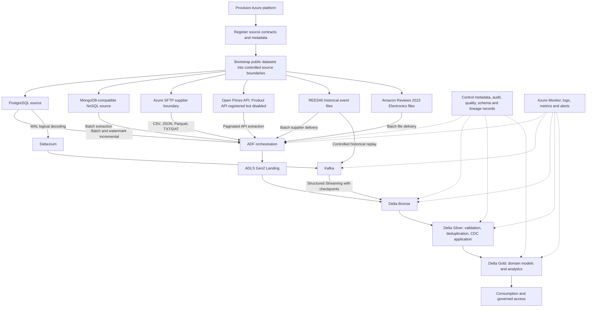
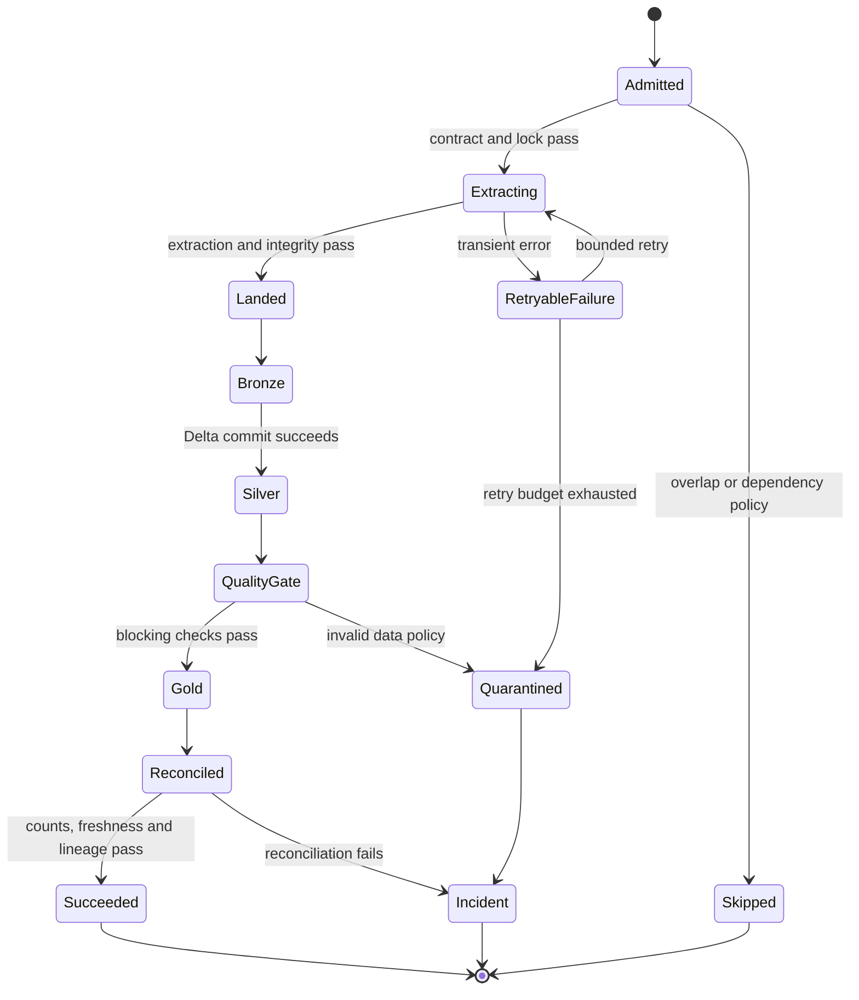
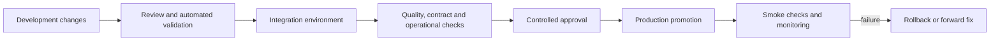

# Enterprise Retail Data Platform Architecture

**Status:** Approved base architecture with working Source → Ingestion → Landing → Bronze implementation blueprint
**Document type:** Architecture and operating model  
**Implementation status:** Documentation only; no application, infrastructure, pipeline, notebook, test, or CI/CD code is defined here.  
**Authoritative source:** The architecture explicitly approved in this conversation.

## 1. Objectives

This platform is a production-grade Azure data engineering system used to demonstrate and practice:

- Batch ingestion from relational, NoSQL, API, and external-file sources.
- Watermark-based incremental extraction from PostgreSQL.
- Real database change data capture (CDC) from PostgreSQL WAL through Debezium and Kafka.
- Controlled Kafka replay of historical e-commerce events as a streaming workload. The replay is explicitly a simulation of a stream and is not represented as a live retailer feed.
- Distributed Spark processing using PySpark, Spark SQL, and Delta Lake.
- A medallion lakehouse with Landing, Bronze, Silver, and Gold layers.
- Production controls for idempotency, replay, restartability, schema evolution, data quality, observability, security, lineage, recovery, and controlled deployment.
- A defensible separation between public datasets, controlled source-system environments, and simulated supplier or streaming boundaries.

## 2. Scope

### In scope

The approved platform covers source registration, controlled source bootstrapping, batch and streaming ingestion, lakehouse processing, curated analytics, operational metadata, data quality, monitoring, alerting, recovery, security, governance, testing, and CI/CD promotion.

### Out of scope for this document

This document does not implement code or provision resources. It does not define application-level APIs, business-user dashboards, ML models, or a production business SLA beyond the platform control objectives described below.

## 3. Approved end-to-end architecture

The approved flow is:

1. Provision the Azure platform.
2. Register source contracts and metadata.
3. Bootstrap public datasets into controlled source boundaries.
4. Ingest batch sources to ADLS Gen2 Landing.
5. Ingest batch and streaming records to Delta Bronze.
6. Validate, deduplicate, and apply CDC in Silver.
7. Build Gold domain models and analytics.
8. Monitor, alert, recover, and support the platform.
9. Deploy through CI/CD and controlled environment promotion.



## 4. Source systems

The sources are public datasets or public APIs placed behind controlled source boundaries for this project. Their use does not claim that the original data owners delivered these records to this platform.

| Source | Controlled boundary and format | Processing mode | Purpose |
|---|---|---|---|
| H&M Personalized Fashion Recommendations | H&M CSV tables loaded into PostgreSQL: `customers`, `articles`, `transactions` and the selected supporting files | Historical batch, watermark incremental, and real PostgreSQL CDC | Relational operational source, joins, dimensions, facts, incremental extraction, and CDC |
| PostgreSQL WAL | PostgreSQL logical replication, Debezium PostgreSQL connector, Kafka topics | Streaming CDC | Real database changes generated in the controlled PostgreSQL source environment |
| Open Food Facts | MongoDB-compatible NoSQL source populated from the approved Open Food Facts dump or approved subset | Batch | Semi-structured document ingestion and NoSQL-to-lake processing |
| Open Food Facts Product API | Registered source endpoint; disabled in the working implementation blueprint | Not scheduled | Retained in the base source inventory; no pipeline or credential is provisioned until enabled through architecture change control |
| Open Prices API | Actual Open Prices API endpoint with its required authentication and request controls | Batch API extraction | Authenticated API ingestion, incremental request strategy where supported, and operational recovery |
| REES46 seven monthly archives | Controlled Azure SFTP supplier boundary seeded from the historical monthly files | Batch file ingestion | Multi-file supplier delivery, file contracts, manifesting, quarantine, and large Spark workloads |
| Supplier-style files | Controlled SFTP boundary containing CSV, JSON, Parquet, and flat TXT/DAT files | Batch file ingestion | Heterogeneous external-file processing and contract enforcement |
| REES46 historical events | The same historical event data replayed through Kafka at a controlled rate | Streaming replay | Structured Streaming, lag, checkpoint, replay, ordering, and backpressure exercises |
| Amazon Reviews 2023 | Electronics review JSONL and related public Parquet representation | Batch file ingestion | Large distributed Spark processing and review/product analytics within defensible identifiers |

### Source identity and provenance rules

- Public datasets remain identifiable as public source data.
- PostgreSQL and the NoSQL database are controlled source-system environments created for the project.
- PostgreSQL CDC represents actual controlled inserts, updates, and deletes captured from WAL; it is not a historical claim about retailer CDC.
- Kafka replay represents controlled replay of historical events; it is not a live stream.
- SFTP represents a controlled supplier-boundary simulation seeded from public data; it is not a claim that a public supplier delivered the files over SFTP.
- Cross-domain joins are permitted only where a defensible business key exists. Otherwise, data remains in its own domain or is combined only through explicitly documented analytical relationships.

## 5. Ingestion architecture

### 5.1 Batch ingestion

Azure Data Factory (ADF) is the batch orchestration boundary. It coordinates source extraction, file movement, metadata registration, retries, and Databricks job invocation.

1. A schedule or controlled trigger starts a source-specific ADF pipeline with a stable `run_id`, `source_id`, `entity_id`, `contract_version`, and bounded extraction/delivery window.
2. The pipeline reads the active source/entity contract and durable control state from the Unity Catalog Delta control plane.
3. It extracts from PostgreSQL, Azure Cosmos DB for MongoDB API, Open Prices API, or the controlled SFTP boundary according to the source adapter.
4. It first writes to a run-scoped Landing staging prefix. Staging is never read by Bronze.
5. It validates delivery completeness, checksums/counts where defined, schema fingerprint, and contract version; then atomically publishes the delivery into immutable `committed/` Landing and records the manifest.
6. Only after the `source_delivery` state is `COMMITTED` does ADF invoke Databricks Auto Loader for file inputs. Kafka inputs are consumed by Structured Streaming, not Auto Loader.
7. A Databricks task returns a structured completion result containing run/delivery identity, Bronze Delta version, counts, quality status, and error classification. ADF advances source progress only after the declared reconciliation/commit gate succeeds.
8. Failures preserve the last committed checkpoint/watermark and raw input; retry, quarantine, replay, and backfill use the original durable identity or a separately registered recovery identity.

Batch ingestion is idempotent. A repeated trigger or retry must identify the same source object or extraction window and avoid creating a second logical copy in Bronze.

### 5.2 PostgreSQL historical and incremental ingestion

- The initial load establishes a reconciled historical baseline while controlled mutation generation is paused. It records `snapshot_id` and the captured outbox high sequence before resuming mutations.
- The four controlled tables are `retail_src.articles`, `retail_src.customers`, `retail_src.transactions`, and `retail_src.sample_submission`. The first three use project-managed `retail_ops.incremental_outbox.change_seq BIGINT` for incremental extraction. `sample_submission` is initial-only.
- The controlled outbox is one append-only transactional change table with a global monotonic `change_seq BIGINT` identity, `source_entity STRING`, `source_pk_json STRING`, `operation STRING`, `changed_at_utc TIMESTAMP`, and `row_image_json STRING`. Controlled insert/update/delete and its outbox record commit atomically (trigger or approved write procedure); delete rows retain the source key and operation with a null after-image. It is project infrastructure, not a feature of the public H&M data.
- Incremental extraction uses `change_seq > committed_value AND change_seq <= pending_high_value`; the sequence is the monotonic watermark and deterministic tie-breaker. Re-read the prior 100 sequence values; Bronze idempotency deduplicates by `change_seq`.
- This outbox sequence is a project engineering field, not a claim about the public H&M dataset. Its PKs and physical source columns are assumptions validated against the controlled PostgreSQL schema before pipeline activation.
- The watermark advances only after Landing publication, Bronze commit, and reconciliation succeed. A failed or partial run leaves the committed watermark unchanged.
- One active extraction per source/entity is allowed; JDBC concurrency is capped at two entities. Retries reuse the original run/window and use compare-and-set control updates.

### 5.3 PostgreSQL CDC

PostgreSQL logical replication exposes actual WAL changes. Debezium reads the logical stream and publishes source-keyed events to Kafka. Spark Structured Streaming consumes those events and writes them to Delta Bronze with source metadata, operation type, transaction or event ordering metadata where available, and ingestion time.

CDC controls include:

- A replication slot lifecycle, WAL-retention monitoring, and alerts for connector stoppage or excessive lag.
- Snapshot and streaming handoff tracking so the initial snapshot is not confused with later changes.
- Per-topic partitioning and key selection that preserve ordering for a source primary key where required.
- Checkpointed consumption and replay from Kafka offsets after failure.
- Deduplication using a stable CDC event identity and deterministic ordering rules.
- Explicit handling for insert, update, delete, tombstone, schema change, poison event, large transaction, authentication, and connector restart scenarios.
- A controlled policy for resnapshot, slot recovery, and reconciliation when offsets, checkpoints, or source state are lost.

### 5.4 API ingestion

Open Prices is called as an actual endpoint. The API adapter records request metadata and treats each response page as an extraction unit. The Open Food Facts Product API remains registered but disabled in this implementation blueprint.

The ingestion contract includes authentication or token handling, secret retrieval, pagination, request and connection timeouts, bounded exponential backoff with jitter for transient failures, 4xx and 5xx classification, rate-limit response handling, response-size limits, schema validation, duplicate-response handling, and restartable progress markers.

Open Prices runs daily at 03:05 UTC for a bounded business-date request set. Page size is 100, maximum concurrency is two, connect timeout 10 seconds, request timeout 30 seconds. The durable request key is SHA-256 of endpoint, canonical parameters, date, and cursor/offset. Retry transient errors five times with exponential delay from 5 seconds to 5 minutes plus 0–30 seconds jitter; honor `Retry-After` for HTTP 429. Listed transient network/5xx errors retry; other 4xx are permanent except contract-approved 404. A run is complete only after terminal pagination and all request IDs are accepted. Raw responses and request ledger support replay without another API call.

### 5.5 SFTP file ingestion

The SFTP boundary is a controlled supplier simulation seeded from public files. ADF polls every five minutes during each source's declared release window. A producer uploads to `/_upload/{delivery_id}/{file}.partial`, publishes final immutable objects under `/ready/{delivery_id}/`, then writes the manifest and `_READY` marker last. ADF copies only when `_READY` exists and the manifest validates.

File controls include final-name immutability, nonzero byte checks, SHA-256 and byte-count match, row count where applicable, expected file list and no unlisted files, schema version, extension/content checks, delivery revision, late-file handling, quarantine, retention, and replay. A missing marker, manifest mismatch, partial upload, duplicate logical delivery with changed checksum, or unexpected object prevents commit. Corrections use a new delivery ID/revision; objects are never overwritten.

CSV, JSON, Parquet, and TXT/DAT formats are parsed using format-specific contracts. Delimiter, encoding, quoting, header, record-length, and fixed-width rules are contract attributes rather than implicit parser defaults.

### 5.6 Kafka replay streaming

The REES46 historical files are replayed into Kafka at a controlled rate. The replay is a testable streaming workload with documented replay speed, topic, partitioning, event key, and run identity. It is not described as a live source.

Spark Structured Streaming consumes the topic using a durable checkpoint and a 30-second trigger. Kafka CDC/replay are not file discovery workloads and do not use Auto Loader. Poison records are written to the DLQ before offsets are committed. A replay uses a distinct replay ID and consumer group/checkpoint; it never resets the normal consumer checkpoint.

## 6. Landing layer

ADLS Gen2 Landing is the immutable source boundary. It stores the original extracted bytes or raw API responses together with operational metadata.

Working implementation layout:

```text
abfss://landing@${storage_account}.dfs.core.windows.net/
  _staging/{environment}/{source_system}/{entity_name}/run_id={run_id}/
  committed/{environment}/{source_system}/{entity_name}/business_date={YYYY-MM-DD}/delivery_id={delivery_id}/
  quarantine/{environment}/{source_system}/{entity_name}/reason={reason_code}/run_id={run_id}/
```

Landing requirements:

- Immutable source objects and append-only run manifests.
- Source, entity, extraction mode, contract version, run identifier, arrival time, checksum, size, and schema fingerprint.
- Separate quarantine paths for incomplete, corrupt, malformed, unauthorized, or contract-invalid inputs.
- No silent overwrite of a source object; replacement requires a new delivery ID/revision and explicit lineage.
- Landing states are `STAGING → VALIDATING → COMMITTED`, or `QUARANTINED`; Bronze reads only committed deliveries.
- Retention and lifecycle rules are governed by the approved data-retention decision.

## 7. Bronze layer

Bronze is Delta Lake’s raw, replayable ingestion layer. It preserves source fidelity while adding technical metadata required for operations.

Each record or event carries, where applicable:

- Source and entity identifiers.
- Ingestion run, batch, file, Kafka topic, partition, and offset metadata.
- Source event time and ingestion time.
- Schema or contract version.
- CDC operation, transaction metadata, and event identity.
- Raw payload or source columns with minimal normalization.
- Quarantine reason or parse status for records not eligible for the valid Bronze path.

Bronze writes are idempotent using deterministic source identities and transactionally committed Delta operations. Checkpoints, commit versions, and run metadata make the layer restartable and auditable.

## 8. Silver layer

Silver produces validated, typed, deduplicated, and conformed data. It is the boundary at which source records become trusted for downstream domain processing.

Silver processing includes:

- Explicit data types, timestamp and timezone normalization, and controlled handling of nulls.
- Required-field, domain, uniqueness, referential, and range validation.
- Deterministic duplicate resolution and retention of rejected records with reasons.
- Schema evolution policy for additions, removals, renames, and data-type changes.
- CDC ordering, upsert, delete, tombstone, and reconciliation logic.
- Late-arriving and out-of-order event handling according to source event-time rules.
- Restartable Delta merges with run-level idempotency.
- Source-to-Silver record-count and control-total reconciliation.

Bad records are isolated and observable. A quality failure can stop promotion, route only invalid records to quarantine, or allow a documented partial-success path according to the entity’s contract.

## 9. Gold layer

Gold contains governed domain models and analytics-ready products. It does not invent cross-domain keys.

Examples of valid domain work include:

- H&M customers, articles, and transactions joined using their documented identifiers for customer, product, and transaction analysis.
- REES46 event unions and session, product, funnel, and time-window aggregates within the event domain.
- Amazon review and product metadata analysis where identifiers are actually compatible.
- Open Food Facts products joined to Open Prices records by a documented barcode or product code, preserving leading zeros and isolating unmatched records.
- Supplier-file products joined to an approved product mapping only when the controlled seed data establishes a defensible mapping.

Gold products include freshness, source coverage, quality status, and lineage metadata so consumers can distinguish a complete result from a partial or quarantined run.

## 10. Orchestration

ADF is the primary control-plane orchestrator for scheduled and event-driven batch pipelines. Databricks jobs or task graphs execute Spark and Delta processing steps invoked by ADF. Streaming jobs are independently restartable and are monitored by the same operational metadata and alerting model.

| Orchestration task | Responsibility | Failure behavior |
|---|---|---|
| Run admission | Check schedule, dependency, concurrency, source availability, and active-run locks | Skip or queue overlapping work according to the source policy |
| Contract resolution | Load source, schema, format, watermark, and quality configuration | Fail closed if the contract is missing or invalid |
| Source extraction | Read PostgreSQL, NoSQL, API, or SFTP input | Bounded retries; persist progress; quarantine unrecoverable input |
| Landing commit | Write immutable objects and manifest | Do not advance control state until integrity succeeds |
| Bronze invocation | Start the appropriate batch or stream task | Idempotent retry using the same run identity |
| Silver and Gold promotion | Run dependencies, quality gates, and Delta commits | Stop promotion on blocking quality or dependency failures |
| Reconciliation | Compare counts, keys, control totals, and CDC state | Raise incident and hold watermark when reconciliation fails |
| Completion | Write run, quality, freshness, and lineage outcome | Mark success only after all required gates pass |

The orchestrator persists run state rather than relying on in-memory task state. Every task has a correlation identifier and a deterministic retry policy. Manual reruns require a run or window selection so that operators do not accidentally reprocess an unbounded history.



## 11. Operational metadata and control plane

A metadata-driven control plane supports all source types and all layers. It stores, at minimum:

- Source and entity contracts, format, schema version, ownership, sensitivity, and retention.
- Run identifiers, parent-child task relationships, start/end times, status, retry count, and error classification.
- Batch watermarks, CDC offsets or LSN references, Kafka topic/partition/offset, streaming checkpoint identity, and replay run identity.
- File manifests, checksums, sizes, arrival and processing state, and quarantine reason.
- Input/output row counts, distinct-key counts, control totals, quality results, freshness, and reconciliation outcomes.
- Schema fingerprints and approved evolution history.
- Data lineage from source object or event through Bronze, Silver, and Gold.

Metadata is itself protected, monitored, and backed up according to the platform policy. Control state advances transactionally with the data milestone it represents.

## 12. Data quality

Quality checks are defined by source contract and entity criticality. They are applied at Landing, Bronze, Silver, and Gold as appropriate.

| Quality area | Examples |
|---|---|
| Completeness | File presence, non-zero size, required columns, expected extraction window |
| Validity | Type, range, enum, timestamp, encoding, delimiter, and JSON structure |
| Uniqueness | Source key, event identity, file identity, CDC event identity |
| Consistency | Referential relationships, currency/unit rules, cross-field constraints |
| Accuracy proxies | Control totals, count reconciliation, checksum, source-versus-target comparisons |
| Timeliness | Batch freshness, API completion, Kafka lag, CDC lag, watermark age |
| Schema | Contract fingerprint, compatible additions, blocked breaking changes |
| Distribution | Volume thresholds, null-rate changes, outlier and skew indicators |

Checks produce durable results with rule version, observed value, threshold, status, and affected run or partition. Critical failures block downstream promotion; noncritical failures are visible and require an explicit policy.

## 13. Error handling and failure containment

The platform classifies failures as transient, data, contract, security, dependency, capacity, or operator errors. Each class has a bounded retry or containment action.

| Failure scenario | Prevent or detect | Contain and recover |
|---|---|---|
| Duplicate file or event | Manifest identity, checksum, source event key | Idempotent Bronze write and duplicate quarantine |
| Partial or zero-byte file | Ready marker, size and checksum validation | Keep out of Bronze; request/retry delivery |
| Corrupt or malformed data | Parser and schema validation | Quarantine with record/file reason and preserve raw input |
| Breaking schema change | Contract fingerprint and compatibility policy | Stop affected entity; alert owner; retain source for replay |
| Late or out-of-order event | Event-time metadata, watermark and lateness metrics | Allowed lateness policy, deterministic deduplication and correction path |
| API rate limit or outage | Status classification, timeout and rate metrics | Backoff with jitter, resume from page marker, alert on SLA breach |
| Kafka outage or consumer lag | Broker/consumer metrics and lag thresholds | Backpressure, retry, checkpointed restart and replay |
| Debezium or replication-slot failure | Connector health, LSN and WAL growth alerts | Pause downstream advancement; repair connector or resnapshot under runbook |
| Checkpoint loss or corruption | Checkpoint health and state consistency | Stop stream, preserve offsets, follow approved replay/recovery procedure |
| Spark executor/driver failure | Job outcome, cluster metrics, retryable error classification | Retry idempotently; isolate skew, OOM or shuffle issue for remediation |
| Data skew or small files | Distribution, file-count, task-duration metrics | Repartition, compaction, targeted mitigation, and documented rerun |
| Concurrent or overlapping runs | Run locks and control-table state | Queue, skip, or cancel according to source policy |
| Downstream partial completion | Transactional Delta commits and run dependency state | Resume from last committed layer; do not advance upstream watermark prematurely |
| Credential or permission failure | Secret and access telemetry | Fail closed, rotate or repair permission, then retry from durable state |

No retry may bypass validation or mutate the source to hide an error. Poison records and security failures are isolated and visible to operators.

## 14. Security

- Use managed identities wherever supported; use service principals only where a managed identity is not appropriate.
- Store API keys, database credentials, Kafka credentials, SFTP keys, and tokens in Azure Key Vault. Secrets never appear in code, notebooks, logs, or metadata values.
- Apply least privilege separately to orchestration, ingestion, transformation, administration, and consumption identities.
- Use Unity Catalog permissions for catalogs, schemas, tables, volumes, external locations, and lineage.
- Protect ADLS with identity-based access, private or restricted endpoints where approved, and separate write/read roles by layer.
- Rotate credentials and keys, monitor access, and audit secret retrieval and data access.
- Classify potentially sensitive fields, including customer attributes and free-text reviews, and apply masking or restricted access where required.
- Treat raw Landing and Bronze as more restricted than curated Gold. Quarantine data inherits source sensitivity.

## 15. Governance

Unity Catalog is the governance boundary for the lakehouse. Governance includes:

- Catalog, schema, table, volume, external-location, and storage-credential ownership.
- Data classification, business and technical descriptions, source provenance, and retention.
- Column-level and object-level permissions appropriate to the data sensitivity.
- End-to-end lineage from Landing and streaming source metadata through Gold.
- Schema-change approval and contract versioning.
- Audit logs for access, grants, writes, job execution, and administrative changes.
- Documented ownership, escalation contacts, and runbook links for every critical data product.

## 16. Monitoring and observability

Azure Monitor and platform-native logs collect control-plane, source, streaming, Spark, Delta, and security telemetry. Monitoring is organized around SLIs rather than only job success.

Core signals include:

- Batch success rate, duration, retry count, freshness, watermark age, throughput, and volume deviation.
- File arrival delay, duplicate count, quarantine count, and checksum failures.
- API request rate, error class, page progress, token failures, and rate-limit events.
- Kafka consumer lag, throughput, partition skew, connector state, and WAL/LSN growth.
- Spark task duration, shuffle read/write, spill, skew, executor loss, OOM, driver failure, and cluster utilization.
- Delta commit failures, small-file count, table growth, checkpoint health, and compaction status.
- Silver/Gold quality failures, reconciliation variance, and downstream freshness.
- Authentication, authorization, secret access, and unusual data-access activity.

Alerts are severity-based and actionable. Every alert includes source/entity, environment, run or stream identifier, observed condition, first failure time, likely failure class, and runbook link. Alert fatigue is controlled by deduplication, suppression during planned maintenance, and escalation for persistent failures.

## 17. CI/CD and controlled promotion

CI/CD is part of the approved architecture. It promotes versioned notebooks, jobs, pipeline definitions, configuration, tests, and documentation through controlled environments. This document intentionally does not implement workflows.

Required controls:

- Pull-request review and protected branches.
- Static validation, unit tests, data-contract checks, and deployment validation before promotion.
- Environment-specific configuration supplied securely at deployment time.
- Separate deployment identities with least privilege.
- Immutable version or commit identification in deployed jobs.
- Approval gates for higher environments and a documented rollback or forward-fix procedure.
- Post-deployment smoke checks and evidence captured in the operational metadata.



## 18. Infrastructure

The platform infrastructure consists of the approved Azure service boundaries needed for the flow:

- ADLS Gen2 for Landing and Delta lakehouse storage.
- Azure Data Factory for batch orchestration and source-to-Landing movement.
- Azure Databricks for Spark, PySpark, Spark SQL, Delta Lake, streaming, jobs, and governed lakehouse processing.
- PostgreSQL as the controlled relational source and CDC origin.
- A MongoDB-compatible NoSQL source populated from the approved Open Food Facts source pattern.
- Azure SFTP supplier boundary for external-file simulation.
- Kafka and Debezium for PostgreSQL CDC and controlled event replay.
- Azure Key Vault for secrets.
- Unity Catalog for lakehouse governance and lineage.
- Azure Monitor and associated logs, metrics, and alerting.

Resource names, SKUs, exact cluster sizes, autoscaling bounds, retention durations, and cost limits are environment configuration and are not silently fixed by this document.

## 19. Environments

The intended promotion model is Development, Integration/QA, and Production-like. The Production-like environment demonstrates production controls even when operated for a limited project period.

Environment isolation covers storage paths, catalogs/schemas, secrets, service identities, Kafka topics, checkpoints, control metadata, and alert routing. A stream checkpoint must never be reused across incompatible environments or deployments.

Dataset bootstrapping and replay runs are explicitly labeled by environment and run identity. Public data is not confused with production customer data.

## 20. Networking

Network design follows the approved Azure service capabilities and least-privilege intent:

- Restrict storage, databases, secrets, orchestration, and Databricks access to approved network paths.
- Prefer private endpoints or controlled egress where supported and feasible.
- Restrict SFTP ingress to the controlled supplier boundary and approved identities.
- Permit API egress only to the documented Open Food Facts and Open Prices endpoints as required.
- Protect Kafka and Debezium connections with authentication, encryption, and network restrictions.
- Log network and authorization failures for operational diagnosis.

Exact virtual-network topology, firewall rules, DNS, private-link configuration, and cross-region routing remain deployment-specific unless separately approved.

## 21. Disaster recovery

Recovery is based on immutable Landing data, replayable Kafka offsets where retained, Delta transaction history, checkpoints, metadata, and documented runbooks.

Recovery objectives and controls include:

- Re-run a failed batch from the same Landing object without re-extracting the external source.
- Rebuild Bronze, Silver, or Gold from a known source run or Delta version.
- Resume a stream from its checkpoint or replay a bounded Kafka range after approved checkpoint recovery.
- Reconcile PostgreSQL incremental watermarks and CDC offsets before resuming advancement.
- Detect replication-slot or WAL-retention risk before source recovery becomes impossible.
- Restore control metadata and re-establish secrets, identities, permissions, and alerts before data promotion.
- Validate completeness, freshness, lineage, and quality after recovery.

The Source → Landing → Bronze working blueprint sets demonstration and production-like RPO/RTO targets in Section 29.3. Cross-region implementation, paired-region selection, backup frequency, and failover automation are deployment-specific engineering work; the current environment must not be represented as multi-region HA unless those controls are actually provisioned and tested.

## 22. Testing

Testing is required at multiple levels:

- Unit tests for parsing, transformations, CDC ordering, deduplication, watermark calculation, and error classification.
- Contract tests for schemas, file formats, API responses, and source identifiers.
- Integration tests for ADF-to-ADLS, database extraction, SFTP delivery, Kafka/Debezium, Databricks, Delta, Unity Catalog, and Key Vault boundaries.
- Data-quality tests for completeness, validity, uniqueness, consistency, timeliness, and reconciliation.
- Streaming tests for restart, checkpoint recovery, duplicate events, late events, out-of-order events, backpressure, poison messages, and lag.
- Spark tests for skew, small files, shuffle pressure, executor loss, driver failure, and idempotent rerun.
- Security tests for least privilege, secret redaction, unauthorized access, and audit evidence.
- Failure-injection exercises for source outage, API throttling, malformed files, connector failure, partial writes, concurrent runs, and downstream outage.
- Deployment smoke tests and rollback/forward-fix validation.

## 23. Operational procedures

### Daily operation

Operators review batch freshness, active runs, failures, quarantine, CDC/WAL health, Kafka lag, stream checkpoints, Spark resource signals, quality results, and Gold product freshness.

### New source or contract version

Register the source contract, owner, schema, security classification, quality rules, retention, schedule, and recovery behavior before enabling extraction. Test the new version in a non-production environment and promote it through CI/CD.

### Failed batch

Identify the run and failure class from metadata, inspect the correlated logs, determine whether the failure is transient or data-related, and rerun the bounded run or source window. Do not advance the watermark until all required gates pass.

### Failed stream or CDC connector

Check connector status, offsets/LSN, WAL growth, Kafka lag, checkpoint health, and source availability. Pause downstream promotion if the state is uncertain. Recover from a checkpoint or perform an approved bounded replay/resnapshot and reconcile before marking the stream healthy.

### Quarantined data

Review the source object, rule version, and rejection reason. Correct the source or contract through controlled change, then replay the retained raw input. Never silently edit the raw record to make it pass.

### Backfill or reprocessing

Create a unique backfill run with explicit source window, target layers, expected impact, and concurrency policy. Keep normal processing isolated or coordinate it through the control plane. Reconcile outputs and communicate any freshness or duplicate-risk impact.

### Cost and capacity

Monitor storage growth, API usage, cluster runtime, Kafka throughput, database load, and log volume. Stop or scale workloads only through an approved operational action. Cost alerts are advisory controls and do not replace resource shutdown procedures.

## 24. Approved decisions and working implementation blueprint

The following are approved and must not be changed without explicit architecture review:

1. Azure is the cloud platform.
2. Azure Databricks, Spark, PySpark, Spark SQL, Delta Lake, and medallion layers are core processing choices.
3. PostgreSQL is the relational operational source for H&M data, including historical, watermark incremental, and WAL/Debezium CDC paths.
4. Kafka and Debezium are used for real PostgreSQL CDC and controlled historical event replay.
5. ADF and ADLS Gen2 are used for batch orchestration and Landing.
6. SFTP is a controlled Azure supplier-boundary simulation for CSV, JSON, Parquet, and TXT/DAT files, including the REES46 monthly archives.
7. Open Prices is consumed as an actual API endpoint. The Open Food Facts Product API remains registered but disabled in the working implementation.
8. The Open Food Facts document source uses Azure Cosmos DB for MongoDB API as the managed NoSQL boundary. The full public dump is not loaded into a constrained free-tier instance; use the deterministic approved subset for the development demonstration. This is a service decision, not an unresolved architecture alternative.
9. Bronze, Silver, and Gold remain separate responsibilities with replayable raw data, validated/conformed data, and governed analytical products.
10. Production-grade metadata, quality, security, monitoring, recovery, and controlled deployment are required across every path.

The Source → Ingestion → Landing → Bronze details in this document are the working implementation blueprint. They are not described as decisions awaiting approval. They distinguish (a) approved/working engineering choices, (b) project engineering assumptions that are not source facts, and (c) physical source or environment validation required before activating a pipeline. Validation confirms the blueprint's preconditions and does not reopen the architecture unless evidence demonstrates the stated fallback is also impossible.

## 25. Project engineering assumptions and implementation-time validation

- Azure subscription capacity, regional service availability, quota, and connector availability will be verified before provisioning.
- Public dataset licenses and API terms permit the planned educational/research use and attribution; the operator remains responsible for confirming current terms.
- The controlled PostgreSQL and NoSQL environments can be populated without representing them as the original public providers.
- There is no defensible cross-source business key among the selected retail, food, review, and event datasets unless a source contract proves otherwise. Cross-domain joins must not invent identifiers.
- Controlled PostgreSQL uses project-assigned `transaction_id` and outbox `change_seq`; these are engineering fields and must be created in the controlled source, not attributed to H&M.
- The physical H&M CSV columns, nullability, file encodings, and candidate natural keys are validated from the downloaded files and controlled PostgreSQL schema before activation. A missing required key disables that entity's typed/incremental path until the controlled schema is corrected to the frozen rule.
- The DAT/TXT (`WC_F_2016`) record layout is not asserted as a source fact. It must be inspected; absent a verified layout contract, retain the bytes in Landing and quarantine from parsed Bronze.
- Azure region, quotas, SKU availability, managed file events, connector versions, private endpoint support, and actual costs are environment-specific validations. They do not change the logical architecture.
- Current license/API terms, attribution requirements, and permitted use are checked before bootstrap and recorded with provenance.
- Retention and incident contacts must be configured to the project's operational context; raw inputs remain replayable through the active retention period.
- The project may run for a limited demonstration period, but its controls are designed as production patterns.

## 26. Environment configuration and implementation-time validation

These values are configured per environment without changing the working architecture: actual Azure region and paired recovery region; SKU/quota and capacity; Databricks runtime and compute policy; managed file-event availability; private endpoint/DNS/firewall settings; identity object IDs and role assignments; API credentials/rate ceilings; cost budget; notification recipients; and concrete retention settings within policy. Values must be recorded in environment configuration and validated before a production-like run. The Azure Cosmos DB for MongoDB API choice, Auto Loader role, ADF handoff, ingestion mode, and source contracts are working architecture decisions, not environment alternatives.

## 27. Architecture change control

This document is the approved baseline. A proposed change must identify the affected source, layer, control, failure mode, security or cost consequence, migration/recovery impact, and test evidence. No existing approved component or processing mode may be replaced, simplified, or reinterpreted without explicit review and approval.

## 28. Production-readiness gap analysis

This section records the production-readiness review performed against the approved architecture. It does not replace, remove, or simplify any approved component. It identifies the controls that must be implemented and tested before a component can be considered production-ready.

The scenario labels are used consistently throughout this section:

- **Happy path:** expected successful processing.
- **Transient failure:** a failure that may succeed after bounded retry or waiting.
- **Permanent failure:** a condition that cannot be fixed by retry alone.
- **Data failure:** invalid, incomplete, duplicate, corrupt, late, or unexpected data.
- **Dependency failure:** an unavailable or degraded service, connector, network, or external provider.
- **Security failure:** an authentication, authorization, secret, privacy, or audit failure.
- **Capacity failure:** quota, storage, memory, CPU, disk, throughput, or rate-limit exhaustion.
- **Concurrency failure:** overlapping runs, duplicate delivery, race conditions, or conflicting state changes.
- **Recovery path:** how normal processing resumes after failure.
- **Replay path:** how retained source data or offsets are processed again deterministically.
- **Backfill path:** how a bounded historical range is processed while normal operations continue.
- **Disaster-recovery scenario:** loss of a service, region, checkpoint, metadata store, or deployment state.

The designs below describe the working Source → Landing → Bronze implementation blueprint. Project assumptions are labelled as such; facts requiring access to controlled source instances are validation checks, not unresolved architecture choices.

### 28.1 Source boundaries and ingestion paths

#### 28.1.1 Dataset bootstrap and provenance boundary

- **Happy path:** Each public dataset is downloaded or obtained through its documented endpoint, checksum-recorded, attributed, and loaded only into its explicitly controlled PostgreSQL, NoSQL, SFTP, ADLS, or Kafka boundary.
- **Transient failure:** A download, decompression, or source upload times out; retry with bounded backoff and retain the last verified partial state outside the consumable path.
- **Permanent failure:** A source URL is unavailable, the license disallows the planned use, or the file cannot be verified; stop bootstrap and mark the source unavailable rather than substituting an unapproved dataset.
- **Data failure:** The file is truncated, corrupt, unexpectedly structured, or has a changed row/column profile; quarantine it and preserve the source evidence and checksum.
- **Dependency failure:** Public hosting, local staging, database, storage, or transfer service is unavailable; record the dependency outage and do not claim the dataset is loaded.
- **Security failure:** An unsigned or unexpected download, exposed credential, or unauthorized source write is detected; fail closed, rotate credentials, and audit the incident.
- **Capacity failure:** Local disk, ADLS capacity, database storage, decompression memory, or transfer bandwidth is insufficient; stop before partial source publication and raise a capacity incident.
- **Concurrency failure:** Two bootstrap runs publish the same source version or seed the same controlled boundary simultaneously; use a source-version lock and immutable run identifier.
- **Recovery path:** Resume from the last verified source object or restart the bounded bootstrap run; publish only after checksum, size, and manifest validation.
- **Replay path:** Re-read the immutable staged source version and re-seed a new run without downloading the public source again.
- **Backfill path:** Register a historical source version as a separate bootstrap run and maintain lineage to the original public URL and checksum.
- **Disaster-recovery scenario:** Loss of the staging area or source boundary is recovered from retained immutable Landing copies and the recorded source manifest; re-bootstrap only when the retained copy is unavailable.

**Gap and implementation design:** A bootstrap manifest must be created before publication with source URL, dataset version, retrieval timestamp, license/attribution reference, byte size, checksum, decompressed size if known, target boundary, and run identifier. A source version is immutable after publication.

#### 28.1.2 H&M PostgreSQL historical batch

- **Happy path:** The approved H&M tables are loaded into PostgreSQL, extracted consistently to Landing, and reconciled by table and run counts before Bronze processing.
- **Transient failure:** A database connection resets or a query times out; retry the same bounded extraction under a fixed run identity without advancing control state.
- **Permanent failure:** A table is missing, credentials are invalid after rotation, or the source schema is incompatible; fail the table run and require a contract or access correction.
- **Data failure:** Duplicate keys, invalid dates, null required identifiers, or inconsistent relationships are detected; quarantine affected records and block the relevant Silver promotion according to severity.
- **Dependency failure:** PostgreSQL, ADLS, ADF, or the network is unavailable; keep the run in a recoverable state and prevent a false successful watermark.
- **Security failure:** The extraction identity lacks only the required permissions or a credential is exposed; fail closed, audit, and repair access through Key Vault and RBAC.
- **Capacity failure:** PostgreSQL experiences lock pressure, connection exhaustion, storage pressure, or an extraction exceeds the query/cluster budget; use bounded reads, throttling, and operational escalation.
- **Concurrency failure:** Two initial loads or a historical load and incremental load overlap; use an entity-level load lock and prohibit incremental advancement until baseline completion.
- **Recovery path:** Restart the failed table or run from the same source window and compare the new manifest and counts with the previous attempt.
- **Replay path:** Reprocess the immutable Landing objects into Bronze without rereading PostgreSQL.
- **Backfill path:** Create a named historical window and target table list; isolate it from the normal watermark and reconcile its output separately.
- **Disaster-recovery scenario:** If PostgreSQL is lost, restore the controlled source from its approved backup or reseed it from the retained public source; rebuild downstream data from Landing where possible.

**Gap and implementation design:** Use an initial-load control record with `source_entity`, `source_snapshot_id`, `run_id`, extraction consistency marker, row count, checksum/control totals, and completion state. Do not permit incremental or CDC promotion while the baseline state is incomplete.

#### 28.1.3 PostgreSQL watermark incremental extraction

- **Happy path:** Each table is extracted using a persisted high-water mark and a deterministic tie-breaker, then the watermark advances only after Landing, Bronze, and required quality gates succeed.
- **Transient failure:** The query or network fails during extraction; retry the same window and do not create a new logical window.
- **Permanent failure:** The selected watermark column is removed, becomes non-monotonic, or is no longer populated; stop the entity and require a contract revision.
- **Data failure:** Equal timestamps, late updates, clock skew, null watermarks, or updates outside the expected window cause missed or repeated rows; use overlap extraction and deterministic deduplication.
- **Dependency failure:** PostgreSQL, ADF, ADLS, or the metadata store is unavailable; leave the previous watermark active and alert on freshness.
- **Security failure:** The extractor can write to source tables or read unauthorized columns; reduce privileges and verify audit logs before resuming.
- **Capacity failure:** The extraction window is too large or creates source lock/load pressure; split the window, use keyset pagination, and apply source-friendly isolation.
- **Concurrency failure:** Two incremental runs read and update the same watermark; acquire an entity lock and use compare-and-set semantics on the control record.
- **Recovery path:** Re-run from the last committed watermark with an overlap interval and deduplicate by source key plus source change metadata.
- **Replay path:** Reprocess the Landing window or use a recorded extraction query/window; never depend on the current source state for a historical replay.
- **Backfill path:** Run a separate bounded backfill watermark range with its own run identity and do not modify the normal watermark until reconciliation completes.
- **Disaster-recovery scenario:** Restore the last committed watermark/control record and rebuild the affected interval from Landing or a source snapshot before resuming.

**Working implementation control:** Use the project-managed outbox sequence and preceding-100 overlap defined in Sections 5.2 and 29.4. Validate the controlled schema and compare-and-set implementation before activation. Advance the committed high sequence only after the Bronze commit and reconciliation gates described in Section 29.8.

#### 28.1.4 PostgreSQL WAL, Debezium, and Kafka CDC path

- **Happy path:** PostgreSQL emits WAL changes, Debezium publishes keyed events, Kafka retains them, Spark consumes them with a checkpoint, and Silver applies ordered upserts/deletes.
- **Transient failure:** A connector, broker, database connection, or Spark micro-batch fails; retry or restart from the last durable offset/checkpoint without acknowledging uncommitted work.
- **Permanent failure:** The replication slot is invalidated, required logical-decoding privileges are removed, or an incompatible connector/schema prevents decoding; stop downstream CDC and initiate the approved resnapshot/reconciliation procedure.
- **Data failure:** Duplicate events, tombstones, schema changes, large transactions, missing keys, or out-of-order records occur; preserve raw events, classify them, and apply deterministic Silver rules.
- **Dependency failure:** PostgreSQL, Debezium, Kafka, Databricks, checkpoint storage, or metadata storage is unavailable; hold downstream advancement and monitor the lag/WAL budget.
- **Security failure:** Connector credentials, Kafka ACLs, TLS, or database replication permissions fail; fail closed, rotate secrets, and verify no sensitive payload was logged.
- **Capacity failure:** WAL grows, Kafka retention is exhausted, partitions are skewed, connector queues fill, or Spark state exceeds memory; alert before the recovery point is lost and throttle or scale within approved limits.
- **Concurrency failure:** Snapshot and streaming handoff overlap, two connectors use the same slot/topic, or two Silver consumers mutate the same table; enforce one authoritative connector and stream per source entity/environment.
- **Recovery path:** Inspect source LSN, connector offsets, Kafka offsets, checkpoint, and Silver commit version; resume from the last consistent boundary and reconcile counts and keys.
- **Replay path:** Replay a bounded Kafka offset/LSN range or retained Bronze CDC events into an isolated target run, then merge only after duplicate and ordering checks pass.
- **Backfill path:** Use a source snapshot or bounded CDC replay into a separate backfill table/version; reconcile with the live state before promotion.
- **Disaster-recovery scenario:** Restore connector configuration, Kafka data/offsets where retained, checkpoints, and control metadata; if the replay point is lost, perform the approved resnapshot and key-level reconciliation.

**Working implementation control:** Use the distinct source-change, transport, and Bronze idempotency identities defined in Section 29.4; persist connector health, replication slot LSN, source LSN, Kafka offset, checkpoint identity, and Bronze commit version. A resnapshot is permitted only after an explicit gap assessment and reconciliation record.

#### 28.1.5 Open Food Facts NoSQL batch source

- **Happy path:** The approved Open Food Facts source boundary is populated, a connector or export reads documents in bounded pages, and raw documents land with source identity and extraction metadata.
- **Transient failure:** A cursor, connection, import, or page read times out; retry the same page/range using a resumable cursor or deterministic document key.
- **Permanent failure:** The selected Azure Cosmos DB for MongoDB API cannot import/export the approved subset, lacks required compatibility, or cannot meet measured capacity; stop the affected source path, retain immutable Landing input, and record the environment capability failure. Do not silently substitute another NoSQL service.
- **Data failure:** Documents contain malformed JSON, inconsistent nested structures, duplicate product codes, missing barcodes, or unexpected arrays; preserve raw documents and route invalid records to quarantine.
- **Dependency failure:** NoSQL service, connector, storage, network, or source import job is unavailable; do not mark the batch complete and retain the last successful page marker.
- **Security failure:** Public network access, weak credentials, overbroad database roles, or unmasked document fields are detected; restrict access and rotate credentials before retry.
- **Capacity failure:** Dataset expansion after decompression exceeds storage, document limits, RU/throughput, import rate, or Spark driver memory; use streaming/batched export and verify capacity before full publication.
- **Concurrency failure:** Two imports mutate the same collection or two extractors reuse a cursor; use collection/run locks and separate staging collections or snapshots.
- **Recovery path:** Restart from the last durable page/document marker and reconcile document counts and key coverage.
- **Replay path:** Re-read retained raw documents from Landing into Bronze; avoid repeated reads from the NoSQL service for transformation retries.
- **Backfill path:** Extract a bounded document key or source-version range into an isolated run and merge only after duplicate/key reconciliation.
- **Disaster-recovery scenario:** Restore the source boundary from an approved backup or reseed it from the immutable Landing dump; rebuild downstream documents from Landing where possible.

**Working implementation control:** Run a capacity and compatibility proof for the selected Azure Cosmos DB for MongoDB API using the deterministic subset's decompressed size, document count, nested-document distribution, ADF export method, and Spark reader. This validates feasibility and environment sizing; it does not reopen the selected service decision.

#### 28.1.6 Open Food Facts Product API

- **Happy path:** Product identifiers are selected from an approved input set, pages are fetched, raw responses are retained, and validated products land with request metadata.
- **Transient failure:** DNS, connection, timeout, 429, or 5xx occurs; apply bounded exponential backoff with jitter and respect retry-after information.
- **Permanent failure:** A product is consistently 404/invalid, the endpoint contract is incompatible, or access is revoked; classify the item and complete only according to the partial-result policy.
- **Data failure:** Response schema changes, duplicate responses, invalid JSON, missing product code, or leading-zero loss occurs; reject the response or field and preserve the raw payload.
- **Dependency failure:** API, DNS, Key Vault, ADF, ADLS, or metadata store is unavailable; pause page progression and preserve the last successful cursor.
- **Security failure:** Token/credential failure, secret exposure, unexpected certificate, or an unauthorized endpoint is detected; fail closed and rotate/validate credentials.
- **Capacity failure:** API rate limits, response-size limits, local staging, or downstream write throughput are exceeded; throttle and checkpoint at page/item granularity.
- **Concurrency failure:** Multiple runs request the same products or update the same page marker; use a request-key registry and compare-and-set progress state.
- **Recovery path:** Resume from the last committed page/item, deduplicate by product code plus response version, and reconcile requested versus returned identifiers.
- **Replay path:** Reprocess retained raw API responses without making external requests again.
- **Backfill path:** Run a bounded product-code list or source-version list with a separate request batch and lineage.
- **Disaster-recovery scenario:** Reconstruct API-derived Bronze from retained responses; only re-call the API when retention is unavailable and current terms/rate limits permit it.

**Gap and implementation design:** Use an API request ledger keyed by endpoint, request parameters, page/cursor, run, response checksum, status, and retry count. Preserve barcode strings exactly, including leading zeros.

#### 28.1.7 Open Prices API

- **Happy path:** Authentication succeeds, pages or query windows are retrieved, responses are retained, and prices are validated against product/location/time fields.
- **Transient failure:** Token refresh, rate limit, timeout, or 5xx occurs; retry with jitter and resume from the last committed page/window.
- **Permanent failure:** Credentials are revoked, an endpoint/version is retired, or a response cannot meet the contract; stop the affected extraction and record the permanent reason.
- **Data failure:** Duplicate prices, malformed coordinates, invalid currency/value, missing barcode, or inconsistent timestamps occur; quarantine or reject by rule while retaining raw response.
- **Dependency failure:** API, authentication service, Key Vault, network, ADLS, or metadata store fails; preserve request progress and do not claim a complete window.
- **Security failure:** Authentication material is exposed, scopes are excessive, or the endpoint certificate/host is unexpected; fail closed and audit.
- **Capacity failure:** API quotas, response volume, staging storage, or downstream processing capacity is exhausted; window requests and throttle according to the contract.
- **Concurrency failure:** Overlapping windows create duplicate prices or two token refreshes invalidate one another; lock the request window and use a shared token state policy.
- **Recovery path:** Resume from a durable page/window marker and reconcile requested records, response counts, and duplicate keys.
- **Replay path:** Replay retained raw responses into Bronze and Silver without re-consuming the API.
- **Backfill path:** Process a bounded date/location/product window with an isolated run and explicit downstream correction policy.
- **Disaster-recovery scenario:** Restore request ledger and raw responses; re-call only missing windows after validating current API terms and rate limits.

**Gap and implementation design:** Record endpoint version, authentication method, scope, page/window parameters, response checksum, rate-limit headers, and source event time. Define which API fields are authoritative when a product or price changes between requests.

#### 28.1.8 Azure SFTP supplier boundary

- **Happy path:** A supplier-style file is delivered completely, readiness is verified, ADF transfers it to Landing, and the manifest marks it accepted exactly once.
- **Transient failure:** Transfer interruption, temporary authentication failure, or network reset occurs; retry the transfer using a temporary destination and resume/restart safely.
- **Permanent failure:** File format, key, checksum, or supplier identity is invalid; quarantine the file and keep it out of Bronze until a corrected delivery is received.
- **Data failure:** Zero-byte, partial, duplicate, malformed, wrong-encoding, wrong-delimiter, fixed-width, or unexpected-extension files are quarantined with a reason.
- **Dependency failure:** SFTP endpoint, ADF, ADLS, DNS, network, or Key Vault is unavailable; retain the source file and alert on arrival SLA breach.
- **Security failure:** Host-key mismatch, weak key, unauthorized source path, leaked private key, or overbroad write/read access occurs; fail closed and rotate/revoke access.
- **Capacity failure:** Concurrent file deliveries, transfer bandwidth, Landing storage, or ADF integration runtime capacity is exhausted; throttle and preserve file order where required.
- **Concurrency failure:** ADF reads a file while it is still uploading or two runs process the same name; require atomic rename/ready marker and manifest-level idempotency.
- **Recovery path:** Re-check readiness and checksum, then retry to a new immutable Landing run; never overwrite an accepted object.
- **Replay path:** Reprocess the immutable Landing file and manifest without rereading SFTP.
- **Backfill path:** Deliver historical files under a distinct supplier batch/run namespace and process them with explicit target dates.
- **Disaster-recovery scenario:** Restore the file and manifest from ADLS; if SFTP state is lost, use retained Landing rather than requesting a duplicate delivery.

**Working implementation control:** Require the concrete `_upload/*.partial → /ready/{delivery_id}/ → manifest → _READY last` pattern from Section 29.5. Store the pinned host key, source path, producer identity, checksums, and delivery state.

#### 28.1.9 REES46 SFTP batch archives

- **Happy path:** The seven monthly archives arrive as separate immutable files, are validated, and are processed with month/source lineage.
- **Transient failure:** One monthly transfer or decompression fails; retry only that month and leave successful months immutable and marked complete.
- **Permanent failure:** A month is unavailable, corrupted, or licensed incorrectly; record the missing month and block any Gold claim that requires full period coverage.
- **Data failure:** Delimiter, column, event-time, product, user, or event-type drift is detected; quarantine the affected month/file and preserve raw bytes.
- **Dependency failure:** SFTP, ADLS, ADF, Spark, or decompression capacity is unavailable; maintain per-month state and avoid reprocessing completed months.
- **Security failure:** Supplier boundary or storage access is unauthorized; fail closed and do not expose raw events in diagnostics.
- **Capacity failure:** Large files, decompression, shuffle, storage, or cluster capacity is insufficient; process by month/file and use bounded Spark partitions.
- **Concurrency failure:** Multiple months or replay jobs write the same Landing/Bronze target or compact the same table; partition work by source month and use table/run locks.
- **Recovery path:** Restart the failed month from its Landing manifest and reconcile per-month counts before unioning the dataset.
- **Replay path:** Re-run any month from immutable Landing into an isolated Bronze version or replay topic.
- **Backfill path:** Add a historical month as a bounded source run, then refresh only affected Silver/Gold partitions.
- **Disaster-recovery scenario:** Rebuild the full period from retained monthly Landing objects; if a month is lost, report incomplete coverage rather than fabricating it.

**Gap and implementation design:** Treat each monthly archive as an independent file contract and run unit. The manifest must include source month, compressed/uncompressed size, checksum, schema fingerprint, row count after parse, and coverage status.

#### 28.1.10 Amazon Reviews 2023 batch files

- **Happy path:** Electronics review JSONL and compatible metadata are staged, parsed with explicit schemas, and processed in distributed Spark batches.
- **Transient failure:** Download, decompression, read, or Spark task fails; retry the bounded file/partition and preserve the source manifest.
- **Permanent failure:** The representation is inaccessible, licensing terms are incompatible, or identifiers cannot be reconciled; stop the affected product model and document the limitation.
- **Data failure:** Malformed JSONL, schema drift, duplicate reviews, invalid ratings, missing identifiers, or inconsistent timestamps are quarantined or rule-filtered.
- **Dependency failure:** Source hosting, ADLS, Databricks, storage, or metadata services fail; resume from Landing rather than re-reading the public source.
- **Security failure:** Raw review text or identifiers are exposed to unauthorized consumers; restrict Bronze/raw text and audit access.
- **Capacity failure:** File size, skewed products, shuffle, executor memory, or small-file output exceeds limits; tune partitions, isolate skew, and compact output.
- **Concurrency failure:** Review and metadata loads publish incompatible versions or two jobs rewrite the same product partition; use versioned runs and target locks.
- **Recovery path:** Restart from immutable Landing and rerun only failed input partitions with deterministic output paths/keys.
- **Replay path:** Rebuild Bronze/Silver from retained JSONL/Parquet without downloading again.
- **Backfill path:** Process a product/category/time slice and refresh impacted Gold partitions with lineage to the backfill run.
- **Disaster-recovery scenario:** Restore source files and manifests from ADLS and rebuild derived tables; retained raw text remains the recovery source.

**Gap and implementation design:** Maintain separate review and metadata contracts, record the representation/version and identifier mapping, and require a join-quality report before any review/product Gold product is published.

#### 28.1.11 REES46 Kafka replay stream

- **Happy path:** A replay controller reads an approved historical file range, publishes keyed events at the configured rate, and records replay run identity and source offsets.
- **Transient failure:** Producer, broker, network, or consumer interruption occurs; resume from the last published source position or restart idempotently using event identity.
- **Permanent failure:** Historical input cannot be parsed, topic configuration is incompatible, or the replay identity cannot be made deterministic; stop the replay and preserve the failed run.
- **Data failure:** Duplicate events, malformed records, invalid event time, and out-of-order events occur; preserve raw event and route invalid messages to an observable dead-letter path.
- **Dependency failure:** Kafka, replay storage, Databricks, checkpoint storage, or metadata store is unavailable; pause publishing or consumption without silently skipping source ranges.
- **Security failure:** Producer/consumer ACL, TLS, secret, or topic authorization failure occurs; fail closed and rotate credentials through Key Vault.
- **Capacity failure:** Producer rate exceeds brokers/consumers, partitions skew, retention is insufficient, or Spark state grows; apply backpressure, rate limits, and lag alerts.
- **Concurrency failure:** Two replay controllers publish the same run or two stream jobs use one checkpoint; enforce replay and checkpoint locks.
- **Recovery path:** Identify the last source position, broker offset, checkpoint, and Bronze commit; resume from the consistent boundary and deduplicate.
- **Replay path:** Start a new replay run from a bounded historical file range with a distinct replay identifier and topic/consumer-group policy.
- **Backfill path:** Replay a bounded event-time range into an isolated target or correction mode, then recompute affected aggregates.
- **Disaster-recovery scenario:** Restore topics/offsets/checkpoints where retained; otherwise replay from immutable REES46 Landing files and reconcile event counts.

**Gap and implementation design:** Record `replay_run_id`, source file/row position, producer timestamp, Kafka topic/partition/offset, event identity, configured rate, and completion watermark. The replay controller must be restartable and must never claim a live-source SLA.

### 28.2 Lakehouse and Spark processing

#### 28.2.1 ADLS Gen2 Landing

- **Happy path:** A complete immutable object and manifest are written, validated, and made visible to the Bronze task.
- **Transient failure:** An upload or metadata write fails; retry the same object to a temporary path and publish atomically.
- **Permanent failure:** The object cannot be verified, the path contract is invalid, or storage permissions cannot be corrected; quarantine and fail the run.
- **Data failure:** Size, checksum, schema fingerprint, or file content disagrees with the manifest; do not publish to the accepted Landing state.
- **Dependency failure:** ADLS, ADF, network, identity, or metadata store is unavailable; preserve source-side state and retry within the run budget.
- **Security failure:** Public access, unauthorized external location, incorrect ACL, or sensitive raw data exposure is detected; revoke access and audit.
- **Capacity failure:** Storage quota, transaction/operation limits, or small-object explosion occurs; enforce file-size and batching controls.
- **Concurrency failure:** Two tasks publish the same object path or one reads before atomic completion; use run-specific immutable paths and commit markers.
- **Recovery path:** Complete the temporary upload or create a new immutable run object, then validate before exposure.
- **Replay path:** Read the accepted object by manifest/run identifier and never mutate it during replay.
- **Backfill path:** Write historical inputs under a distinct backfill run/date namespace and preserve original source event time.
- **Disaster-recovery scenario:** Restore from replicated/retained storage or rehydrate from source boundaries; rebuild downstream state from the manifest catalog.

**Gap and implementation design:** Separate `staging`, `accepted`, and `quarantine` prefixes; publish a manifest state transition only after the object is durable. Use retention/lifecycle rules approved for the environment.

#### 28.2.2 Delta Bronze

- **Happy path:** Batch and streaming inputs append source-faithful records with technical metadata and commit atomically.
- **Transient failure:** A Spark task, Delta commit, or checkpoint write fails; retry the micro-batch/job with the same input identity.
- **Permanent failure:** A table is corrupt, a required schema cannot be read, or a transaction log cannot be recovered; stop downstream use and restore/rebuild from Landing.
- **Data failure:** Parse errors, duplicate source identities, malformed CDC, or unexpected schema are retained with status and quarantined where necessary.
- **Dependency failure:** ADLS, Databricks, Kafka, checkpoint storage, Unity Catalog, or metadata service fails; stop or retry without advancing source control state.
- **Security failure:** Unauthorized write/read or raw-sensitive access is detected; revoke privileges and audit affected tables/paths.
- **Capacity failure:** Small files, excessive partitions, shuffle spill, table/log growth, or checkpoint storage pressure occurs; compact/optimize under controlled maintenance and tune ingestion.
- **Concurrency failure:** Two writers target the same table/partition or batch and stream overlap; use separate write ownership, transaction conditions, and coordinated promotion.
- **Recovery path:** Resume from the last Delta commit/checkpoint and reprocess only uncommitted inputs; validate commit and count reconciliation.
- **Replay path:** Rebuild Bronze from Landing or replay Kafka offsets using a new run/version and deterministic source identity.
- **Backfill path:** Write a separate Bronze backfill version or bounded partition and promote after reconciliation; do not overwrite raw history silently.
- **Disaster-recovery scenario:** Restore Delta transaction logs/data or rebuild from immutable Landing and Kafka retention; verify table history and lineage after recovery.

**Gap and implementation design:** Define per-table source identity, write owner, schema mode, quarantine representation, checkpoint path, retention, compaction trigger, and transaction reconciliation policy before implementation.

#### 28.2.3 Delta Silver

- **Happy path:** Bronze records are typed, validated, deduplicated, conformed, and committed into trusted Silver tables.
- **Transient failure:** A transformation task or Delta merge fails; retry deterministically from Bronze without creating duplicate target state.
- **Permanent failure:** A breaking schema or business key rule cannot be resolved; block the entity and retain the prior trusted version.
- **Data failure:** Null keys, invalid domains, duplicate identities, late events, bad CDC ordering, or referential failures are rejected or handled by contract.
- **Dependency failure:** Bronze, Delta, catalog, Spark, metadata, or quality service is unavailable; do not mark Silver complete.
- **Security failure:** A transformation reads unauthorized raw columns or publishes restricted fields; fail the job and audit the access path.
- **Capacity failure:** Skewed joins, large merges, state growth, shuffle pressure, or small files exceed cluster limits; isolate hot keys, batch merges, and optimize layout.
- **Concurrency failure:** Two Silver jobs merge the same entity or a backfill overlaps normal processing; use entity locks and versioned target commits.
- **Recovery path:** Resume from the last successful Silver commit and rerun the bounded Bronze run/partition; reconcile output keys and counts.
- **Replay path:** Rebuild Silver from a specified Bronze version/run with the same rule version and record the replay lineage.
- **Backfill path:** Recompute only affected historical partitions or keys, then reconcile against current state before Gold refresh.
- **Disaster-recovery scenario:** Rebuild Silver from Bronze/Delta history after table loss; validate the rule version and quality evidence before republishing.

**Gap and implementation design:** Define rule versioning, quality severity, deduplication order, CDC merge ordering, late-arrival policy, quarantine schema, and partition/compaction strategy per entity.

#### 28.2.4 Delta Gold and domain analytics

- **Happy path:** Silver domain tables are joined only on approved keys and produce complete, quality-qualified analytical products.
- **Transient failure:** A join, aggregate, or Delta write fails; retry the bounded dependency set without duplicating product output.
- **Permanent failure:** A required Silver domain is unavailable or a business definition is disputed; hold the product and preserve the last accepted version.
- **Data failure:** Missing keys, unmatched domains, unexpected distributions, or partial upstream freshness occur; publish status and block or downgrade according to product policy.
- **Dependency failure:** Silver, catalog, Spark, storage, or serving consumer fails; preserve the previous Gold version and alert on freshness.
- **Security failure:** A restricted field leaks into a broad product or a consumer lacks approved access; mask/remove the field and correct grants.
- **Capacity failure:** Large joins, skew, shuffle, output growth, or concurrent refreshes exceed capacity; use staged joins, targeted repartitioning, and bounded refreshes.
- **Concurrency failure:** Two refreshes publish different versions or a backfill overwrites a normal run; use product-level locks and atomic version promotion.
- **Recovery path:** Rebuild the product from recorded Silver versions and rule/config versions; retain the last known good Gold snapshot.
- **Replay path:** Recompute from a selected Silver/Delta version and publish a new product version with lineage.
- **Backfill path:** Refresh affected product partitions/time windows and clearly mark the corrected version and impact range.
- **Disaster-recovery scenario:** Recreate Gold from Silver after workspace/storage loss; if Silver is also lost, rebuild the medallion path from Landing.

**Gap and implementation design:** For each product, define approved keys, grain, completeness rule, freshness rule, output owner, consumer permissions, atomic publication mechanism, and correction/backfill behavior.

#### 28.2.5 Azure Databricks and Spark execution

- **Happy path:** A cluster/job reads the intended Delta/source inputs, distributes work, commits outputs, and emits run/quality metrics.
- **Transient failure:** Executor loss, shuffle fetch failure, temporary storage issue, or job retry occurs; rely on bounded task/job retries and idempotent output.
- **Permanent failure:** Unsupported runtime/library, deterministic code/configuration error, or unrecoverable table state occurs; fail the deployment/job and preserve evidence.
- **Data failure:** Skew, malformed input, schema mismatch, state explosion, or invalid join cardinality occurs; fail or quarantine according to the data contract.
- **Dependency failure:** ADLS, Unity Catalog, Key Vault, Kafka, ADF, or external connector is unavailable; stop before partial promotion and expose the dependency status.
- **Security failure:** Cluster identity, data access mode, secret scope, library, or notebook permission violates least privilege; block execution and audit.
- **Capacity failure:** Driver/executor OOM, disk spill, shuffle explosion, quota, autoscaling limit, or cost guardrail breach occurs; tune partitioning, cluster policy, and workload bounds.
- **Concurrency failure:** Jobs share a mutable checkpoint/table, use incompatible libraries, or run overlapping writes; isolate job ownership and environment state.
- **Recovery path:** Re-run from immutable inputs and last committed Delta/checkpoint state, using the same versioned job configuration.
- **Replay path:** Rerun a selected input run, Delta version, Kafka offset range, or checkpoint recovery path in an isolated target.
- **Backfill path:** Use a bounded job parameter for source time/key range and separate output version/lock from normal processing.
- **Disaster-recovery scenario:** Recreate jobs, policies, libraries, identities, checkpoints, and tables from versioned deployment artifacts and retained data.

**Gap and implementation design:** Establish cluster policies, job-level retry limits, Spark configuration baselines, partition-size targets, skew/OOM runbooks, library pinning, and cost/runtime budgets per environment.

### 28.3 Control plane, governance, security, deployment, and platform

#### 28.3.1 Azure Data Factory orchestration

- **Happy path:** ADF admits a run, resolves metadata, extracts or transfers data, invokes Databricks, evaluates gates, and records completion.
- **Transient failure:** Activity timeout, integration-runtime disconnect, temporary source outage, or Databricks submission failure occurs; retry according to activity class and run identity.
- **Permanent failure:** Pipeline definition, linked service, contract, or parameter is invalid; fail before extraction and require a controlled deployment fix.
- **Data failure:** Source or manifest quality gate fails; route to quarantine and prevent watermark/promotion advancement.
- **Dependency failure:** ADF, integration runtime, source, ADLS, Key Vault, or Databricks is unavailable; hold the run and alert with dependency classification.
- **Security failure:** Managed identity, linked-service secret, network path, or role assignment is invalid; fail closed and avoid logging connection strings.
- **Capacity failure:** Integration runtime concurrency, activity quota, queue, or throughput is exhausted; queue/throttle according to source priority.
- **Concurrency failure:** Duplicate trigger, overlapping schedule, or manual rerun races with normal execution; use a metadata lock and deterministic run ID.
- **Recovery path:** Retry only failed activities or resume the run from the last committed stage; do not rerun successful extraction without idempotency checks.
- **Replay path:** Invoke a specific source/run/manifest replay parameter and skip external extraction when Landing is complete.
- **Backfill path:** Submit a bounded date/key/run parameter with separate priority, lock, and downstream refresh scope.
- **Disaster-recovery scenario:** Redeploy ADF definitions and linked services from CI/CD, restore metadata, and validate a controlled canary pipeline before resuming schedules.

**Working blueprint:** Source/entity schedules, retry classes, bounded concurrency, lease/lock scope, ADF-to-Databricks parameters, alert signals, and run states are specified in Section 29. The detailed state-transition matrix is explicitly incomplete and is tracked in Section 29.8 for further analysis and implementation validation.

#### 28.3.2 Operational metadata and control plane

- **Happy path:** Every task writes a durable run state, input/output metrics, quality result, lineage reference, and control advancement atomically with the milestone.
- **Transient failure:** A metadata write times out; retry with idempotent upsert and keep the data milestone pending until metadata is durable.
- **Permanent failure:** Metadata schema or store is corrupt/unavailable beyond the recovery budget; halt state advancement rather than processing without auditability.
- **Data failure:** Contradictory run state, impossible watermark, duplicate manifest, or missing lineage is detected; quarantine the control record and require reconciliation.
- **Dependency failure:** ADF, Databricks, storage, database, or monitoring cannot read/write control state; fail closed for state-changing operations.
- **Security failure:** Unauthorized metadata mutation or sensitive data in logs/control fields occurs; revoke access and redact/rotate as required.
- **Capacity failure:** Run volume, log volume, schema history, or metadata table growth exceeds limits; archive under retention rules and monitor store health.
- **Concurrency failure:** Two workers update a run/watermark simultaneously; use optimistic version checks or transactional compare-and-set updates.
- **Recovery path:** Restore the last consistent control snapshot and reconcile against ADLS manifests, Delta commits, Kafka offsets, and source state.
- **Replay path:** Create a new run record linked to the original run and copy only immutable input references; never rewrite historical audit evidence.
- **Backfill path:** Use a distinct run type, parent run, scope, priority, and impact record for all historical correction work.
- **Disaster-recovery scenario:** Restore control data before resuming jobs; if the latest state is ambiguous, rebuild it from immutable manifests and Delta/Kafka evidence.

**Working implementation control:** Use the Unity Catalog Delta control plane, logical keys, `row_version`, and compare-and-set semantics in Section 29.8. The detailed state-transition matrix remains explicitly incomplete; no watermark may advance until the expanded transition guards and reconciliation checks are implemented and verified.

#### 28.3.3 Unity Catalog governance boundary

- **Happy path:** Catalog, schema, storage credentials, external locations, tables, lineage, and grants are deployed and used through governed identities.
- **Transient failure:** Metadata service, permission propagation, or lineage collection is delayed; retry reads/writes and do not bypass governance with unmanaged paths.
- **Permanent failure:** A table/path is not registered or a required grant violates policy; block publication until the governance defect is corrected.
- **Data failure:** Classification, owner, schema, or lineage is missing; mark the asset noncompliant and prevent broad consumption.
- **Dependency failure:** Unity Catalog, metastore, storage credential, or workspace binding is unavailable; hold affected jobs.
- **Security failure:** Overbroad grant, public external location, unmasked sensitive column, or audit gap is detected; revoke/quarantine access and investigate.
- **Capacity failure:** Metadata object count, audit/log volume, or catalog operation rate is exceeded; archive and control registration frequency.
- **Concurrency failure:** Two deployments alter grants/schema or register conflicting objects; serialize catalog changes through CI/CD.
- **Recovery path:** Restore/redeploy catalog objects, grants, external locations, and lineage bindings from versioned definitions, then validate access.
- **Replay path:** Re-register or reprocess retained inputs under the same governed object and a new run/version.
- **Backfill path:** Publish a versioned backfill table/partition with explicit owner, lineage, and consumer impact.
- **Disaster-recovery scenario:** Recreate the metastore/workspace bindings and storage credentials, then validate least privilege before reopening data access.

**Gap and implementation design:** Establish naming, ownership, classification, grant groups, external-location boundaries, row/column protection, audit retention, and promotion checks as catalog policy.

#### 28.3.4 Azure Key Vault and secret boundary

- **Happy path:** Jobs retrieve the minimum required secret through an identity, use it in memory, and emit no secret value to logs or metadata.
- **Transient failure:** Key Vault or identity token request fails; retry within a short bounded window and preserve the task state.
- **Permanent failure:** Secret is expired, revoked, missing, or scoped incorrectly; fail closed and require rotation or access repair.
- **Data failure:** A secret is accidentally written to source data, logs, notebooks, or configuration; quarantine the exposure and rotate immediately.
- **Dependency failure:** Key Vault, managed identity, network, DNS, or service endpoint is unavailable; do not fall back to hard-coded or local credentials.
- **Security failure:** Unauthorized secret read, excessive permission, weak secret, or audit anomaly occurs; revoke access and investigate.
- **Capacity failure:** Secret operation throttling or vault quota is reached; cache only within approved lifetime and reduce unnecessary reads.
- **Concurrency failure:** Simultaneous rotation invalidates active connections or multiple jobs update secret versions unexpectedly; use versioned rotation and overlap windows.
- **Recovery path:** Restore identity bindings and secret version, validate connectivity, and retry the bounded run.
- **Replay path:** Re-run using the currently authorized secret; historical run metadata must refer to secret version, not secret value.
- **Backfill path:** Use the same least-privilege identity and no special bypass; record the backfill requester and scope.
- **Disaster-recovery scenario:** Restore/recreate the vault, secrets, identities, and private access path from secure deployment procedures before restarting jobs.

**Gap and implementation design:** Define secret names, owners, rotation periods, versioning, access groups, break-glass procedure, redaction rules, and alerting for expiry/read anomalies.

#### 28.3.5 Azure Monitor, logs, metrics, and alerting

- **Happy path:** Logs, metrics, traces, quality results, and alerts correlate to source/entity, environment, run, stream, and deployment identifiers.
- **Transient failure:** Telemetry delivery is delayed or a query endpoint is temporarily unavailable; buffer where supported and alert on observability loss.
- **Permanent failure:** A log/metric source is disabled, retention is exhausted, or an alert route is invalid; treat it as an operational incident, not an invisible gap.
- **Data failure:** Metrics are malformed, missing dimensions, or inconsistent with control metadata; quarantine the signal and reconcile telemetry definitions.
- **Dependency failure:** Azure Monitor, workspace, alert action, email/notification route, or source integration fails; raise a monitoring-health alert through an independent path.
- **Security failure:** Sensitive payloads appear in logs or unauthorized users can read operational data; redact, restrict, and audit.
- **Capacity failure:** Log ingestion, query, workspace, or alert quota is exceeded; sample noncritical telemetry and retain critical signals.
- **Concurrency failure:** Duplicate alerts, alert storms, or overlapping maintenance suppressions occur; deduplicate by incident key and bound suppression windows.
- **Recovery path:** Restore telemetry configuration, re-run failed queries, and reconcile missed incidents from run/control data.
- **Replay path:** Reconstruct operational history from run metadata, Delta history, Kafka offsets, and retained logs; do not fabricate missing telemetry.
- **Backfill path:** Tag historical validation/reprocessing telemetry with a backfill run ID so it cannot be confused with normal freshness.
- **Disaster-recovery scenario:** Recreate monitoring workspaces, diagnostic settings, alert rules, action groups, and dashboards from versioned definitions before workload restart.

**Gap and implementation design:** Define correlation dimensions, metric ownership, alert severity, action group, retention, redaction, deduplication, and observability-health checks for every production job/stream.

#### 28.3.6 CI/CD and deployment boundary

- **Happy path:** A reviewed version passes validation, deploys to the next environment, runs smoke tests, and records commit/deployment identity.
- **Transient failure:** Package/artifact upload, deployment API, or environment provisioning temporarily fails; retry the same immutable artifact.
- **Permanent failure:** Tests, policy validation, schema compatibility, or deployment configuration fails; block promotion and preserve evidence.
- **Data failure:** A deployment changes a contract or transformation with incompatible existing data; require migration/replay plan before approval.
- **Dependency failure:** Git provider, build runner, artifact store, Azure API, Unity Catalog, or Databricks workspace is unavailable; hold promotion.
- **Security failure:** Build secret exposure, untrusted dependency, overprivileged deploy identity, or unsigned artifact is detected; stop promotion and rotate/revoke.
- **Capacity failure:** Build runner, artifact store, workspace quota, or deployment concurrency is exhausted; queue and preserve version ordering.
- **Concurrency failure:** Two deployments target the same environment or a rollback races with promotion; use environment locks and immutable release IDs.
- **Recovery path:** Redeploy the last known good artifact or apply a reviewed forward fix; validate smoke tests and operational metadata afterward.
- **Replay path:** Re-deploy a prior version and replay a bounded source run to verify behavior without mutating production history.
- **Backfill path:** Deploy backfill-specific configuration/job version with separate approval, scope, and output version.
- **Disaster-recovery scenario:** Recreate the workspace/job/pipeline definitions from the repository and artifacts, then promote through the normal gates.

**Gap and implementation design:** Define repository layout, artifact immutability, branch protection, environment locks, approval roles, secret injection, rollback ownership, and post-deployment evidence requirements.

#### 28.3.7 Infrastructure, environments, and networking

- **Happy path:** Approved Azure resources, identities, storage paths, network rules, quotas, and environment bindings are provisioned consistently.
- **Transient failure:** Resource deployment, DNS, private endpoint, role propagation, or quota request is delayed; retry the same versioned deployment.
- **Permanent failure:** A service/region does not support a required connector, private path, quota, or feature; stop that deployment, preserve the architecture, and select a supported configuration within the frozen design or document a change request if none exists.
- **Data failure:** Environment paths or catalogs point to the wrong source/target; fail deployment validation before data movement.
- **Dependency failure:** Azure control plane, network, DNS, identity, or service endpoint is unavailable; do not partially promote the environment.
- **Security failure:** Public exposure, incorrect NSG/firewall, broad storage access, missing TLS, or cross-environment credential reuse is detected; block traffic and remediate.
- **Capacity failure:** Regional quota, storage, cluster, database, Kafka, or network throughput is insufficient; request quota or apply approved workload bounds.
- **Concurrency failure:** Two infrastructure deployments mutate shared resources or environments; use deployment locks and drift detection.
- **Recovery path:** Reapply the known-good infrastructure definition and verify identities, routes, access, and service health before jobs resume.
- **Replay path:** Restore the same environment version and replay from immutable source/run references.
- **Backfill path:** Use isolated compute/storage paths or controlled priority so backfills do not starve normal workloads.
- **Disaster-recovery scenario:** Recreate the environment in the approved recovery region or resource group from versioned infrastructure definitions and retained data.

**Gap and implementation design:** Define environment-specific resource inventory, region, quota requests, network trust zones, egress allow-list, private-endpoint/DNS model, drift detection, and deployment lock ownership.

#### 28.3.8 Disaster-recovery control plane

- **Happy path:** Recovery plans are tested and restore data, metadata, identities, jobs, checkpoints, monitors, and access in the documented order.
- **Transient failure:** A restore operation or service comes up partially; retry the failed component while preserving the recovery checkpoint.
- **Permanent failure:** A backup is corrupt, expired, or incomplete; declare the affected recovery objective unmet and use the next approved source/rebuild path.
- **Data failure:** Restored counts, versions, checksums, lineage, or quality results do not reconcile; keep the platform read-only or quarantined.
- **Dependency failure:** Recovery region, Azure control plane, identity, storage, source boundary, Kafka retention, or public API is unavailable; invoke the documented degraded-mode decision.
- **Security failure:** Recovery copies or temporary access expose data or secrets; use isolated identities, encryption, time-bounded access, and audit.
- **Capacity failure:** Recovery region quota, storage, network, or compute cannot support the workload; prioritize control plane, critical Bronze/Silver, then Gold rebuild.
- **Concurrency failure:** Recovery runs while normal processing or a second recovery is active; acquire a global recovery lock and freeze promotion.
- **Recovery path:** Restore control metadata and security first, then Landing/Bronze, then stream checkpoints/connectors, then Silver/Gold, followed by reconciliation.
- **Replay path:** Rebuild from retained Landing, Delta history, Kafka offsets, and source manifests when a derived layer is unavailable.
- **Backfill path:** After service restoration, process missed source windows as bounded backfills and mark the freshness gap and correction version.
- **Disaster-recovery scenario:** Execute the approved regional/service-loss runbook, record actual RPO/RTO, validate security and quality, and obtain operator approval before reopening consumers.

**Working implementation control:** Use the recovery order and RPO/RTO targets in Sections 21 and 29.3. Region, backup frequency, and actual failover mechanics are deployment configuration and must be exercised; a successful exercise records measured objectives without implying unprovisioned HA.

### 28.4 Operational procedure gap analysis

#### 28.4.1 Daily operation

- **Happy path:** Operators review the dashboard/run queue and confirm freshness, quality, lag, capacity, security, and cost signals.
- **Transient failure:** A dashboard or metric query is delayed; use the control metadata and service-native views while the telemetry path recovers.
- **Permanent failure:** A critical source/product misses its agreed control objective; open an incident and keep stale Gold visibly marked.
- **Data failure:** Quality, reconciliation, or volume anomalies appear; stop promotion or quarantine according to the entity policy.
- **Dependency failure:** Source, pipeline, stream, storage, or monitoring dependency is unavailable; classify and escalate using the owning runbook.
- **Security failure:** Suspicious access, secret read, or public exposure is detected; invoke security incident handling and restrict access.
- **Capacity failure:** Runtime, lag, storage, or cost crosses guardrail; throttle or stop the lowest-priority workload through approved action.
- **Concurrency failure:** Multiple operators issue overlapping reruns or conflicting recovery actions; use incident ownership and run locks.
- **Recovery path:** Assign an incident owner, identify last good state, execute the bounded runbook, and verify quality/freshness after recovery.
- **Replay path:** Use the original run/offset/manifest rather than ad hoc manual data edits.
- **Backfill path:** Create a formal backfill request with scope, priority, consumer impact, and completion evidence.
- **Disaster-recovery scenario:** Escalate to the DR runbook when service/region loss exceeds normal recovery; freeze uncontrolled changes.

#### 28.4.2 New source or contract version

- **Happy path:** The contract, owner, schema, quality rules, security classification, retention, schedule, and recovery plan pass non-production tests before promotion.
- **Transient failure:** Validation or test dependency is temporarily unavailable; retry without registering a partially approved contract.
- **Permanent failure:** Required owner, key, quality rule, or access design is missing; reject registration.
- **Data failure:** Sample data violates the proposed contract; revise or reject the contract with evidence.
- **Dependency failure:** Source owner, API, database, SFTP, catalog, or deployment environment is unavailable; keep the version pending.
- **Security failure:** Classification, masking, access, or secret design is incomplete; block approval.
- **Capacity failure:** The new source volume exceeds compute/storage/network assumptions; require capacity test and budget review.
- **Concurrency failure:** Two versions or owners register competing definitions; serialize approval and retain version history.
- **Recovery path:** Roll back to the prior approved contract where compatible or keep the source disabled until migration completes.
- **Replay path:** Reprocess retained sample/source runs under the new rule version in isolation.
- **Backfill path:** Specify whether historical data is migrated, dual-written, or left under the prior version; record the decision.
- **Disaster-recovery scenario:** Ensure the contract and its recovery metadata are included in the environment rebuild artifact.

#### 28.4.3 Failed batch, failed stream, quarantine, and correction

- **Happy path:** A failure is classified, bounded, assigned, corrected, rerun, reconciled, and closed with evidence.
- **Transient failure:** Retry within the run budget; if successful, retain the original failure and retry evidence.
- **Permanent failure:** Escalate to source/owner, keep impacted outputs blocked or marked stale, and avoid repeated blind retries.
- **Data failure:** Preserve raw input and rejection reason, correct the contract/source, then replay retained data.
- **Dependency failure:** Track dependency owner and outage window; do not mutate watermarks or checkpoints to hide the outage.
- **Security failure:** Separate security incidents from ordinary data retries and preserve audit evidence.
- **Capacity failure:** Apply the capacity runbook, bound the workload, and record the resource cause and remediation.
- **Concurrency failure:** Stop competing reruns and select one authoritative recovery run.
- **Recovery path:** Resume from the last committed layer/checkpoint/control state and perform post-recovery reconciliation.
- **Replay path:** Use source run, Landing manifest, Bronze version, Kafka offset, or API response ledger as the replay boundary.
- **Backfill path:** Use explicit backfill type, date/key scope, target version, and downstream refresh list.
- **Disaster-recovery scenario:** Escalate from local rerun to service rebuild or regional recovery when the normal source/checkpoint is unavailable.

**Gap and implementation design:** Define severity, ownership, escalation timers, runbook links, incident evidence, stale-data labeling, change approval, and closure criteria for each operational procedure.

## 29. Source → Ingestion → Landing → Bronze working implementation blueprint

This section is the authoritative source/entity implementation mapping for the first delivery boundary. It does not add detailed Silver or Gold implementation. Source facts, engineering decisions, assumptions, and implementation-time validation are distinguished in the matrices. The blueprint is operationally actionable; physical validation is required before activating each connector.

### 29.1 Source mapping matrix

| Source | Entity / delivery | Extraction → ingestion → Landing → Bronze | Mode | Business-key / identity rule |
|---|---|---|---|---|
| H&M controlled PostgreSQL | `articles` | PostgreSQL snapshot/JDBC → ADF → committed CSV/Parquet Landing extract → Auto Loader → Bronze | Initial, daily batch, watermark incremental, and WAL CDC | `article_id` is a project assumption validated in the controlled schema; outbox `change_seq` is incremental identity |
| H&M controlled PostgreSQL | `customers` | As above | Initial, daily batch, watermark incremental, and WAL CDC | `customer_id` assumption; outbox `change_seq` incremental identity |
| H&M controlled PostgreSQL | `transactions` | As above | Initial, hourly batch, watermark incremental, and WAL CDC | Project-assigned `transaction_id BIGINT`; do not claim a source-native ID without validation; outbox `change_seq` |
| H&M controlled PostgreSQL | `sample_submission` | Snapshot/JDBC → ADF → committed Landing extract → Auto Loader → Bronze | Initial-only batch | `customer_id` assumption; no incremental or CDC claim |
| PostgreSQL WAL / Debezium | CDC for `articles` | WAL logical decoding → Debezium → `retail.cdc.hm.articles.v1` → Structured Streaming → Bronze | Continuous CDC | Source-change identity is table + PK + LSN/transaction/order; transport identity is topic/partition/offset |
| PostgreSQL WAL / Debezium | CDC for `customers` | Same path, `retail.cdc.hm.customers.v1` | Continuous CDC | Same; PK validated from controlled schema |
| PostgreSQL WAL / Debezium | CDC for `transactions` | Same path, `retail.cdc.hm.transactions.v1` | Continuous CDC | Same; project-assigned `transaction_id` |
| Open Food Facts | Product-document subset | Approved dump subset → Azure Cosmos DB for MongoDB API → ADF Copy/export → committed JSON Landing → Auto Loader → Bronze | Weekly snapshot batch | Source product identifier retained exactly as found; field existence/uniqueness is validated, never invented |
| REES46 | `2019-Oct.csv.gz` | Public archive bootstrap → controlled SFTP delivery → ADF manifest-gated copy → committed compressed/raw Landing → Auto Loader → Bronze | Batch file | Source event fields preserved; no cross-domain key asserted |
| REES46 | `2019-Nov.csv.gz` | Same | Batch file | Same |
| REES46 | `2019-Dec.csv.gz` | Same | Batch file | Same |
| REES46 | `2020-Jan.csv.gz` | Same | Batch file | Same |
| REES46 | `2020-Feb.csv.gz` | Same | Batch file | Same |
| REES46 | `2020-Mar.csv.gz` | Same | Batch file | Same |
| REES46 | `2020-Apr.csv.gz` | Same | Batch file | Same |
| Open Food Facts supplier simulation | Three JSONL deliveries | Public JSONL split into three immutable SFTP deliveries → ADF → committed Landing → Auto Loader → Bronze | Batch file | Preserve documented product identifiers; no assumed join to H&M/REES46/Amazon |
| Amazon Reviews 2023 Electronics | Ten Parquet files | Public file bootstrap → committed ADLS/SFTP-controlled delivery → ADF → committed Landing → Auto Loader → Bronze | Batch file | Keep dataset review/product identifiers as delivered; validate uniqueness/semantics before use |
| Amazon Reviews 2023 Electronics | Electronics reviews JSONL | Public JSONL bootstrap → controlled delivery → ADF → committed Landing → Auto Loader → Bronze | Batch file | Same; no inferred product-key equivalence with Open Food Facts |
| Supplier flat file | `WC_F_2016` DAT/TXT | Controlled delivery → ADF manifest gate → committed raw Landing; Auto Loader only after verified parser contract → Bronze | Batch file | No key or layout assumed; preserve raw bytes while contract is unverified |
| Open Prices API | `proofs_drafts_retrieve` bounded daily request set | HTTPS paginated request → API request ledger → raw response Landing → Auto Loader → Bronze | Daily batch API | Request identity is endpoint + canonical parameters + business date + cursor/offset; source record key validated from response |
| Open Food Facts Product API | Product endpoint | Registered but no scheduled extraction, credential, or Bronze table | Disabled | Enabling it is a governed architecture change; base source inventory remains preserved |
| REES46 replay | Historical REES46 events | Controlled replay publisher → `retail.replay.rees46.events.v1` → Structured Streaming → Bronze | Streaming replay, not live source | Deterministic replay event key where source fields support it; otherwise replay ID + source file/row ordinal |

No defensible cross-source business key is asserted between the unrelated H&M, Open Food Facts, REES46, Amazon Reviews, and Open Prices domains. Joins across them are not represented as source-truth joins. Spark scale demonstrations can use distributed transformations and within-domain joins/aggregations or explicitly labelled analytical comparisons.

### 29.2 Source contract matrix

Each contract is versioned and records source/entity, owner, format, encoding, schema/fingerprint, required fields, key policy, extraction window, completeness signal, expected delivery, late policy, retry class, sensitivity, retention, and permitted replay. Unknown physical facts are validated as specified; they are not fabricated.

| Source/entity | Contract and completeness evidence | Change / schema rule | Failure disposition |
|---|---|---|---|
| PostgreSQL `articles` | Controlled schema contract; source query window, snapshot marker, row count, max `change_seq`; source files/rows reconcile | Contract schema and canonical fingerprint; breaking key/schema change blocks run | Retry transient JDBC failures; preserve window/watermark; quarantine incompatible extract |
| PostgreSQL `customers` | Same | Same | Same |
| PostgreSQL `transactions` | Same; hourly window is closed before extraction | Same | Same |
| PostgreSQL `sample_submission` | One-time snapshot ID and row count | Initial schema contract; no recurring delta expectation | Retry same snapshot; no false incremental completeness |
| PostgreSQL CDC entities | Debezium connector/slot health, snapshot completion, LSN and Kafka offsets | Debezium schema history plus contract version; unknown breaking event is DLQ/quarantine before offset commit | Connector recovery from recorded source/transport positions; resnapshot only via controlled recovery procedure |
| Cosmos product subset | Snapshot ID, expected object count/bytes, export manifest and checksums | JSON contract; preserve unknown fields in rescued/raw payload; incompatible required-key change blocks | Re-run same snapshot idempotently; do not claim full public dump loaded |
| Each of seven REES46 files | `_READY`, manifest-listed exact names, bytes, SHA-256, row count, source month, delivery ID/revision | CSV header/order and parser contract fingerprint; schema incompatibility quarantines delivery | Retry copy; do not publish partial delivery; corrected source gets new delivery ID |
| OFF JSONL deliveries 1–3 | Same SFTP manifest/marker and per-file bytes/hash/records | JSONL contract/fingerprint; malformed lines counted/quarantined by row policy | Delivery-level quarantine for integrity/schema failure; row-level quarantine for malformed record where contract permits |
| Amazon Parquet files 1–10 | Manifest exact file list, bytes/hash, row count where generated, dataset release identity | Parquet schema fingerprint; additive fields rescued, breaking required changes quarantined | Retry delivery; keep source raw immutable |
| Amazon Electronics JSONL | Manifest and counts/checksum | JSONL contract; preserve extra fields, quarantine malformed records | Same |
| `WC_F_2016` DAT/TXT | Manifest, bytes/hash and explicit layout version | No parsed Bronze until delimiter/encoding/record-width/layout is inspected and contract is registered | Raw Landing may commit; parser path stays blocked/quarantined until verified |
| Open Prices API | Every request/page in `ops.api_request_state`; terminal pagination, response checksums, status and accepted request set | Versioned response contract/fingerprint; incompatible response blocks completion | Retry transient; resume from durable cursor/page; preserve successful raw pages |
| Product API disabled | No active operational contract or schedule | Activation requires a versioned contract and governed change | No extraction; no silent accidental activation |
| Kafka replay | Replay manifest, source file checksum/row count, producer count, topic and offsets | Event schema ID/version; invalid records to DLQ with source offset | Re-run with new replay ID/group/checkpoint; normal group remains untouched |

### 29.3 Ingestion schedule and service objectives

These are project engineering operating targets for the controlled demonstration, not promises made by public dataset providers. Landing SLA starts when a source is available/ready; Bronze SLA starts when a delivery is committed in Landing. Freshness is measured from the stated release/close event.

| Entity/path | Trigger / extraction window | Landing SLA | Bronze SLA | Freshness target |
|---|---|---:|---:|---|
| PostgreSQL `articles` | Daily 00:30 UTC; bounded high-water capture | 30 min | 15 min | 01:15 UTC |
| PostgreSQL `customers` | Daily 00:30 UTC | 30 min | 15 min | 01:15 UTC |
| PostgreSQL `transactions` | Hourly at HH:15 UTC for the closed HH:00–HH:00 window | 20 min | 10 min | HH:45 UTC |
| PostgreSQL CDC three entities | Continuous Debezium/Kafka; controlled CUD generator every 2 min | No Landing stage | P95 ≤5 min from source commit to Bronze | Continuous, P95 ≤5 min |
| `sample_submission` | One-time initial snapshot after source bootstrap | 2 h | 30 min | Within 24 h of release |
| Cosmos product subset | Sunday 01:15 UTC weekly snapshot | 90 min | 30 min | 03:15 UTC |
| REES46 seven SFTP files | Supplier release window 00:00–02:00 UTC; poll every 5 min | 30 min after each valid `_READY` | 30 min after Landing commit | Within 2 h of readiness deadline |
| OFF JSONL SFTP deliveries | 02:00–03:00 UTC window; poll every 5 min | 30 min after readiness | 30 min | Within 2 h after readiness deadline |
| Amazon Electronics Parquet/JSONL | 03:00–04:00 UTC window; poll every 5 min | 30 min after readiness | 30 min | Within 2 h after readiness deadline |
| `WC_F_2016` | 04:00–05:00 UTC window; poll every 5 min | 30 min after readiness | 30 min after parser contract is active | Within 2 h after readiness deadline |
| Open Prices | Daily 03:05 UTC; bounded business-date range | 2 h | 30 min | 05:35 UTC |
| Product API | Disabled; no schedule | N/A | N/A | N/A |
| REES46 Kafka replay | Explicit replay request; controlled rate and replay scope | N/A | P95 ≤5 min from Kafka publish to Bronze | Per replay run target |

Demonstration RPO/RTO targets: extraction and Landing 24h/4h; Bronze and control/checkpoint/schema state 24h/4h; CDC 5m/1h; Kafka 7d/2h for the one-broker development topology (non-HA), and target 5m/2h for a production-like three-broker topology; API 24h/24h; Cosmos snapshot 7d/24h in development and target 24h/4h in production-like configuration. Targets are recovery objectives to measure, not claims that a single-region/dev deployment delivers HA.

### 29.4 PostgreSQL snapshot, incremental and CDC identity

**Initial load.** Pause the controlled mutation generator; capture `snapshot_id` and current global outbox high sequence; export a consistent source snapshot; reconcile counts and keys; publish Landing; load Bronze; record baseline commit; set the initial committed watermark to the captured high sequence; then resume mutations. Do not start CDC application before the snapshot-to-stream boundary and reconciliation are recorded.

**Incremental.** `articles`, `customers`, and `transactions` use project-managed `retail_ops.incremental_outbox.change_seq BIGINT`. Extraction predicate is `change_seq > committed_value AND change_seq <= pending_high_value`; re-read the preceding 100 sequence values; deduplicate idempotently in Bronze by `change_seq`. `sample_submission` is initial-only. Physical source columns and schema are inspected before activation; if a required key/sequence field is absent, add the project-owned field/table according to this rule or keep that entity path blocked. Do not substitute an unverified timestamp.

**Three separate CDC identities.** (1) Source-change identity: source table + validated PK + WAL LSN, transaction/order metadata, and operation. (2) Transport identity: Kafka topic + partition + offset. (3) Bronze idempotency identity: source table + LSN + transaction/order + operation, with transport coordinates retained as lineage. Missing identity metadata is quarantined/DLQ, not guessed. Deletes/tombstones remain explicit events. Debezium snapshot identity and snapshot high-water LSN are retained for handoff reconciliation.

### 29.5 SFTP delivery and manifest contract

`_READY` is written last. Manifest is UTF-8 JSON and includes `contract_version`, `source_id`, `entity_id`, `delivery_id`, `delivery_revision`, `business_date` or bounded period, `created_at_utc`, producer identity, and an exact `files[]` list. Each file entry includes relative final path, format, compression, size_bytes, sha256, record_count when computable, schema_version/fingerprint, and optional partition values. ADF requires one valid marker and one manifest, all listed files present and final, exact byte/hash matches, expected count policy, correct contract version, no unlisted files, and no zero-byte files (unless contract explicitly allows). ADF copies to run-scoped staging, validates destination integrity, then commits manifest and delivery state. Corrections use a new revision and delivery ID; no replacement in place.

### 29.6 Landing → Bronze Auto Loader design

Auto Loader is the incremental file ingestion mechanism from **committed ADLS Landing into Delta Bronze** for PostgreSQL batch extracts, Cosmos exports, SFTP deliveries, and persisted API responses. It is not the ADF source-copy mechanism and is not used for Kafka.

- Trigger: Databricks Workflows task invoked by ADF after Landing delivery commit; `cloudFiles` with `AvailableNow` (bounded catch-up then termination), not a continuously running stream for these finite file drops.
- Discovery: managed file events for the Unity Catalog external location when supported and enabled; directory-listing discovery is the explicit degraded fallback with an alert and measured discovery lag.
- Contract/schema: explicit registered schema per entity. Schema inference observes new fields only; it does not silently approve contract evolution. Use `cloudFiles.schemaEvolutionMode = "rescue"` and `_rescued_data`; malformed/corrupt records are routed to quarantine under the entity's row policy.
- Idempotency/state: one checkpoint per environment/source/entity/normal execution mode; one schema location per environment/source/entity. `cloudFiles.includeExistingFiles = true` for initial bootstrap; record initial listing boundary. Keep checkpoint paths durable and protected. Do not delete/reset checkpoint to recover a normal failed run.
- Path filter: only `committed/` prefixes; exclude `_staging/`, `quarantine/`, manifests, and `_READY` control objects from data-file input. ADF delivery ledger is the gate; Auto Loader file discovery alone does not mean a delivery is complete.
- Reprocessing: isolated checkpoint and schema location under a registered `reprocessing_request_id`; target Bronze commit retains original source identity and separate processing attempt identity.
- Configuration safety: overwrite disabled; no schema auto-merge into Bronze by default; rescued fields remain raw until the versioned contract accepts them. Parser options (header, delimiter, encoding, multiline, compression) come from the source contract.

### 29.7 Kafka, API, NoSQL, and orchestration handoffs

**Kafka topics and retention.** `retail.cdc.hm.articles.v1` (3 partitions, key `article_id`, 14-day retention); `retail.cdc.hm.customers.v1` (3, `customer_id`, 14d); `retail.cdc.hm.transactions.v1` (6, project `transaction_id`, 14d); `retail.replay.rees46.events.v1` (6, `user_id` when present, otherwise deterministic replay key, 7d); `retail.dlq.platform.v1` (3, 30d). Development is one broker and explicitly non-HA; production-like target is three brokers, RF=3, min ISR=2, separate Connect worker. Consumer lag warning at 2m, breach at 10m. Replay uses a new group and checkpoint, replay ID, and bounded source scope. Kafka's retention is the replay window; older replay requires republishing retained source files.

**Open Prices API.** API request ledger in `retail_de_dev.ops.api_request_state`; stable request hash is endpoint + canonical params + business date + cursor/offset. Page size 100, max 2 concurrent calls, 10s connection timeout, 30s request timeout. Retry 5 times, exponential 5s→5m plus 0–30s jitter; honor 429 Retry-After; retry transient network/5xx only; other 4xx are permanent except contract-approved 404. Commit API progress only after terminal pagination and all expected requests are durably landed and reconciled. Successful pages survive later-page failures.

**Mongo service.** Use Azure Cosmos DB for MongoDB API, not MongoDB Atlas, for the controlled product subset. ADF exports/copies documents to JSON Landing. Weekly snapshot; no change-stream claim. Development uses only an actually available free allowance for a deterministic subset and must measure storage/RU usage; production-like resilience requires provisioned capacity and appropriate private/network/backup configuration. The 14.8 GB compressed public dump is not assumed to fit the 1 GB Cosmos free storage allowance after decompression; only the approved subset is loaded.

**ADF → Databricks parameter contract.** ADF submits `run_id`, `source_id`, `entity_id`, `mode`, `contract_version`, `delivery_id` (when file-based), `business_window_start_utc`, `business_window_end_utc`, `pending_high_watermark` (when incremental), `landing_manifest_uri`, `environment`, and `attempt`. No secret is passed as a parameter. Databricks returns `run_id`, `delivery_id`, `status`, `bronze_table`, `delta_commit_version`, `input_records`, `accepted_records`, `quarantined_records`, `schema_fingerprint`, `quality_status`, `error_class`, and `retryable`. ADF considers success only when the job result is terminal `SUCCEEDED` and the control-plane commit/reconciliation record matches the submitted identities. Failure preserves watermark and source delivery state for retry/recovery.

### 29.8 Control plane, idempotency and states

**Authoritative source of truth:** Unity Catalog Delta control tables in catalog `retail_de_dev`, schemas `metadata`, `landing_audit`, `ops`, `quarantine`, and `dq`. External source state (ADF run status, Kafka offsets, Auto Loader checkpoint) is recorded as evidence but does not independently advance business progress. Existing governed volumes remain: `retail_de_dev.metadata.vol_source_contracts`, `retail_de_dev.metadata.vol_control_files`, `retail_de_dev.landing_audit.vol_landing_samples`, and `retail_de_dev.quarantine.vol_quarantine_files`.

Core tables and logical keys:

| Fully qualified table | Purpose | Logical PK / uniqueness | State / key audit data |
|---|---|---|---|
| `retail_de_dev.ops.platform_config` | Environment/platform config | `environment, config_key` | `config_version`, enabled flag, created/updated timestamps and principals |
| `retail_de_dev.metadata.source_config` | Source registry | `source_id` | active/version/owner/retention |
| `retail_de_dev.metadata.entity_config` | Entity registry | `source_id, entity_id` | mode, schedule, active contract |
| `retail_de_dev.metadata.source_contract` | Active versioned source contract | `source_id, entity_id, contract_version` | schema, keys, format, readiness/completeness, policy |
| `retail_de_dev.metadata.source_mapping` | Authoritative mapping to target boundary | `source_id, entity_id, mapping_version` | extraction, Landing, Bronze target, mode |
| `retail_de_dev.metadata.schema_history` | Immutable accepted schema versions | `source_id, entity_id, schema_version` | canonical schema JSON, fingerprint, effective time |
| `retail_de_dev.metadata.schema_drift_event` | Drift decision/audit | `drift_event_id` | old/new fingerprint, classification, action, disposition |
| `retail_de_dev.ops.ingestion_run` | Run-level lifecycle | `run_id` | source window, state, lease, attempt, timestamps, result |
| `retail_de_dev.ops.task_run` | Task-level execution | `run_id, task_id, attempt` | task state, timing, retry, error class |
| `retail_de_dev.landing_audit.source_delivery` | Delivery lifecycle | `delivery_id, delivery_revision` | marker/manifest/hash validation and Landing state |
| `retail_de_dev.landing_audit.delivery_manifest` | Manifest file inventory | `delivery_id, relative_path` | size/hash/record count/schema version |
| `retail_de_dev.landing_audit.file_processing` | Auto Loader file progress | `source_id, entity_id, file_id` | checkpoint, run, processed status, Bronze commit |
| `retail_de_dev.ops.watermark_state` | Committed/pending JDBC progress | `source_id, entity_id` | committed/pending seq, run, version |
| `retail_de_dev.ops.cdc_offset_state` | CDC source/transport position evidence | `source_id, entity_id, partition_id` | LSN/transaction/order and Kafka position |
| `retail_de_dev.ops.kafka_offset_state` | Stream/replay offset evidence | `consumer_id, topic, partition_id` | committed offset, checkpoint URI, replay ID |
| `retail_de_dev.ops.api_request_state` | API page ledger | `request_hash` | cursor, status, attempts, response hash/path |
| `retail_de_dev.quarantine.quarantine_event` | Quarantine reason and replay linkage | `quarantine_event_id` | source identity, reason, severity, disposition |
| `retail_de_dev.dq.reconciliation_result` | Count/hash/control reconciliation | `run_id, check_id` | expected/actual, result, variance |
| `retail_de_dev.ops.backfill_request` | Authorized bounded backfill | `backfill_request_id` | scope, target, status, owner, impact |
| `retail_de_dev.ops.reprocessing_request` | Isolated replay/reprocess | `reprocessing_request_id` | original run, checkpoint, contract version, status |
| `retail_de_dev.ops.bronze_commit` | Bronze commit evidence | `run_id, source_id, entity_id` | table/version/counts/schema fingerprint |
| `retail_de_dev.ops.operational_state` | Leases/circuit-breaker/dependency health | `environment, state_key` | owner, expiry, state, version |
| `retail_de_dev.ops.alert_event` | Alert audit and closure | `alert_id` | severity, correlation, notification, resolution |

Physical column contract (Delta types; all timestamps UTC):

| Table | Required columns and types (in addition to common audit fields where applicable) |
|---|---|
| `ops.platform_config` | `environment STRING`, `config_key STRING`, `config_value STRING`, `config_version INT`, `is_enabled BOOLEAN` |
| `metadata.source_config` | `source_id STRING`, `source_type STRING`, `source_name STRING`, `owner STRING`, `is_enabled BOOLEAN`, `retention_days INT` |
| `metadata.entity_config` | `source_id STRING`, `entity_id STRING`, `entity_name STRING`, `ingestion_mode STRING`, `schedule STRING`, `active_contract_version INT`, `is_enabled BOOLEAN` |
| `metadata.source_contract` | `source_id STRING`, `entity_id STRING`, `contract_version INT`, `contract_json STRING`, `schema_fingerprint STRING`, `effective_from TIMESTAMP`, `effective_to TIMESTAMP`, `status STRING`, `approved_by STRING` |
| `metadata.source_mapping` | `source_id STRING`, `entity_id STRING`, `mapping_version INT`, `extraction_spec_json STRING`, `landing_prefix STRING`, `bronze_table STRING`, `ingestion_mode STRING`, `is_enabled BOOLEAN` |
| `metadata.schema_history` | `source_id STRING`, `entity_id STRING`, `schema_version INT`, `schema_json STRING`, `schema_fingerprint STRING`, `effective_at TIMESTAMP`, `contract_version INT` |
| `metadata.schema_drift_event` | `drift_event_id STRING`, `source_id STRING`, `entity_id STRING`, `run_id STRING`, `old_fingerprint STRING`, `new_fingerprint STRING`, `classification STRING`, `action STRING`, `status STRING`, `detected_at TIMESTAMP` |
| `ops.ingestion_run` | `run_id STRING`, `source_id STRING`, `entity_id STRING`, `mode STRING`, `contract_version INT`, `state STRING`, `window_start TIMESTAMP`, `window_end TIMESTAMP`, `attempt INT`, `lease_owner STRING`, `lease_expires_at TIMESTAMP`, `started_at TIMESTAMP`, `completed_at TIMESTAMP`, `error_class STRING`, `error_message_redacted STRING` |
| `ops.task_run` | `run_id STRING`, `task_id STRING`, `attempt INT`, `state STRING`, `started_at TIMESTAMP`, `completed_at TIMESTAMP`, `retryable BOOLEAN`, `error_class STRING`, `error_message_redacted STRING` |
| `landing_audit.source_delivery` | `delivery_id STRING`, `delivery_revision INT`, `source_id STRING`, `entity_id STRING`, `run_id STRING`, `state STRING`, `manifest_uri STRING`, `manifest_sha256 STRING`, `file_count INT`, `total_bytes BIGINT`, `discovered_at TIMESTAMP`, `committed_at TIMESTAMP` |
| `landing_audit.delivery_manifest` | `delivery_id STRING`, `relative_path STRING`, `format STRING`, `compression STRING`, `size_bytes BIGINT`, `sha256 STRING`, `record_count BIGINT`, `schema_version STRING`, `schema_fingerprint STRING` |
| `landing_audit.file_processing` | `source_id STRING`, `entity_id STRING`, `file_id STRING`, `delivery_id STRING`, `run_id STRING`, `checkpoint_uri STRING`, `state STRING`, `bronze_table STRING`, `delta_version BIGINT`, `processed_at TIMESTAMP` |
| `ops.watermark_state` | `source_id STRING`, `entity_id STRING`, `committed_value BIGINT`, `pending_value BIGINT`, `pending_run_id STRING`, `row_version BIGINT`, `updated_at TIMESTAMP` |
| `ops.cdc_offset_state` | `source_id STRING`, `entity_id STRING`, `source_table STRING`, `source_lsn STRING`, `transaction_id STRING`, `event_order BIGINT`, `topic STRING`, `partition_id INT`, `offset BIGINT`, `checkpoint_uri STRING`, `updated_at TIMESTAMP` |
| `ops.kafka_offset_state` | `consumer_id STRING`, `topic STRING`, `partition_id INT`, `committed_offset BIGINT`, `checkpoint_uri STRING`, `replay_id STRING`, `updated_at TIMESTAMP` |
| `ops.api_request_state` | `request_hash STRING`, `source_id STRING`, `entity_id STRING`, `endpoint STRING`, `canonical_parameters STRING`, `business_date DATE`, `cursor STRING`, `page_number BIGINT`, `state STRING`, `attempt INT`, `response_uri STRING`, `response_sha256 STRING`, `http_status INT`, `updated_at TIMESTAMP` |
| `quarantine.quarantine_event` | `quarantine_event_id STRING`, `source_id STRING`, `entity_id STRING`, `run_id STRING`, `delivery_id STRING`, `source_record_id STRING`, `reason_code STRING`, `detail_redacted STRING`, `content_sha256 STRING`, `contract_version INT`, `state STRING`, `reprocessing_request_id STRING`, `detected_at TIMESTAMP`, `closed_at TIMESTAMP` |
| `dq.reconciliation_result` | `run_id STRING`, `check_id STRING`, `source_id STRING`, `entity_id STRING`, `expected_value DECIMAL(38,0)`, `actual_value DECIMAL(38,0)`, `variance DECIMAL(38,0)`, `result STRING`, `checked_at TIMESTAMP` |
| `ops.backfill_request` | `backfill_request_id STRING`, `source_id STRING`, `entity_id STRING`, `window_start TIMESTAMP`, `window_end TIMESTAMP`, `target_layer STRING`, `state STRING`, `requested_by STRING`, `reason STRING`, `created_at TIMESTAMP`, `completed_at TIMESTAMP` |
| `ops.reprocessing_request` | `reprocessing_request_id STRING`, `source_id STRING`, `entity_id STRING`, `original_run_id STRING`, `contract_version INT`, `checkpoint_uri STRING`, `scope_json STRING`, `state STRING`, `requested_by STRING`, `created_at TIMESTAMP`, `completed_at TIMESTAMP` |
| `ops.bronze_commit` | `run_id STRING`, `source_id STRING`, `entity_id STRING`, `bronze_table STRING`, `delta_commit_version BIGINT`, `input_records BIGINT`, `accepted_records BIGINT`, `quarantined_records BIGINT`, `schema_fingerprint STRING`, `committed_at TIMESTAMP` |
| `ops.operational_state` | `environment STRING`, `state_key STRING`, `state_value STRING`, `owner STRING`, `lease_expires_at TIMESTAMP`, `row_version BIGINT`, `updated_at TIMESTAMP` |
| `ops.alert_event` | `alert_id STRING`, `correlation_id STRING`, `source_id STRING`, `entity_id STRING`, `severity STRING`, `alert_type STRING`, `state STRING`, `first_seen_at TIMESTAMP`, `last_seen_at TIMESTAMP`, `notified_at TIMESTAMP`, `resolved_at TIMESTAMP`, `resolution STRING` |

Common audit columns for mutable configuration and operational tables are `created_at TIMESTAMP`, `created_by STRING`, `updated_at TIMESTAMP`, `updated_by STRING`, and `row_version BIGINT`; immutable event/history tables use `created_at TIMESTAMP` and `created_by STRING` and are append-only. Logical PK/UKs are exactly those listed in the preceding table. FKs are logical references validated in write logic: source/entity IDs reference their registry rows; contract and mapping versions reference registered source/entity pairs; run IDs reference `ingestion_run`; delivery IDs reference `source_delivery`; task, quality, Bronze commit, quarantine, and request rows reference their originating run/delivery/request. Delta does not enforce relational FK/unique constraints as a transactional database would; logical keys are checked in write logic, writes use deterministic MERGE/upsert and optimistic concurrency, and append-only events preserve audit. Indexes are not specified because Delta Lake does not provide conventional B-tree indexes; optimize using measured clustering/data skipping only after query patterns are observed. Every table has owner `data-platform-operations`; retention follows the control/audit retention policy. Schema changes are versioned and deployed before consumers.

Idempotency identities: JDBC batch `source/entity + bounded window + contract version`; outbox CDC incremental `source/entity + change_seq`; CDC Bronze `table + LSN + transaction/order + operation`; file batch `delivery_id + revision + relative path + SHA-256`; Auto Loader normal file processing `source/entity + canonical file identity + checkpoint`; API `request_hash + response checksum`; Cosmos snapshot `snapshot_id + document source key`; Kafka `topic + partition + offset` for transport and source event identity for logical deduplication; replay adds `replay_id` and source file/row ordinal. Processing attempt IDs are separate from source identity so retry cannot create new logical input.

**State-transition matrix status: INCOMPLETE — requires more explicit analysis and implementation validation.** The states below are the working lifecycle outline, not a complete transition specification. Before implementation, expand every row with event/trigger, actor, legal source state, preconditions, compare-and-set/lease guard, side effects, durable commit point, timeout, retry class, terminal condition, emitted metrics, and recovery/reconciliation procedure. Do not infer missing transitions in production code. Mark transition tests incomplete until each transition and invalid transition has an executable verification.

| State machine | Transition event and guard | Durable action / success state | Failure and recovery | Completeness |
|---|---|---|---|---|
| `ingestion_run` | Scheduler/ADF creates `PLANNED`; lease acquisition requires no live lease and matching `row_version`; extract starts only with active contract and dependencies healthy; validation starts after extraction is durable | Persist each state with run/task timestamps; `LANDING_COMMITTED` only after manifest and committed path; `SUCCEEDED` only after Bronze commit plus reconciliation | Transient → `RETRY_WAIT` and same run/window; lease expiry → fenced retry; permanent → `FAILED`; data/contract rejection → `QUARANTINED`; recovery registers separate backfill/reprocess run | INCOMPLETE: enumerate all legal/illegal edges, lease-expiry race, side-effect compensation and terminal close rules |
| `source_delivery` | Discovery creates `DISCOVERED`; absent marker remains `WAITING_READY`; marker triggers manifest validation; valid manifest permits copy; destination integrity permits atomic `COMMITTED`; Bronze completion moves to `CONSUMED` | Staging is not visible; commit atomically publishes manifest + delivery state after destination checks | Hash/schema/inventory failure → `QUARANTINED`; transient copy failure → `RETRY_WAIT`; corrected delivery uses new revision; late valid delivery commits with freshness incident | INCOMPLETE: marker races, duplicate arrival and commit/manifest atomicity need explicit transition tests |
| `watermark_state` | Run captures pending high value from outbox; `COMMITTED(n) → PENDING(run, high)` guarded by entity lease/version; only matched Bronze commit + reconcile permits `COMMITTED(high)` | Compare-and-set `row_version`; source/run/window and prior value retained as audit | Any failed/aborted step clears pending state while committed `n` remains; conflicting update retries then fails closed | INCOMPLETE: concurrent writers, aborted transaction, stale lease and recovery conflict transitions need tests |
| `schema_drift_event` | Fingerprint mismatch creates `DETECTED`; contract rules classify; compatible nullable/additive change records `ACCEPTED_COMPATIBLE`; incompatible event becomes `BLOCKED_BREAKING` and delivery quarantine | Preserve Landing bytes, old/new fingerprint and decision; accepted schema creates immutable version before replay | New contract version + isolated reprocess transitions to `REPROCESS_ELIGIBLE`, then `REPROCESSED/CLOSED` after reconcile | INCOMPLETE: contract-owner evidence, downstream impact acknowledgement and closure evidence need explicit transitions |
| `quarantine_event` | Failure creates `OPEN`; owner records investigation; corrected source/contract sets `SOURCE_OR_CONTRACT_CORRECTED`; approved request sets `REPROCESS_REQUESTED`; successful commit/reconcile sets `REPROCESSED → CLOSED` | Preserve original evidence, reason, content hash, contract version and linked recovery run | Unrecoverable data remains open or becomes `WAIVED_WITH_RATIONALE` with authorized actor/evidence; never delete to clear backlog | INCOMPLETE: waiver authority, retention/expiry, reopen and partial-reprocess transitions need tests |
| API request | Scheduler registers expected request set; each request `PENDING → IN_FLIGHT`; response persisted before `SUCCEEDED`; transient → `RETRY_WAIT`; permanent → `FAILED_PERMANENT`; all expected pages terminal and reconciled → request set `COMPLETE` | Persist cursor/page, response URI/hash/status and attempt; advance cursor only after durable page write | Retry same request hash; preserve successful pages; restart from last durable cursor; invalidated cursor creates bounded restart request and reconciliation | INCOMPLETE: token invalidation and exact terminal-pagination cases need tests |
| Kafka/CDC | Consumer `STARTING → RUNNING`; record processed to Bronze or durable DLQ before committed offset; failures restart same normal checkpoint; bounded restart exhaustion → `FAILED`; replay uses independent group/checkpoint | Record topic/partition/offset and source LSN; offset commit follows durable sink action | Restart same checkpoint for normal path; checkpoint loss triggers assessed recovery and separate replay; replay does not mutate normal consumer offsets | INCOMPLETE: rebalance/epoch fencing, checkpoint loss, DLQ failure and atomicity boundaries need explicit tests |

Default retry/concurrency working values: ADF 3 retries (1, 5, 15 min + jitter); PostgreSQL 3 (1, 5, 15 min); SFTP 3 (30 sec, 2 min, 5 min); API 5 (5 sec exponential capped 5 min + jitter); Cosmos 3 (1, 5, 15 min); Databricks batch 2 (5, 15 min); Kafka stream restart 3 (1, 5, 15 min); control-plane conflict 5 exponential retries (1–30 sec). Timeouts: ADF 30m, PostgreSQL 30m/entity, SFTP 15m/file, API 30s/request, Cosmos 30m, Databricks 90m. Concurrency: one active source/entity; JDBC max two entities; API max two requests; SFTP max four files/delivery. Lease TTL: batch 120m, stream 10m; heartbeat 60s/30s. Circuit breaker opens after three failures in 60m and remains open 30m. These are bounded starting values to validate against observed workload and quotas; changing measured values is environment tuning, not source-contract fabrication.

### 29.9 Schema contract, drift and quarantine

Canonical schema fingerprint is SHA-256 over normalized schema JSON plus contract version. CSV and DAT/TXT field order is significant; JSON/Parquet object field order is not. Schema authority is the versioned `metadata.source_contract`; accepted immutable versions are in `metadata.schema_history`; detected change is recorded in `metadata.schema_drift_event`. Auto Loader inference is not schema authority.

| Drift type | Detection/classification | Landing/Bronze/quarantine action | Approval, impact, recovery |
|---|---|---|---|
| Additive nullable field | Fingerprint diff; compatible candidate | Preserve raw/rescued field; keep current typed projection; record drift and alert | Contract owner accepts new version; replay raw input with new version |
| Removed optional field | Contract diff | Warning; preserve prior contract and raw evidence | Owner confirms optionality; rebuild/reprocess only if consumer contract needs it |
| Removed required field | Required-field validation | Block delivery or quarantine | Source/contract correction, then retry/reprocess |
| Renamed field | Old required absent plus new unexpected present; never guess rename | Breaking; preserve Landing, quarantine from normal Bronze | Explicit versioned mapping change; controlled reprocess |
| Type widening | Compare declared types | Preserve raw; compatible only if conversion is lossless under contract; record warning | Contract version and replay where typed representation changes |
| Type narrowing | Compare declared types/range | Incompatible; quarantine affected record/delivery | Correct source or approved conversion; reprocess retained raw |
| Nullability relaxed | Contract diff | Warning; permit null only if required rules remain satisfied | Contract version update |
| Column reorder | Parser/schema fingerprint | CSV/DAT is breaking; JSON/Parquet order alone is compatible | Correct parser contract or version and replay |
| Nested additive field | Recursive schema diff | Preserve/rescue raw nested field | Contract owner updates version; replay if downstream needs field |
| Unexpected field | Contract diff | Preserve raw/rescued data, alert; exclude from typed projection | Register/version before use |
| Missing required/key field or key semantic change | Contract/key validation | Breaking; quarantine/block; no guessed key | Correct source/contract and reprocess |
| Malformed schema, duplicate fields, format/compression mismatch | Parser/manifest validation | Delivery quarantine; no Bronze commit | Correct delivery and new revision; retain evidence |
| Incompatible/breaking change | Any non-lossless contract incompatibility | Preserve immutable Landing; block affected entity Bronze and alert | Explicit contract owner acceptance/version; downstream impact assessment; isolated reprocessing |

Quarantine reason taxonomy: `MANIFEST_MISSING`, `MANIFEST_INVALID`, `CHECKSUM_MISMATCH`, `BYTE_COUNT_MISMATCH`, `RECORD_COUNT_MISMATCH`, `UNLISTED_FILE`, `ZERO_BYTE_FILE`, `SCHEMA_MALFORMED`, `SCHEMA_BREAKING`, `REQUIRED_FIELD_MISSING`, `KEY_MISSING`, `TYPE_INCOMPATIBLE`, `PARSE_ERROR`, `DUPLICATE_CONFLICT`, `AUTHORIZATION_FAILURE`, `SOURCE_CONTRACT_MISMATCH`, `POISON_EVENT`, `API_PAGE_INCOMPLETE`, `UNKNOWN`. Preserve source URI, delivery/run/request/replay identity, content hash, contract/fingerprint, first/last seen times, error detail redacted for secrets/PII, and disposition. No raw input is silently dropped.

### 29.10 Security, observability, recovery and implementation boundary

- ADF uses managed identity; Databricks accesses ADLS through Access Connector/Unity Catalog external locations. Key Vault holds secrets only; no credentials in job parameters, notebooks, logs, manifests, or Git.
- PostgreSQL has separate least-privilege read and logical replication identities. Cosmos identity is read/export-only. SFTP uses a read-only SSH identity. Kafka uses TLS and topic/consumer ACLs. Deployment identity is separate from runtime identities. Landing/Bronze access is restricted by catalog grants and external-location permissions.
- Correlate ADF, Databricks, source delivery, file, API request, Kafka offset, and Delta commit using `run_id`, `delivery_id`, `source_id`, and `entity_id`. Metrics include arrival/commit latency, freshness, files/bytes/records, duplicate and quarantine rates, drift, reconciliation variance, watermark age, WAL growth, Kafka/CDC lag, API errors/429, retry count, checkpoint/control-plane health, and cost/capacity. Alert on freshness/SLA breach, missing delivery/marker, integrity/schema failure, retries exhausted, stale watermark, WAL risk, Kafka lag (2m warning/10m breach), DLQ growth, API rate limiting, permissions, and monitoring pipeline health.
- Disaster recovery restores identity/configuration and control metadata first, then Landing, source/export positions and checkpoints, Bronze tables, and only then downstream layers. The demonstrated one-broker Kafka topology is non-HA; the RPO/RTO values above must be measured in a recovery exercise. A checkpoint loss triggers controlled replay/backfill, never silent offset or watermark skipping.
- **Implementation boundary:** this blueprint ends at Bronze commit and the minimum Bronze handoff (`source_id`, `entity_id`, source/run/delivery identity, contract/schema version, event/ingestion time, source key when validated, CDC operation/identity or Kafka coordinates where applicable, raw payload/source fields, parse/quarantine status, Delta commit/version, and reconciliation counts). It does not freeze detailed Silver/Gold transformations, business metrics, or consumer-specific products.

### 29.11 Implementation sequence

1. Validate subscription/region/quotas, identity/network reachability, Unity Catalog external locations, and cost guardrails.
2. Register source/entity contracts and mappings; inspect source files and controlled PostgreSQL/Cosmos schemas; record fingerprints and provenance.
3. Build/seed controlled source boundaries and verify row/file counts, checksums, licensing, and source identity assumptions.
4. Implement PostgreSQL consistent initial load and reconcile before enabling incremental or CDC.
5. Validate SFTP marker/manifest fixtures and prove ADF refuses partial, corrupted, duplicate-conflicting, or unexpected deliveries.
6. Validate Open Prices pagination, rate-limit/retry behavior, durable request ledger, and terminal completion.
7. Configure committed Landing paths and Auto Loader per-entity checkpoint/schema locations; prove AvailableNow restart and isolated reprocessing.
8. Configure Debezium/Kafka topics, source and transport identity, lag/WAL monitoring, DLQ durability, and isolated replay.
9. Implement Bronze commit and control-plane reconciliation; validate idempotency, checkpoint/watermark behavior, quarantine, backfill, and recovery.
10. Complete the state-transition matrix and tests marked incomplete above before representing the control plane as production-ready.

### 29.12 Consolidated decision register

| ID | Decision | Basis | Rationale / implementation consequence | Validation; does it change architecture? |
|---|---|---|---|---|
| D-01 | ADF orchestrates batch extraction and Landing; Databricks Auto Loader ingests committed files to Bronze | PROJECT DECISION | Separates source copy/orchestration from scalable incremental file discovery | Validate connectors and external location; no, unless unsupported |
| D-02 | Auto Loader uses AvailableNow, managed file events with directory-listing fallback, dedicated per-entity checkpoint/schema location, explicit contract schema, rescued data | ENGINEERING DECISION | Bounded, restartable file ingestion; prevents staging/partial reads | Validate event support and recovery tests; config tuning does not change architecture |
| D-03 | PostgreSQL controlled H&M tables use snapshot, outbox sequence incremental on three mutable entities, WAL/Debezium CDC; sample_submission initial-only | PROJECT PRODUCTION ASSUMPTION | Public CSVs do not supply production mutation log; project outbox makes the exercise truthful | Inspect schema and prove snapshot handoff; physical column check does not change rule |
| D-04 | Cosmos DB for MongoDB API hosts deterministic Open Food Facts subset; weekly batch snapshot | ENGINEERING DECISION | Keeps NoSQL source type while avoiding unsupported full-dump/free-tier capacity claim | Validate available capacity, connector/export and cost; subset sizing may tune, service choice remains |
| D-05 | SFTP delivery is manifest + checksum/count contract, `_READY` last, staging then immutable commit | PROJECT DECISION | Deterministically distinguishes complete supplier delivery from partial upload | Validate ADF copy and SHA-256 procedure; no |
| D-06 | Open Prices is the active API; Product API is registered disabled | PROJECT DECISION | Matches available source scope without pretending both are active | Validate API terms/auth and pagination; enabling Product API requires architecture change |
| D-07 | REES46 Kafka is controlled historical replay, distinct from actual PostgreSQL CDC | SOURCE FACT / PROJECT DECISION | Avoids falsely calling historical data a live source | Verify replay manifest/row counts; no |
| D-08 | Unity Catalog Delta control plane is authoritative logical progress store | PROJECT DECISION | Unifies lineage and recovery evidence while preserving native checkpoint/offset evidence | DDL and concurrency validation remain implementation details; no |
| D-09 | Cross-domain business keys are not assumed | PROJECT ENGINEERING ASSUMPTION | Prevents misleading joins across unrelated public datasets | Validate any future documented key; absence does not block within-domain Spark processing |
| D-10 | State-transition matrix is incomplete and must be expanded/tested before production-readiness claim | PROJECT DECISION | Current lifecycle outline lacks exhaustive guards, side effects, and transition evidence | Complete implementation analysis; this incompleteness is explicit, not a competing architecture |

### 29.13 Implementation-time validation checklist

- Confirm exact H&M CSV names, header/order, encodings, row counts, key candidates, and controlled PostgreSQL schema; verify project-assigned `transaction_id` and outbox `change_seq` behavior.
- Prove consistent initial snapshot and snapshot-to-Debezium LSN handoff; reconcile before enabling CDC.
- Verify each REES46 archive's checksum, true row count, compressed/uncompressed size, exact schema, and SFTP manifest values.
- Verify OFF JSONL and Amazon Parquet/JSONL file inventory, license/attribution, checksums, schemas, and subset strategy.
- Inspect `WC_F_2016` bytes and determine encoding/layout using source evidence; until verified, parsed Bronze remains disabled.
- Verify Open Prices endpoint contract, pagination terminal condition, auth, rate limits, 429 semantics, and current terms.
- Verify Cosmos MongoDB API compatibility, selected subset size after decompression, RU/storage capacity, ADF export route, and actual current free-tier eligibility. Do not use the 14.8 GB full dump as an assumed-fit test.
- Verify ADF managed identity permissions, ADLS paths/ACLs, Key Vault access, Databricks Access Connector, Unity Catalog grants, external location, and managed file-event support.
- Validate control-plane DDL, logical-key collision handling, Delta optimistic concurrency, retention, and backup/restore.
- Complete all state-transition details in 29.8; test legal and illegal transitions, concurrent lease acquisition, lease expiry/fencing, retries, checkpoint loss, watermarks, quarantine closure, replay, and backfill.
- Measure actual SLA/freshness/RPO/RTO, Kafka lag/WAL thresholds, throughput and cost under the chosen environment; label measurements by environment and do not generalize development results as production guarantees.

## 30. Consistency check against the approved architecture and working blueprint

The update preserves the approved base platform and incorporates the working implementation blueprint through Bronze. The only explicitly incomplete design artifact is the detailed state-transition matrix in Section 29.8; it is labelled as incomplete and requires further analysis and implementation validation.

| Approved component or requirement | Where it is represented | Consistency result |
|---|---|---|
| Azure, Databricks, Spark/PySpark/Spark SQL, Delta and medallion | Sections 1–3, 7–10, 18–23 | Preserved |
| PostgreSQL H&M batch/incremental and WAL/Debezium CDC | Sections 4–5, 29.1, 29.3–29.4 | Preserved; incremental source field is accurately identified as project-managed outbox sequence, not H&M source fact |
| Cosmos DB for MongoDB API Open Food Facts subset | Sections 24–26, 29.1, 29.3, 29.7, decision D-04 | Service decision resolved; actual capacity remains a deployment validation |
| Open Prices API active and Product API disabled | Sections 4–5, 29.1–29.3, decision D-06 | Inventory preserved; operational mode is explicit |
| SFTP supplier simulation and manifest readiness | Sections 4–6, 29.1–29.2, 29.5 | Preserved and made explicit; not misrepresented as public-provider SFTP |
| Seven REES46 monthly archives as batch and REES46 as controlled Kafka replay | Sections 4–5, 29.1–29.3, 29.7 | Both paths preserved and distinguished; replay is not represented as live data |
| OFF JSONL, Amazon Electronics Parquet/JSONL and DAT/TXT | Sections 4, 29.1–29.3, 29.5, 29.13 | Preserved; unknown DAT layout is validation, not invented schema |
| ADF batch orchestration and ADLS Gen2 Landing | Sections 5–6, 10, 29.5, 29.7 | Preserved; readiness and commit gate specified |
| Auto Loader for committed Landing → Bronze files | Sections 5, 6, 29.6 | Explicit AvailableNow pattern, checkpoint/schema strategy, schema mode and recovery boundary |
| Kafka/Debezium CDC and Structured Streaming | Sections 5, 7, 29.1, 29.4, 29.7 | Preserved; separate source, transport and Bronze identities documented |
| Bronze handoff only; no detailed Silver/Gold implementation | Sections 7–9 and 29.10 | Preserved; implementation freeze boundary ends at Bronze |
| Security, governance, monitoring, CI/CD, infrastructure, environments and DR | Sections 10–23 and 29.10 | Preserved; configuration separated from architecture |
| Metadata, quality, error handling, replay, backfill and recovery | Sections 11–16, 21–23, 28–29 | Preserved and expanded |
| State-transition matrix completeness | Section 29.8 | Explicitly incomplete and requires expansion/testing; no claim of production-ready state machine |
| No application or infrastructure code | Document status and scope | Preserved |

No approved base component or source boundary was removed. No unsupported cross-source key or undocumented physical source fact is asserted. Environment/source validation and the incomplete state-transition matrix are called out explicitly rather than silently treated as complete.
