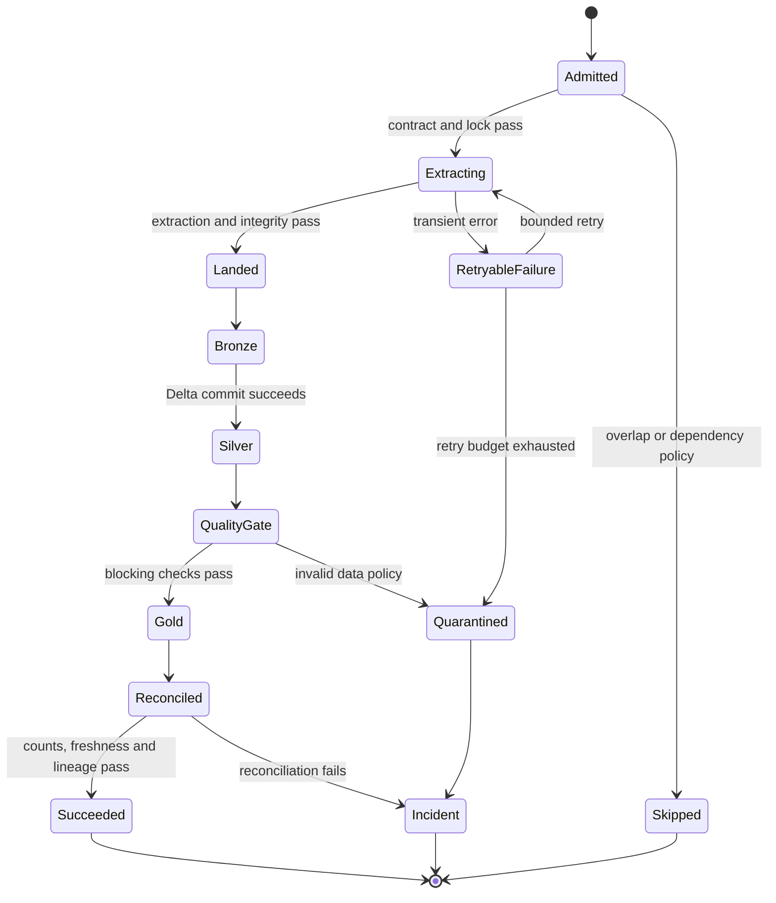
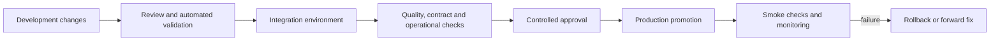

# Enterprise Retail Data Platform Architecture

**Status:** Approved architecture record  
**Document type:** Architecture and operating model  
**Implementation status:** Documentation only; no application, infrastructure, pipeline, notebook, test, or CI/CD code is defined here.  
**Authoritative source:** The architecture explicitly approved in this conversation.

## 1. Objectives

This platform is a production-grade Azure data engineering system used to demonstrate and practice:

- Batch ingestion from relational, NoSQL, API, and external-file sources.
- Watermark-based incremental extraction from PostgreSQL.
- Real database change data capture (CDC) from PostgreSQL WAL through Debezium and Kafka.
- Controlled Kafka replay of historical e-commerce events as a streaming workload. The replay is explicitly a simulation of a stream and is not represented as a live retailer feed.
- Distributed Spark processing using PySpark, Spark SQL, and Delta Lake.
- A medallion lakehouse with Landing, Bronze, Silver, and Gold layers.
- Production controls for idempotency, replay, restartability, schema evolution, data quality, observability, security, lineage, recovery, and controlled deployment.
- A defensible separation between public datasets, controlled source-system environments, and simulated supplier or streaming boundaries.

## 2. Scope

### In scope

The approved platform covers source registration, controlled source bootstrapping, batch and streaming ingestion, lakehouse processing, curated analytics, operational metadata, data quality, monitoring, alerting, recovery, security, governance, testing, and CI/CD promotion.

### Out of scope for this document

This document does not implement code or provision resources. It does not define application-level APIs, business-user dashboards, ML models, or a production business SLA beyond the platform control objectives described below.

## 3. Approved end-to-end architecture

The approved flow is:

1. Provision the Azure platform.
2. Register source contracts and metadata.
3. Bootstrap public datasets into controlled source boundaries.
4. Ingest batch sources to ADLS Gen2 Landing.
5. Ingest batch and streaming records to Delta Bronze.
6. Validate, deduplicate, and apply CDC in Silver.
7. Build Gold domain models and analytics.
8. Monitor, alert, recover, and support the platform.
9. Deploy through CI/CD and controlled environment promotion.


## 4. Source systems

The sources are public datasets or public APIs placed behind controlled source boundaries for this project. Their use does not claim that the original data owners delivered these records to this platform.

| Source | Controlled boundary and format | Processing mode | Purpose |
|---|---|---|---|
| H&M Personalized Fashion Recommendations | H&M CSV tables loaded into PostgreSQL: `customers`, `articles`, `transactions` and the selected supporting files | Historical batch, watermark incremental, and real PostgreSQL CDC | Relational operational source, joins, dimensions, facts, incremental extraction, and CDC |
| PostgreSQL WAL | PostgreSQL logical replication, Debezium PostgreSQL connector, Kafka topics | Streaming CDC | Real database changes generated in the controlled PostgreSQL source environment |
| Open Food Facts | MongoDB-compatible NoSQL source populated from the approved Open Food Facts dump or approved subset | Batch | Semi-structured document ingestion and NoSQL-to-lake processing |
| Open Food Facts Product API | Actual Product API endpoint | Batch API extraction | Pagination, rate-limit handling, retry, schema and API operational controls |
| Open Prices API | Actual Open Prices API endpoint with its required authentication and request controls | Batch API extraction | Authenticated API ingestion, incremental request strategy where supported, and operational recovery |
| REES46 seven monthly archives | Controlled Azure SFTP supplier boundary seeded from the historical monthly files | Batch file ingestion | Multi-file supplier delivery, file contracts, manifesting, quarantine, and large Spark workloads |
| Supplier-style files | Controlled SFTP boundary containing CSV, JSON, Parquet, and flat TXT/DAT files | Batch file ingestion | Heterogeneous external-file processing and contract enforcement |
| REES46 historical events | The same historical event data replayed through Kafka at a controlled rate | Streaming replay | Structured Streaming, lag, checkpoint, replay, ordering, and backpressure exercises |
| Amazon Reviews 2023 | Electronics review JSONL and related public Parquet representation | Batch file ingestion | Large distributed Spark processing and review/product analytics within defensible identifiers |

### Source identity and provenance rules

- Public datasets remain identifiable as public source data.
- PostgreSQL and the NoSQL database are controlled source-system environments created for the project.
- PostgreSQL CDC represents actual controlled inserts, updates, and deletes captured from WAL; it is not a historical claim about retailer CDC.
- Kafka replay represents controlled replay of historical events; it is not a live stream.
- SFTP represents a controlled supplier-boundary simulation seeded from public data; it is not a claim that a public supplier delivered the files over SFTP.
- Cross-domain joins are permitted only where a defensible business key exists. Otherwise, data remains in its own domain or is combined only through explicitly documented analytical relationships.

## 5. Ingestion architecture

### 5.1 Batch ingestion

Azure Data Factory (ADF) is the batch orchestration boundary. It coordinates source extraction, file movement, metadata registration, retries, and Databricks job invocation.

1. A schedule or controlled trigger starts a source-specific ADF pipeline.
2. The pipeline reads the source contract and the previous successful control state.
3. It extracts from PostgreSQL, the NoSQL source, APIs, or SFTP according to the source adapter.
4. The pipeline writes immutable source objects to ADLS Gen2 Landing using a source/run/arrival layout.
5. It records a manifest containing source name, object path, file size, checksum, arrival time, extraction window, schema version, and run identifier.
6. It invokes the Databricks Bronze task only after the Landing object and manifest are complete.
7. Successful objects are marked processed; failed or contract-invalid objects are quarantined without being silently deleted.

Batch ingestion is idempotent. A repeated trigger or retry must identify the same source object or extraction window and avoid creating a second logical copy in Bronze.

### 5.2 PostgreSQL historical and incremental ingestion

- The initial load establishes the historical baseline in Landing and Bronze.
- Subsequent incremental extracts use a persisted watermark/control record, such as a source commit timestamp plus a tie-breaker or another approved monotonic source field.
- The extraction predicate must handle equal timestamps, late updates, clock precision, and rows changed during the extraction window.
- The watermark advances only after extraction, manifest validation, Bronze commit, and the required quality gates succeed.
- The control record stores the requested window, actual high-water mark, row counts, checksums where applicable, and run status.
- Overlapping runs are prevented or explicitly serialized by the orchestrator. A retry reuses the same run identity and extraction window.

### 5.3 PostgreSQL CDC

PostgreSQL logical replication exposes actual WAL changes. Debezium reads the logical stream and publishes source-keyed events to Kafka. Spark Structured Streaming consumes those events and writes them to Delta Bronze with source metadata, operation type, transaction or event ordering metadata where available, and ingestion time.

CDC controls include:

- A replication slot lifecycle, WAL-retention monitoring, and alerts for connector stoppage or excessive lag.
- Snapshot and streaming handoff tracking so the initial snapshot is not confused with later changes.
- Per-topic partitioning and key selection that preserve ordering for a source primary key where required.
- Checkpointed consumption and replay from Kafka offsets after failure.
- Deduplication using a stable CDC event identity and deterministic ordering rules.
- Explicit handling for insert, update, delete, tombstone, schema change, poison event, large transaction, authentication, and connector restart scenarios.
- A controlled policy for resnapshot, slot recovery, and reconciliation when offsets, checkpoints, or source state are lost.

### 5.4 API ingestion

The Product API and Open Prices API are called as actual endpoints. The API adapter records request metadata and treats each response as an extraction unit.

The ingestion contract includes authentication or token handling, secret retrieval, pagination, request and connection timeouts, bounded exponential backoff with jitter for transient failures, 4xx and 5xx classification, rate-limit response handling, response-size limits, schema validation, duplicate-response handling, and restartable progress markers.

Partial API extraction is never marked complete. A failed page or token refresh leaves the run recoverable from its last durable progress point. Raw responses and request metadata are retained according to the approved retention policy so that a transformation failure can be replayed without re-calling the external API.

### 5.5 SFTP file ingestion

The SFTP boundary is a controlled supplier simulation. ADF detects or receives files, verifies readiness, and transfers them to ADLS Gen2 Landing.

File controls include atomic delivery conventions, file-size and zero-byte checks, checksum or content validation, extension-versus-content checks, manifest and duplicate-file detection, late-arriving file handling, schema contract selection, quarantine, retention, and replay. A file is considered complete only after the transfer and integrity checks succeed; a partially uploaded file must not enter Bronze.

CSV, JSON, Parquet, and TXT/DAT formats are parsed using format-specific contracts. Delimiter, encoding, quoting, header, record-length, and fixed-width rules are contract attributes rather than implicit parser defaults.

### 5.6 Kafka replay streaming

The REES46 historical files are replayed into Kafka at a controlled rate. The replay is a testable streaming workload with documented replay speed, topic, partitioning, event key, and run identity. It is not described as a live source.

Spark Structured Streaming consumes the topic using a durable checkpoint. The stream handles duplicates, out-of-order events, late events, backpressure, consumer lag, malformed events, poison records, Kafka outages, checkpoint recovery, restart, and controlled replay. Watermarks are used only where the processing logic requires state cleanup and where the event-time semantics are defined.

## 6. Landing layer

ADLS Gen2 Landing is the immutable source boundary. It stores the original extracted bytes or raw API responses together with operational metadata.

Recommended logical layout:

```text
landing/<source>/<entity>/arrival_date=YYYY-MM-DD/run_id=<run-id>/part...
```

Landing requirements:

- Immutable source objects and append-only run manifests.
- Source, entity, extraction mode, contract version, run identifier, arrival time, checksum, size, and schema fingerprint.
- Separate quarantine paths for incomplete, corrupt, malformed, unauthorized, or contract-invalid inputs.
- No silent overwrite of a source object; replacement requires a new run and explicit lineage.
- Retention and lifecycle rules are governed by the approved data-retention decision.

## 7. Bronze layer

Bronze is Delta Lake’s raw, replayable ingestion layer. It preserves source fidelity while adding technical metadata required for operations.

Each record or event carries, where applicable:

- Source and entity identifiers.
- Ingestion run, batch, file, Kafka topic, partition, and offset metadata.
- Source event time and ingestion time.
- Schema or contract version.
- CDC operation, transaction metadata, and event identity.
- Raw payload or source columns with minimal normalization.
- Quarantine reason or parse status for records not eligible for the valid Bronze path.

Bronze writes are idempotent using deterministic source identities and transactionally committed Delta operations. Checkpoints, commit versions, and run metadata make the layer restartable and auditable.

## 8. Silver layer

Silver produces validated, typed, deduplicated, and conformed data. It is the boundary at which source records become trusted for downstream domain processing.

Silver processing includes:

- Explicit data types, timestamp and timezone normalization, and controlled handling of nulls.
- Required-field, domain, uniqueness, referential, and range validation.
- Deterministic duplicate resolution and retention of rejected records with reasons.
- Schema evolution policy for additions, removals, renames, and data-type changes.
- CDC ordering, upsert, delete, tombstone, and reconciliation logic.
- Late-arriving and out-of-order event handling according to source event-time rules.
- Restartable Delta merges with run-level idempotency.
- Source-to-Silver record-count and control-total reconciliation.

Bad records are isolated and observable. A quality failure can stop promotion, route only invalid records to quarantine, or allow a documented partial-success path according to the entity’s contract.

## 9. Gold layer

Gold contains governed domain models and analytics-ready products. It does not invent cross-domain keys.

Examples of valid domain work include:

- H&M customers, articles, and transactions joined using their documented identifiers for customer, product, and transaction analysis.
- REES46 event unions and session, product, funnel, and time-window aggregates within the event domain.
- Amazon review and product metadata analysis where identifiers are actually compatible.
- Open Food Facts products joined to Open Prices records by a documented barcode or product code, preserving leading zeros and isolating unmatched records.
- Supplier-file products joined to an approved product mapping only when the controlled seed data establishes a defensible mapping.

Gold products include freshness, source coverage, quality status, and lineage metadata so consumers can distinguish a complete result from a partial or quarantined run.

## 10. Orchestration

ADF is the primary control-plane orchestrator for scheduled and event-driven batch pipelines. Databricks jobs or task graphs execute Spark and Delta processing steps invoked by ADF. Streaming jobs are independently restartable and are monitored by the same operational metadata and alerting model.

| Orchestration task | Responsibility | Failure behavior |
|---|---|---|
| Run admission | Check schedule, dependency, concurrency, source availability, and active-run locks | Skip or queue overlapping work according to the source policy |
| Contract resolution | Load source, schema, format, watermark, and quality configuration | Fail closed if the contract is missing or invalid |
| Source extraction | Read PostgreSQL, NoSQL, API, or SFTP input | Bounded retries; persist progress; quarantine unrecoverable input |
| Landing commit | Write immutable objects and manifest | Do not advance control state until integrity succeeds |
| Bronze invocation | Start the appropriate batch or stream task | Idempotent retry using the same run identity |
| Silver and Gold promotion | Run dependencies, quality gates, and Delta commits | Stop promotion on blocking quality or dependency failures |
| Reconciliation | Compare counts, keys, control totals, and CDC state | Raise incident and hold watermark when reconciliation fails |
| Completion | Write run, quality, freshness, and lineage outcome | Mark success only after all required gates pass |

The orchestrator persists run state rather than relying on in-memory task state. Every task has a correlation identifier and a deterministic retry policy. Manual reruns require a run or window selection so that operators do not accidentally reprocess an unbounded history.



## 11. Operational metadata and control plane

A metadata-driven control plane supports all source types and all layers. It stores, at minimum:

- Source and entity contracts, format, schema version, ownership, sensitivity, and retention.
- Run identifiers, parent-child task relationships, start/end times, status, retry count, and error classification.
- Batch watermarks, CDC offsets or LSN references, Kafka topic/partition/offset, streaming checkpoint identity, and replay run identity.
- File manifests, checksums, sizes, arrival and processing state, and quarantine reason.
- Input/output row counts, distinct-key counts, control totals, quality results, freshness, and reconciliation outcomes.
- Schema fingerprints and approved evolution history.
- Data lineage from source object or event through Bronze, Silver, and Gold.

Metadata is itself protected, monitored, and backed up according to the platform policy. Control state advances transactionally with the data milestone it represents.

## 12. Data quality

Quality checks are defined by source contract and entity criticality. They are applied at Landing, Bronze, Silver, and Gold as appropriate.

| Quality area | Examples |
|---|---|
| Completeness | File presence, non-zero size, required columns, expected extraction window |
| Validity | Type, range, enum, timestamp, encoding, delimiter, and JSON structure |
| Uniqueness | Source key, event identity, file identity, CDC event identity |
| Consistency | Referential relationships, currency/unit rules, cross-field constraints |
| Accuracy proxies | Control totals, count reconciliation, checksum, source-versus-target comparisons |
| Timeliness | Batch freshness, API completion, Kafka lag, CDC lag, watermark age |
| Schema | Contract fingerprint, compatible additions, blocked breaking changes |
| Distribution | Volume thresholds, null-rate changes, outlier and skew indicators |

Checks produce durable results with rule version, observed value, threshold, status, and affected run or partition. Critical failures block downstream promotion; noncritical failures are visible and require an explicit policy.

## 13. Error handling and failure containment

The platform classifies failures as transient, data, contract, security, dependency, capacity, or operator errors. Each class has a bounded retry or containment action.

| Failure scenario | Prevent or detect | Contain and recover |
|---|---|---|
| Duplicate file or event | Manifest identity, checksum, source event key | Idempotent Bronze write and duplicate quarantine |
| Partial or zero-byte file | Ready marker, size and checksum validation | Keep out of Bronze; request/retry delivery |
| Corrupt or malformed data | Parser and schema validation | Quarantine with record/file reason and preserve raw input |
| Breaking schema change | Contract fingerprint and compatibility policy | Stop affected entity; alert owner; retain source for replay |
| Late or out-of-order event | Event-time metadata, watermark and lateness metrics | Allowed lateness policy, deterministic deduplication and correction path |
| API rate limit or outage | Status classification, timeout and rate metrics | Backoff with jitter, resume from page marker, alert on SLA breach |
| Kafka outage or consumer lag | Broker/consumer metrics and lag thresholds | Backpressure, retry, checkpointed restart and replay |
| Debezium or replication-slot failure | Connector health, LSN and WAL growth alerts | Pause downstream advancement; repair connector or resnapshot under runbook |
| Checkpoint loss or corruption | Checkpoint health and state consistency | Stop stream, preserve offsets, follow approved replay/recovery procedure |
| Spark executor/driver failure | Job outcome, cluster metrics, retryable error classification | Retry idempotently; isolate skew, OOM or shuffle issue for remediation |
| Data skew or small files | Distribution, file-count, task-duration metrics | Repartition, compaction, targeted mitigation, and documented rerun |
| Concurrent or overlapping runs | Run locks and control-table state | Queue, skip, or cancel according to source policy |
| Downstream partial completion | Transactional Delta commits and run dependency state | Resume from last committed layer; do not advance upstream watermark prematurely |
| Credential or permission failure | Secret and access telemetry | Fail closed, rotate or repair permission, then retry from durable state |

No retry may bypass validation or mutate the source to hide an error. Poison records and security failures are isolated and visible to operators.

## 14. Security

- Use managed identities wherever supported; use service principals only where a managed identity is not appropriate.
- Store API keys, database credentials, Kafka credentials, SFTP keys, and tokens in Azure Key Vault. Secrets never appear in code, notebooks, logs, or metadata values.
- Apply least privilege separately to orchestration, ingestion, transformation, administration, and consumption identities.
- Use Unity Catalog permissions for catalogs, schemas, tables, volumes, external locations, and lineage.
- Protect ADLS with identity-based access, private or restricted endpoints where approved, and separate write/read roles by layer.
- Rotate credentials and keys, monitor access, and audit secret retrieval and data access.
- Classify potentially sensitive fields, including customer attributes and free-text reviews, and apply masking or restricted access where required.
- Treat raw Landing and Bronze as more restricted than curated Gold. Quarantine data inherits source sensitivity.

## 15. Governance

Unity Catalog is the governance boundary for the lakehouse. Governance includes:

- Catalog, schema, table, volume, external-location, and storage-credential ownership.
- Data classification, business and technical descriptions, source provenance, and retention.
- Column-level and object-level permissions appropriate to the data sensitivity.
- End-to-end lineage from Landing and streaming source metadata through Gold.
- Schema-change approval and contract versioning.
- Audit logs for access, grants, writes, job execution, and administrative changes.
- Documented ownership, escalation contacts, and runbook links for every critical data product.

## 16. Monitoring and observability

Azure Monitor and platform-native logs collect control-plane, source, streaming, Spark, Delta, and security telemetry. Monitoring is organized around SLIs rather than only job success.

Core signals include:

- Batch success rate, duration, retry count, freshness, watermark age, throughput, and volume deviation.
- File arrival delay, duplicate count, quarantine count, and checksum failures.
- API request rate, error class, page progress, token failures, and rate-limit events.
- Kafka consumer lag, throughput, partition skew, connector state, and WAL/LSN growth.
- Spark task duration, shuffle read/write, spill, skew, executor loss, OOM, driver failure, and cluster utilization.
- Delta commit failures, small-file count, table growth, checkpoint health, and compaction status.
- Silver/Gold quality failures, reconciliation variance, and downstream freshness.
- Authentication, authorization, secret access, and unusual data-access activity.

Alerts are severity-based and actionable. Every alert includes source/entity, environment, run or stream identifier, observed condition, first failure time, likely failure class, and runbook link. Alert fatigue is controlled by deduplication, suppression during planned maintenance, and escalation for persistent failures.

## 17. CI/CD and controlled promotion

CI/CD is part of the approved architecture. It promotes versioned notebooks, jobs, pipeline definitions, configuration, tests, and documentation through controlled environments. This document intentionally does not implement workflows.

Required controls:

- Pull-request review and protected branches.
- Static validation, unit tests, data-contract checks, and deployment validation before promotion.
- Environment-specific configuration supplied securely at deployment time.
- Separate deployment identities with least privilege.
- Immutable version or commit identification in deployed jobs.
- Approval gates for higher environments and a documented rollback or forward-fix procedure.
- Post-deployment smoke checks and evidence captured in the operational metadata.



## 18. Infrastructure

The platform infrastructure consists of the approved Azure service boundaries needed for the flow:

- ADLS Gen2 for Landing and Delta lakehouse storage.
- Azure Data Factory for batch orchestration and source-to-Landing movement.
- Azure Databricks for Spark, PySpark, Spark SQL, Delta Lake, streaming, jobs, and governed lakehouse processing.
- PostgreSQL as the controlled relational source and CDC origin.
- A MongoDB-compatible NoSQL source populated from the approved Open Food Facts source pattern.
- Azure SFTP supplier boundary for external-file simulation.
- Kafka and Debezium for PostgreSQL CDC and controlled event replay.
- Azure Key Vault for secrets.
- Unity Catalog for lakehouse governance and lineage.
- Azure Monitor and associated logs, metrics, and alerting.

Resource names, SKUs, exact cluster sizes, autoscaling bounds, retention durations, and cost limits are environment configuration and are not silently fixed by this document.

## 19. Environments

The intended promotion model is Development, Integration/QA, and Production-like. The Production-like environment demonstrates production controls even when operated for a limited project period.

Environment isolation covers storage paths, catalogs/schemas, secrets, service identities, Kafka topics, checkpoints, control metadata, and alert routing. A stream checkpoint must never be reused across incompatible environments or deployments.

Dataset bootstrapping and replay runs are explicitly labeled by environment and run identity. Public data is not confused with production customer data.

## 20. Networking

Network design follows the approved Azure service capabilities and least-privilege intent:

- Restrict storage, databases, secrets, orchestration, and Databricks access to approved network paths.
- Prefer private endpoints or controlled egress where supported and feasible.
- Restrict SFTP ingress to the controlled supplier boundary and approved identities.
- Permit API egress only to the documented Open Food Facts and Open Prices endpoints as required.
- Protect Kafka and Debezium connections with authentication, encryption, and network restrictions.
- Log network and authorization failures for operational diagnosis.

Exact virtual-network topology, firewall rules, DNS, private-link configuration, and cross-region routing remain deployment-specific unless separately approved.

## 21. Disaster recovery

Recovery is based on immutable Landing data, replayable Kafka offsets where retained, Delta transaction history, checkpoints, metadata, and documented runbooks.

Recovery objectives and controls include:

- Re-run a failed batch from the same Landing object without re-extracting the external source.
- Rebuild Bronze, Silver, or Gold from a known source run or Delta version.
- Resume a stream from its checkpoint or replay a bounded Kafka range after approved checkpoint recovery.
- Reconcile PostgreSQL incremental watermarks and CDC offsets before resuming advancement.
- Detect replication-slot or WAL-retention risk before source recovery becomes impossible.
- Restore control metadata and re-establish secrets, identities, permissions, and alerts before data promotion.
- Validate completeness, freshness, lineage, and quality after recovery.

Cross-region replication, formal RPO/RTO values, backup frequency, and a second-region failover deployment are intentionally deferred until the target Azure region, budget, and availability requirements are explicitly approved.

## 22. Testing

Testing is required at multiple levels:

- Unit tests for parsing, transformations, CDC ordering, deduplication, watermark calculation, and error classification.
- Contract tests for schemas, file formats, API responses, and source identifiers.
- Integration tests for ADF-to-ADLS, database extraction, SFTP delivery, Kafka/Debezium, Databricks, Delta, Unity Catalog, and Key Vault boundaries.
- Data-quality tests for completeness, validity, uniqueness, consistency, timeliness, and reconciliation.
- Streaming tests for restart, checkpoint recovery, duplicate events, late events, out-of-order events, backpressure, poison messages, and lag.
- Spark tests for skew, small files, shuffle pressure, executor loss, driver failure, and idempotent rerun.
- Security tests for least privilege, secret redaction, unauthorized access, and audit evidence.
- Failure-injection exercises for source outage, API throttling, malformed files, connector failure, partial writes, concurrent runs, and downstream outage.
- Deployment smoke tests and rollback/forward-fix validation.

## 23. Operational procedures

### Daily operation

Operators review batch freshness, active runs, failures, quarantine, CDC/WAL health, Kafka lag, stream checkpoints, Spark resource signals, quality results, and Gold product freshness.

### New source or contract version

Register the source contract, owner, schema, security classification, quality rules, retention, schedule, and recovery behavior before enabling extraction. Test the new version in a non-production environment and promote it through CI/CD.

### Failed batch

Identify the run and failure class from metadata, inspect the correlated logs, determine whether the failure is transient or data-related, and rerun the bounded run or source window. Do not advance the watermark until all required gates pass.

### Failed stream or CDC connector

Check connector status, offsets/LSN, WAL growth, Kafka lag, checkpoint health, and source availability. Pause downstream promotion if the state is uncertain. Recover from a checkpoint or perform an approved bounded replay/resnapshot and reconcile before marking the stream healthy.

### Quarantined data

Review the source object, rule version, and rejection reason. Correct the source or contract through controlled change, then replay the retained raw input. Never silently edit the raw record to make it pass.

### Backfill or reprocessing

Create a unique backfill run with explicit source window, target layers, expected impact, and concurrency policy. Keep normal processing isolated or coordinate it through the control plane. Reconcile outputs and communicate any freshness or duplicate-risk impact.

### Cost and capacity

Monitor storage growth, API usage, cluster runtime, Kafka throughput, database load, and log volume. Stop or scale workloads only through an approved operational action. Cost alerts are advisory controls and do not replace resource shutdown procedures.

## 24. Approved decisions

The following are approved and must not be changed without explicit architecture review:

1. Azure is the cloud platform.
2. Azure Databricks, Spark, PySpark, Spark SQL, Delta Lake, and medallion layers are core processing choices.
3. PostgreSQL is the relational operational source for H&M data, including historical, watermark incremental, and WAL/Debezium CDC paths.
4. Kafka and Debezium are used for real PostgreSQL CDC and controlled historical event replay.
5. ADF and ADLS Gen2 are used for batch orchestration and Landing.
6. SFTP is a controlled Azure supplier-boundary simulation for CSV, JSON, Parquet, and TXT/DAT files, including the REES46 monthly archives.
7. Open Food Facts Product API and Open Prices API are consumed as actual API endpoints.
8. The Open Food Facts document source is represented by a NoSQL source boundary; its exact managed service remains deferred because the approved architecture did not establish a final service choice.
9. Bronze, Silver, and Gold remain separate responsibilities with replayable raw data, validated/conformed data, and governed analytical products.
10. Production-grade metadata, quality, security, monitoring, recovery, and controlled deployment are required across every path.

## 25. Assumptions

- Azure subscription capacity, regional service availability, quota, and connector availability will be verified before provisioning.
- Public dataset licenses and API terms permit the planned educational/research use and attribution; the operator remains responsible for confirming current terms.
- The controlled PostgreSQL and NoSQL environments can be populated without representing them as the original public providers.
- A defensible key is available before any cross-domain Gold join is enabled.
- Source owners, quality thresholds, retention, and escalation contacts will be assigned during implementation.
- The project may run for a limited demonstration period, but its controls are designed as production patterns.

## 26. Intentionally deferred items

These items were not established as final architectural choices and must not be silently decided in implementation:

- Exact managed MongoDB-compatible service, SKU, import path, and capacity strategy for the Open Food Facts document source.
- Exact Kafka hosting topology, broker sizing, retention, and network placement.
- Exact Azure region, paired region, private-network topology, firewall rules, DNS, and cross-region design.
- Exact Databricks runtime, cluster policy, node types, autoscaling bounds, serverless use, and cost guardrails.
- Exact catalog/schema names, table names, storage paths, retention periods, and partitioning values.
- Formal SLA, SLO, RPO, RTO, and alert threshold values for each source and Gold product.
- Exact CI/CD provider, repository branching policy, environment approval identities, and deployment mechanism.
- Cross-region disaster-recovery implementation and failover automation.
- Final business definitions for Gold metrics and any joins not supported by a documented source identifier.

## 27. Architecture change control

This document is the approved baseline. A proposed change must identify the affected source, layer, control, failure mode, security or cost consequence, migration/recovery impact, and test evidence. No existing approved component or processing mode may be replaced, simplified, or reinterpreted without explicit review and approval.

## 28. Production-readiness gap analysis

This section records the production-readiness review performed against the approved architecture. It does not replace, remove, or simplify any approved component. It identifies the controls that must be implemented and tested before a component can be considered production-ready.

The scenario labels are used consistently throughout this section:

- **Happy path:** expected successful processing.
- **Transient failure:** a failure that may succeed after bounded retry or waiting.
- **Permanent failure:** a condition that cannot be fixed by retry alone.
- **Data failure:** invalid, incomplete, duplicate, corrupt, late, or unexpected data.
- **Dependency failure:** an unavailable or degraded service, connector, network, or external provider.
- **Security failure:** an authentication, authorization, secret, privacy, or audit failure.
- **Capacity failure:** quota, storage, memory, CPU, disk, throughput, or rate-limit exhaustion.
- **Concurrency failure:** overlapping runs, duplicate delivery, race conditions, or conflicting state changes.
- **Recovery path:** how normal processing resumes after failure.
- **Replay path:** how retained source data or offsets are processed again deterministically.
- **Backfill path:** how a bounded historical range is processed while normal operations continue.
- **Disaster-recovery scenario:** loss of a service, region, checkpoint, metadata store, or deployment state.

The designs below are implementation-level proposals. They are not additional approved architectural decisions until explicitly accepted through the change-control process.

### 28.1 Source boundaries and ingestion paths

#### 28.1.1 Dataset bootstrap and provenance boundary

- **Happy path:** Each public dataset is downloaded or obtained through its documented endpoint, checksum-recorded, attributed, and loaded only into its explicitly controlled PostgreSQL, NoSQL, SFTP, ADLS, or Kafka boundary.
- **Transient failure:** A download, decompression, or source upload times out; retry with bounded backoff and retain the last verified partial state outside the consumable path.
- **Permanent failure:** A source URL is unavailable, the license disallows the planned use, or the file cannot be verified; stop bootstrap and mark the source unavailable rather than substituting an unapproved dataset.
- **Data failure:** The file is truncated, corrupt, unexpectedly structured, or has a changed row/column profile; quarantine it and preserve the source evidence and checksum.
- **Dependency failure:** Public hosting, local staging, database, storage, or transfer service is unavailable; record the dependency outage and do not claim the dataset is loaded.
- **Security failure:** An unsigned or unexpected download, exposed credential, or unauthorized source write is detected; fail closed, rotate credentials, and audit the incident.
- **Capacity failure:** Local disk, ADLS capacity, database storage, decompression memory, or transfer bandwidth is insufficient; stop before partial source publication and raise a capacity incident.
- **Concurrency failure:** Two bootstrap runs publish the same source version or seed the same controlled boundary simultaneously; use a source-version lock and immutable run identifier.
- **Recovery path:** Resume from the last verified source object or restart the bounded bootstrap run; publish only after checksum, size, and manifest validation.
- **Replay path:** Re-read the immutable staged source version and re-seed a new run without downloading the public source again.
- **Backfill path:** Register a historical source version as a separate bootstrap run and maintain lineage to the original public URL and checksum.
- **Disaster-recovery scenario:** Loss of the staging area or source boundary is recovered from retained immutable Landing copies and the recorded source manifest; re-bootstrap only when the retained copy is unavailable.

**Gap and implementation design:** A bootstrap manifest must be created before publication with source URL, dataset version, retrieval timestamp, license/attribution reference, byte size, checksum, decompressed size if known, target boundary, and run identifier. A source version is immutable after publication.

#### 28.1.2 H&M PostgreSQL historical batch

- **Happy path:** The approved H&M tables are loaded into PostgreSQL, extracted consistently to Landing, and reconciled by table and run counts before Bronze processing.
- **Transient failure:** A database connection resets or a query times out; retry the same bounded extraction under a fixed run identity without advancing control state.
- **Permanent failure:** A table is missing, credentials are invalid after rotation, or the source schema is incompatible; fail the table run and require a contract or access correction.
- **Data failure:** Duplicate keys, invalid dates, null required identifiers, or inconsistent relationships are detected; quarantine affected records and block the relevant Silver promotion according to severity.
- **Dependency failure:** PostgreSQL, ADLS, ADF, or the network is unavailable; keep the run in a recoverable state and prevent a false successful watermark.
- **Security failure:** The extraction identity lacks only the required permissions or a credential is exposed; fail closed, audit, and repair access through Key Vault and RBAC.
- **Capacity failure:** PostgreSQL experiences lock pressure, connection exhaustion, storage pressure, or an extraction exceeds the query/cluster budget; use bounded reads, throttling, and operational escalation.
- **Concurrency failure:** Two initial loads or a historical load and incremental load overlap; use an entity-level load lock and prohibit incremental advancement until baseline completion.
- **Recovery path:** Restart the failed table or run from the same source window and compare the new manifest and counts with the previous attempt.
- **Replay path:** Reprocess the immutable Landing objects into Bronze without rereading PostgreSQL.
- **Backfill path:** Create a named historical window and target table list; isolate it from the normal watermark and reconcile its output separately.
- **Disaster-recovery scenario:** If PostgreSQL is lost, restore the controlled source from its approved backup or reseed it from the retained public source; rebuild downstream data from Landing where possible.

**Gap and implementation design:** Use an initial-load control record with `source_entity`, `source_snapshot_id`, `run_id`, extraction consistency marker, row count, checksum/control totals, and completion state. Do not permit incremental or CDC promotion while the baseline state is incomplete.

#### 28.1.3 PostgreSQL watermark incremental extraction

- **Happy path:** Each table is extracted using a persisted high-water mark and a deterministic tie-breaker, then the watermark advances only after Landing, Bronze, and required quality gates succeed.
- **Transient failure:** The query or network fails during extraction; retry the same window and do not create a new logical window.
- **Permanent failure:** The selected watermark column is removed, becomes non-monotonic, or is no longer populated; stop the entity and require a contract revision.
- **Data failure:** Equal timestamps, late updates, clock skew, null watermarks, or updates outside the expected window cause missed or repeated rows; use overlap extraction and deterministic deduplication.
- **Dependency failure:** PostgreSQL, ADF, ADLS, or the metadata store is unavailable; leave the previous watermark active and alert on freshness.
- **Security failure:** The extractor can write to source tables or read unauthorized columns; reduce privileges and verify audit logs before resuming.
- **Capacity failure:** The extraction window is too large or creates source lock/load pressure; split the window, use keyset pagination, and apply source-friendly isolation.
- **Concurrency failure:** Two incremental runs read and update the same watermark; acquire an entity lock and use compare-and-set semantics on the control record.
- **Recovery path:** Re-run from the last committed watermark with an overlap interval and deduplicate by source key plus source change metadata.
- **Replay path:** Reprocess the Landing window or use a recorded extraction query/window; never depend on the current source state for a historical replay.
- **Backfill path:** Run a separate bounded backfill watermark range with its own run identity and do not modify the normal watermark until reconciliation completes.
- **Disaster-recovery scenario:** Restore the last committed watermark/control record and rebuild the affected interval from Landing or a source snapshot before resuming.

**Gap and implementation design:** Select and record a per-table `(watermark_column, tie_breaker_column, overlap_duration, extraction_isolation, null_policy)` contract. Advance state through `started -> landed -> bronze_committed -> quality_passed -> advanced`; only the final state may update the active high-water mark.

#### 28.1.4 PostgreSQL WAL, Debezium, and Kafka CDC path

- **Happy path:** PostgreSQL emits WAL changes, Debezium publishes keyed events, Kafka retains them, Spark consumes them with a checkpoint, and Silver applies ordered upserts/deletes.
- **Transient failure:** A connector, broker, database connection, or Spark micro-batch fails; retry or restart from the last durable offset/checkpoint without acknowledging uncommitted work.
- **Permanent failure:** The replication slot is invalidated, required logical-decoding privileges are removed, or an incompatible connector/schema prevents decoding; stop downstream CDC and initiate the approved resnapshot/reconciliation procedure.
- **Data failure:** Duplicate events, tombstones, schema changes, large transactions, missing keys, or out-of-order records occur; preserve raw events, classify them, and apply deterministic Silver rules.
- **Dependency failure:** PostgreSQL, Debezium, Kafka, Databricks, checkpoint storage, or metadata storage is unavailable; hold downstream advancement and monitor the lag/WAL budget.
- **Security failure:** Connector credentials, Kafka ACLs, TLS, or database replication permissions fail; fail closed, rotate secrets, and verify no sensitive payload was logged.
- **Capacity failure:** WAL grows, Kafka retention is exhausted, partitions are skewed, connector queues fill, or Spark state exceeds memory; alert before the recovery point is lost and throttle or scale within approved limits.
- **Concurrency failure:** Snapshot and streaming handoff overlap, two connectors use the same slot/topic, or two Silver consumers mutate the same table; enforce one authoritative connector and stream per source entity/environment.
- **Recovery path:** Inspect source LSN, connector offsets, Kafka offsets, checkpoint, and Silver commit version; resume from the last consistent boundary and reconcile counts and keys.
- **Replay path:** Replay a bounded Kafka offset/LSN range or retained Bronze CDC events into an isolated target run, then merge only after duplicate and ordering checks pass.
- **Backfill path:** Use a source snapshot or bounded CDC replay into a separate backfill table/version; reconcile with the live state before promotion.
- **Disaster-recovery scenario:** Restore connector configuration, Kafka data/offsets where retained, checkpoints, and control metadata; if the replay point is lost, perform the approved resnapshot and key-level reconciliation.

**Gap and implementation design:** Define a CDC identity containing connector/source, table, primary key, transaction/LSN metadata, and Kafka topic/partition/offset. Persist connector health, slot LSN, source LSN, Kafka offsets, checkpoint version, and Silver commit version. A resnapshot is permitted only after an explicit gap assessment and reconciliation record.

#### 28.1.5 Open Food Facts NoSQL batch source

- **Happy path:** The approved Open Food Facts source boundary is populated, a connector or export reads documents in bounded pages, and raw documents land with source identity and extraction metadata.
- **Transient failure:** A cursor, connection, import, or page read times out; retry the same page/range using a resumable cursor or deterministic document key.
- **Permanent failure:** The selected managed service cannot import the approved dump, lacks required MongoDB behavior, or cannot meet capacity; stop and raise the deferred service decision rather than silently changing the source.
- **Data failure:** Documents contain malformed JSON, inconsistent nested structures, duplicate product codes, missing barcodes, or unexpected arrays; preserve raw documents and route invalid records to quarantine.
- **Dependency failure:** NoSQL service, connector, storage, network, or source import job is unavailable; do not mark the batch complete and retain the last successful page marker.
- **Security failure:** Public network access, weak credentials, overbroad database roles, or unmasked document fields are detected; restrict access and rotate credentials before retry.
- **Capacity failure:** Dataset expansion after decompression exceeds storage, document limits, RU/throughput, import rate, or Spark driver memory; use streaming/batched export and verify capacity before full publication.
- **Concurrency failure:** Two imports mutate the same collection or two extractors reuse a cursor; use collection/run locks and separate staging collections or snapshots.
- **Recovery path:** Restart from the last durable page/document marker and reconcile document counts and key coverage.
- **Replay path:** Re-read retained raw documents from Landing into Bronze; avoid repeated reads from the NoSQL service for transformation retries.
- **Backfill path:** Extract a bounded document key or source-version range into an isolated run and merge only after duplicate/key reconciliation.
- **Disaster-recovery scenario:** Restore the source boundary from an approved backup or reseed it from the immutable Landing dump; rebuild downstream documents from Landing where possible.

**Gap and implementation design:** Before implementation, run a capacity and compatibility proof for the selected managed service using the decompressed size, document count, nested-document distribution, import method, and Spark connector. Store the chosen service and limits as an explicit decision; keep the adapter contract service-neutral until then.

#### 28.1.6 Open Food Facts Product API

- **Happy path:** Product identifiers are selected from an approved input set, pages are fetched, raw responses are retained, and validated products land with request metadata.
- **Transient failure:** DNS, connection, timeout, 429, or 5xx occurs; apply bounded exponential backoff with jitter and respect retry-after information.
- **Permanent failure:** A product is consistently 404/invalid, the endpoint contract is incompatible, or access is revoked; classify the item and complete only according to the partial-result policy.
- **Data failure:** Response schema changes, duplicate responses, invalid JSON, missing product code, or leading-zero loss occurs; reject the response or field and preserve the raw payload.
- **Dependency failure:** API, DNS, Key Vault, ADF, ADLS, or metadata store is unavailable; pause page progression and preserve the last successful cursor.
- **Security failure:** Token/credential failure, secret exposure, unexpected certificate, or an unauthorized endpoint is detected; fail closed and rotate/validate credentials.
- **Capacity failure:** API rate limits, response-size limits, local staging, or downstream write throughput are exceeded; throttle and checkpoint at page/item granularity.
- **Concurrency failure:** Multiple runs request the same products or update the same page marker; use a request-key registry and compare-and-set progress state.
- **Recovery path:** Resume from the last committed page/item, deduplicate by product code plus response version, and reconcile requested versus returned identifiers.
- **Replay path:** Reprocess retained raw API responses without making external requests again.
- **Backfill path:** Run a bounded product-code list or source-version list with a separate request batch and lineage.
- **Disaster-recovery scenario:** Reconstruct API-derived Bronze from retained responses; only re-call the API when retention is unavailable and current terms/rate limits permit it.

**Gap and implementation design:** Use an API request ledger keyed by endpoint, request parameters, page/cursor, run, response checksum, status, and retry count. Preserve barcode strings exactly, including leading zeros.

#### 28.1.7 Open Prices API

- **Happy path:** Authentication succeeds, pages or query windows are retrieved, responses are retained, and prices are validated against product/location/time fields.
- **Transient failure:** Token refresh, rate limit, timeout, or 5xx occurs; retry with jitter and resume from the last committed page/window.
- **Permanent failure:** Credentials are revoked, an endpoint/version is retired, or a response cannot meet the contract; stop the affected extraction and record the permanent reason.
- **Data failure:** Duplicate prices, malformed coordinates, invalid currency/value, missing barcode, or inconsistent timestamps occur; quarantine or reject by rule while retaining raw response.
- **Dependency failure:** API, authentication service, Key Vault, network, ADLS, or metadata store fails; preserve request progress and do not claim a complete window.
- **Security failure:** Authentication material is exposed, scopes are excessive, or the endpoint certificate/host is unexpected; fail closed and audit.
- **Capacity failure:** API quotas, response volume, staging storage, or downstream processing capacity is exhausted; window requests and throttle according to the contract.
- **Concurrency failure:** Overlapping windows create duplicate prices or two token refreshes invalidate one another; lock the request window and use a shared token state policy.
- **Recovery path:** Resume from a durable page/window marker and reconcile requested records, response counts, and duplicate keys.
- **Replay path:** Replay retained raw responses into Bronze and Silver without re-consuming the API.
- **Backfill path:** Process a bounded date/location/product window with an isolated run and explicit downstream correction policy.
- **Disaster-recovery scenario:** Restore request ledger and raw responses; re-call only missing windows after validating current API terms and rate limits.

**Gap and implementation design:** Record endpoint version, authentication method, scope, page/window parameters, response checksum, rate-limit headers, and source event time. Define which API fields are authoritative when a product or price changes between requests.

#### 28.1.8 Azure SFTP supplier boundary

- **Happy path:** A supplier-style file is delivered completely, readiness is verified, ADF transfers it to Landing, and the manifest marks it accepted exactly once.
- **Transient failure:** Transfer interruption, temporary authentication failure, or network reset occurs; retry the transfer using a temporary destination and resume/restart safely.
- **Permanent failure:** File format, key, checksum, or supplier identity is invalid; quarantine the file and keep it out of Bronze until a corrected delivery is received.
- **Data failure:** Zero-byte, partial, duplicate, malformed, wrong-encoding, wrong-delimiter, fixed-width, or unexpected-extension files are quarantined with a reason.
- **Dependency failure:** SFTP endpoint, ADF, ADLS, DNS, network, or Key Vault is unavailable; retain the source file and alert on arrival SLA breach.
- **Security failure:** Host-key mismatch, weak key, unauthorized source path, leaked private key, or overbroad write/read access occurs; fail closed and rotate/revoke access.
- **Capacity failure:** Concurrent file deliveries, transfer bandwidth, Landing storage, or ADF integration runtime capacity is exhausted; throttle and preserve file order where required.
- **Concurrency failure:** ADF reads a file while it is still uploading or two runs process the same name; require atomic rename/ready marker and manifest-level idempotency.
- **Recovery path:** Re-check readiness and checksum, then retry to a new immutable Landing run; never overwrite an accepted object.
- **Replay path:** Reprocess the immutable Landing file and manifest without rereading SFTP.
- **Backfill path:** Deliver historical files under a distinct supplier batch/run namespace and process them with explicit target dates.
- **Disaster-recovery scenario:** Restore the file and manifest from ADLS; if SFTP state is lost, use retained Landing rather than requesting a duplicate delivery.

**Gap and implementation design:** Require an atomic supplier delivery pattern (`temporary name -> checksum/manifest -> atomic rename` or an equivalent ready marker). Store host key, source path, supplier identity, file checksum, and accepted/processed/quarantined state.

#### 28.1.9 REES46 SFTP batch archives

- **Happy path:** The seven monthly archives arrive as separate immutable files, are validated, and are processed with month/source lineage.
- **Transient failure:** One monthly transfer or decompression fails; retry only that month and leave successful months immutable and marked complete.
- **Permanent failure:** A month is unavailable, corrupted, or licensed incorrectly; record the missing month and block any Gold claim that requires full period coverage.
- **Data failure:** Delimiter, column, event-time, product, user, or event-type drift is detected; quarantine the affected month/file and preserve raw bytes.
- **Dependency failure:** SFTP, ADLS, ADF, Spark, or decompression capacity is unavailable; maintain per-month state and avoid reprocessing completed months.
- **Security failure:** Supplier boundary or storage access is unauthorized; fail closed and do not expose raw events in diagnostics.
- **Capacity failure:** Large files, decompression, shuffle, storage, or cluster capacity is insufficient; process by month/file and use bounded Spark partitions.
- **Concurrency failure:** Multiple months or replay jobs write the same Landing/Bronze target or compact the same table; partition work by source month and use table/run locks.
- **Recovery path:** Restart the failed month from its Landing manifest and reconcile per-month counts before unioning the dataset.
- **Replay path:** Re-run any month from immutable Landing into an isolated Bronze version or replay topic.
- **Backfill path:** Add a historical month as a bounded source run, then refresh only affected Silver/Gold partitions.
- **Disaster-recovery scenario:** Rebuild the full period from retained monthly Landing objects; if a month is lost, report incomplete coverage rather than fabricating it.

**Gap and implementation design:** Treat each monthly archive as an independent file contract and run unit. The manifest must include source month, compressed/uncompressed size, checksum, schema fingerprint, row count after parse, and coverage status.

#### 28.1.10 Amazon Reviews 2023 batch files

- **Happy path:** Electronics review JSONL and compatible metadata are staged, parsed with explicit schemas, and processed in distributed Spark batches.
- **Transient failure:** Download, decompression, read, or Spark task fails; retry the bounded file/partition and preserve the source manifest.
- **Permanent failure:** The representation is inaccessible, licensing terms are incompatible, or identifiers cannot be reconciled; stop the affected product model and document the limitation.
- **Data failure:** Malformed JSONL, schema drift, duplicate reviews, invalid ratings, missing identifiers, or inconsistent timestamps are quarantined or rule-filtered.
- **Dependency failure:** Source hosting, ADLS, Databricks, storage, or metadata services fail; resume from Landing rather than re-reading the public source.
- **Security failure:** Raw review text or identifiers are exposed to unauthorized consumers; restrict Bronze/raw text and audit access.
- **Capacity failure:** File size, skewed products, shuffle, executor memory, or small-file output exceeds limits; tune partitions, isolate skew, and compact output.
- **Concurrency failure:** Review and metadata loads publish incompatible versions or two jobs rewrite the same product partition; use versioned runs and target locks.
- **Recovery path:** Restart from immutable Landing and rerun only failed input partitions with deterministic output paths/keys.
- **Replay path:** Rebuild Bronze/Silver from retained JSONL/Parquet without downloading again.
- **Backfill path:** Process a product/category/time slice and refresh impacted Gold partitions with lineage to the backfill run.
- **Disaster-recovery scenario:** Restore source files and manifests from ADLS and rebuild derived tables; retained raw text remains the recovery source.

**Gap and implementation design:** Maintain separate review and metadata contracts, record the representation/version and identifier mapping, and require a join-quality report before any review/product Gold product is published.

#### 28.1.11 REES46 Kafka replay stream

- **Happy path:** A replay controller reads an approved historical file range, publishes keyed events at the configured rate, and records replay run identity and source offsets.
- **Transient failure:** Producer, broker, network, or consumer interruption occurs; resume from the last published source position or restart idempotently using event identity.
- **Permanent failure:** Historical input cannot be parsed, topic configuration is incompatible, or the replay identity cannot be made deterministic; stop the replay and preserve the failed run.
- **Data failure:** Duplicate events, malformed records, invalid event time, and out-of-order events occur; preserve raw event and route invalid messages to an observable dead-letter path.
- **Dependency failure:** Kafka, replay storage, Databricks, checkpoint storage, or metadata store is unavailable; pause publishing or consumption without silently skipping source ranges.
- **Security failure:** Producer/consumer ACL, TLS, secret, or topic authorization failure occurs; fail closed and rotate credentials through Key Vault.
- **Capacity failure:** Producer rate exceeds brokers/consumers, partitions skew, retention is insufficient, or Spark state grows; apply backpressure, rate limits, and lag alerts.
- **Concurrency failure:** Two replay controllers publish the same run or two stream jobs use one checkpoint; enforce replay and checkpoint locks.
- **Recovery path:** Identify the last source position, broker offset, checkpoint, and Bronze commit; resume from the consistent boundary and deduplicate.
- **Replay path:** Start a new replay run from a bounded historical file range with a distinct replay identifier and topic/consumer-group policy.
- **Backfill path:** Replay a bounded event-time range into an isolated target or correction mode, then recompute affected aggregates.
- **Disaster-recovery scenario:** Restore topics/offsets/checkpoints where retained; otherwise replay from immutable REES46 Landing files and reconcile event counts.

**Gap and implementation design:** Record `replay_run_id`, source file/row position, producer timestamp, Kafka topic/partition/offset, event identity, configured rate, and completion watermark. The replay controller must be restartable and must never claim a live-source SLA.

### 28.2 Lakehouse and Spark processing

#### 28.2.1 ADLS Gen2 Landing

- **Happy path:** A complete immutable object and manifest are written, validated, and made visible to the Bronze task.
- **Transient failure:** An upload or metadata write fails; retry the same object to a temporary path and publish atomically.
- **Permanent failure:** The object cannot be verified, the path contract is invalid, or storage permissions cannot be corrected; quarantine and fail the run.
- **Data failure:** Size, checksum, schema fingerprint, or file content disagrees with the manifest; do not publish to the accepted Landing state.
- **Dependency failure:** ADLS, ADF, network, identity, or metadata store is unavailable; preserve source-side state and retry within the run budget.
- **Security failure:** Public access, unauthorized external location, incorrect ACL, or sensitive raw data exposure is detected; revoke access and audit.
- **Capacity failure:** Storage quota, transaction/operation limits, or small-object explosion occurs; enforce file-size and batching controls.
- **Concurrency failure:** Two tasks publish the same object path or one reads before atomic completion; use run-specific immutable paths and commit markers.
- **Recovery path:** Complete the temporary upload or create a new immutable run object, then validate before exposure.
- **Replay path:** Read the accepted object by manifest/run identifier and never mutate it during replay.
- **Backfill path:** Write historical inputs under a distinct backfill run/date namespace and preserve original source event time.
- **Disaster-recovery scenario:** Restore from replicated/retained storage or rehydrate from source boundaries; rebuild downstream state from the manifest catalog.

**Gap and implementation design:** Separate `staging`, `accepted`, and `quarantine` prefixes; publish a manifest state transition only after the object is durable. Use retention/lifecycle rules approved for the environment.

#### 28.2.2 Delta Bronze

- **Happy path:** Batch and streaming inputs append source-faithful records with technical metadata and commit atomically.
- **Transient failure:** A Spark task, Delta commit, or checkpoint write fails; retry the micro-batch/job with the same input identity.
- **Permanent failure:** A table is corrupt, a required schema cannot be read, or a transaction log cannot be recovered; stop downstream use and restore/rebuild from Landing.
- **Data failure:** Parse errors, duplicate source identities, malformed CDC, or unexpected schema are retained with status and quarantined where necessary.
- **Dependency failure:** ADLS, Databricks, Kafka, checkpoint storage, Unity Catalog, or metadata service fails; stop or retry without advancing source control state.
- **Security failure:** Unauthorized write/read or raw-sensitive access is detected; revoke privileges and audit affected tables/paths.
- **Capacity failure:** Small files, excessive partitions, shuffle spill, table/log growth, or checkpoint storage pressure occurs; compact/optimize under controlled maintenance and tune ingestion.
- **Concurrency failure:** Two writers target the same table/partition or batch and stream overlap; use separate write ownership, transaction conditions, and coordinated promotion.
- **Recovery path:** Resume from the last Delta commit/checkpoint and reprocess only uncommitted inputs; validate commit and count reconciliation.
- **Replay path:** Rebuild Bronze from Landing or replay Kafka offsets using a new run/version and deterministic source identity.
- **Backfill path:** Write a separate Bronze backfill version or bounded partition and promote after reconciliation; do not overwrite raw history silently.
- **Disaster-recovery scenario:** Restore Delta transaction logs/data or rebuild from immutable Landing and Kafka retention; verify table history and lineage after recovery.

**Gap and implementation design:** Define per-table source identity, write owner, schema mode, quarantine representation, checkpoint path, retention, compaction trigger, and transaction reconciliation policy before implementation.

#### 28.2.3 Delta Silver

- **Happy path:** Bronze records are typed, validated, deduplicated, conformed, and committed into trusted Silver tables.
- **Transient failure:** A transformation task or Delta merge fails; retry deterministically from Bronze without creating duplicate target state.
- **Permanent failure:** A breaking schema or business key rule cannot be resolved; block the entity and retain the prior trusted version.
- **Data failure:** Null keys, invalid domains, duplicate identities, late events, bad CDC ordering, or referential failures are rejected or handled by contract.
- **Dependency failure:** Bronze, Delta, catalog, Spark, metadata, or quality service is unavailable; do not mark Silver complete.
- **Security failure:** A transformation reads unauthorized raw columns or publishes restricted fields; fail the job and audit the access path.
- **Capacity failure:** Skewed joins, large merges, state growth, shuffle pressure, or small files exceed cluster limits; isolate hot keys, batch merges, and optimize layout.
- **Concurrency failure:** Two Silver jobs merge the same entity or a backfill overlaps normal processing; use entity locks and versioned target commits.
- **Recovery path:** Resume from the last successful Silver commit and rerun the bounded Bronze run/partition; reconcile output keys and counts.
- **Replay path:** Rebuild Silver from a specified Bronze version/run with the same rule version and record the replay lineage.
- **Backfill path:** Recompute only affected historical partitions or keys, then reconcile against current state before Gold refresh.
- **Disaster-recovery scenario:** Rebuild Silver from Bronze/Delta history after table loss; validate the rule version and quality evidence before republishing.

**Gap and implementation design:** Define rule versioning, quality severity, deduplication order, CDC merge ordering, late-arrival policy, quarantine schema, and partition/compaction strategy per entity.

#### 28.2.4 Delta Gold and domain analytics

- **Happy path:** Silver domain tables are joined only on approved keys and produce complete, quality-qualified analytical products.
- **Transient failure:** A join, aggregate, or Delta write fails; retry the bounded dependency set without duplicating product output.
- **Permanent failure:** A required Silver domain is unavailable or a business definition is disputed; hold the product and preserve the last accepted version.
- **Data failure:** Missing keys, unmatched domains, unexpected distributions, or partial upstream freshness occur; publish status and block or downgrade according to product policy.
- **Dependency failure:** Silver, catalog, Spark, storage, or serving consumer fails; preserve the previous Gold version and alert on freshness.
- **Security failure:** A restricted field leaks into a broad product or a consumer lacks approved access; mask/remove the field and correct grants.
- **Capacity failure:** Large joins, skew, shuffle, output growth, or concurrent refreshes exceed capacity; use staged joins, targeted repartitioning, and bounded refreshes.
- **Concurrency failure:** Two refreshes publish different versions or a backfill overwrites a normal run; use product-level locks and atomic version promotion.
- **Recovery path:** Rebuild the product from recorded Silver versions and rule/config versions; retain the last known good Gold snapshot.
- **Replay path:** Recompute from a selected Silver/Delta version and publish a new product version with lineage.
- **Backfill path:** Refresh affected product partitions/time windows and clearly mark the corrected version and impact range.
- **Disaster-recovery scenario:** Recreate Gold from Silver after workspace/storage loss; if Silver is also lost, rebuild the medallion path from Landing.

**Gap and implementation design:** For each product, define approved keys, grain, completeness rule, freshness rule, output owner, consumer permissions, atomic publication mechanism, and correction/backfill behavior.

#### 28.2.5 Azure Databricks and Spark execution

- **Happy path:** A cluster/job reads the intended Delta/source inputs, distributes work, commits outputs, and emits run/quality metrics.
- **Transient failure:** Executor loss, shuffle fetch failure, temporary storage issue, or job retry occurs; rely on bounded task/job retries and idempotent output.
- **Permanent failure:** Unsupported runtime/library, deterministic code/configuration error, or unrecoverable table state occurs; fail the deployment/job and preserve evidence.
- **Data failure:** Skew, malformed input, schema mismatch, state explosion, or invalid join cardinality occurs; fail or quarantine according to the data contract.
- **Dependency failure:** ADLS, Unity Catalog, Key Vault, Kafka, ADF, or external connector is unavailable; stop before partial promotion and expose the dependency status.
- **Security failure:** Cluster identity, data access mode, secret scope, library, or notebook permission violates least privilege; block execution and audit.
- **Capacity failure:** Driver/executor OOM, disk spill, shuffle explosion, quota, autoscaling limit, or cost guardrail breach occurs; tune partitioning, cluster policy, and workload bounds.
- **Concurrency failure:** Jobs share a mutable checkpoint/table, use incompatible libraries, or run overlapping writes; isolate job ownership and environment state.
- **Recovery path:** Re-run from immutable inputs and last committed Delta/checkpoint state, using the same versioned job configuration.
- **Replay path:** Rerun a selected input run, Delta version, Kafka offset range, or checkpoint recovery path in an isolated target.
- **Backfill path:** Use a bounded job parameter for source time/key range and separate output version/lock from normal processing.
- **Disaster-recovery scenario:** Recreate jobs, policies, libraries, identities, checkpoints, and tables from versioned deployment artifacts and retained data.

**Gap and implementation design:** Establish cluster policies, job-level retry limits, Spark configuration baselines, partition-size targets, skew/OOM runbooks, library pinning, and cost/runtime budgets per environment.

### 28.3 Control plane, governance, security, deployment, and platform

#### 28.3.1 Azure Data Factory orchestration

- **Happy path:** ADF admits a run, resolves metadata, extracts or transfers data, invokes Databricks, evaluates gates, and records completion.
- **Transient failure:** Activity timeout, integration-runtime disconnect, temporary source outage, or Databricks submission failure occurs; retry according to activity class and run identity.
- **Permanent failure:** Pipeline definition, linked service, contract, or parameter is invalid; fail before extraction and require a controlled deployment fix.
- **Data failure:** Source or manifest quality gate fails; route to quarantine and prevent watermark/promotion advancement.
- **Dependency failure:** ADF, integration runtime, source, ADLS, Key Vault, or Databricks is unavailable; hold the run and alert with dependency classification.
- **Security failure:** Managed identity, linked-service secret, network path, or role assignment is invalid; fail closed and avoid logging connection strings.
- **Capacity failure:** Integration runtime concurrency, activity quota, queue, or throughput is exhausted; queue/throttle according to source priority.
- **Concurrency failure:** Duplicate trigger, overlapping schedule, or manual rerun races with normal execution; use a metadata lock and deterministic run ID.
- **Recovery path:** Retry only failed activities or resume the run from the last committed stage; do not rerun successful extraction without idempotency checks.
- **Replay path:** Invoke a specific source/run/manifest replay parameter and skip external extraction when Landing is complete.
- **Backfill path:** Submit a bounded date/key/run parameter with separate priority, lock, and downstream refresh scope.
- **Disaster-recovery scenario:** Redeploy ADF definitions and linked services from CI/CD, restore metadata, and validate a controlled canary pipeline before resuming schedules.

**Gap and implementation design:** Define pipeline trigger type, retry class, timeout, concurrency limit, lock scope, dependency graph, parameter schema, alert route, and run-state transitions for every pipeline.

#### 28.3.2 Operational metadata and control plane

- **Happy path:** Every task writes a durable run state, input/output metrics, quality result, lineage reference, and control advancement atomically with the milestone.
- **Transient failure:** A metadata write times out; retry with idempotent upsert and keep the data milestone pending until metadata is durable.
- **Permanent failure:** Metadata schema or store is corrupt/unavailable beyond the recovery budget; halt state advancement rather than processing without auditability.
- **Data failure:** Contradictory run state, impossible watermark, duplicate manifest, or missing lineage is detected; quarantine the control record and require reconciliation.
- **Dependency failure:** ADF, Databricks, storage, database, or monitoring cannot read/write control state; fail closed for state-changing operations.
- **Security failure:** Unauthorized metadata mutation or sensitive data in logs/control fields occurs; revoke access and redact/rotate as required.
- **Capacity failure:** Run volume, log volume, schema history, or metadata table growth exceeds limits; archive under retention rules and monitor store health.
- **Concurrency failure:** Two workers update a run/watermark simultaneously; use optimistic version checks or transactional compare-and-set updates.
- **Recovery path:** Restore the last consistent control snapshot and reconcile against ADLS manifests, Delta commits, Kafka offsets, and source state.
- **Replay path:** Create a new run record linked to the original run and copy only immutable input references; never rewrite historical audit evidence.
- **Backfill path:** Use a distinct run type, parent run, scope, priority, and impact record for all historical correction work.
- **Disaster-recovery scenario:** Restore control data before resuming jobs; if the latest state is ambiguous, rebuild it from immutable manifests and Delta/Kafka evidence.

**Gap and implementation design:** Define the control-state machine, unique keys, optimistic version field, retention/archive policy, audit immutability, and reconciliation queries before any pipeline can advance a watermark.

#### 28.3.3 Unity Catalog governance boundary

- **Happy path:** Catalog, schema, storage credentials, external locations, tables, lineage, and grants are deployed and used through governed identities.
- **Transient failure:** Metadata service, permission propagation, or lineage collection is delayed; retry reads/writes and do not bypass governance with unmanaged paths.
- **Permanent failure:** A table/path is not registered or a required grant violates policy; block publication until the governance defect is corrected.
- **Data failure:** Classification, owner, schema, or lineage is missing; mark the asset noncompliant and prevent broad consumption.
- **Dependency failure:** Unity Catalog, metastore, storage credential, or workspace binding is unavailable; hold affected jobs.
- **Security failure:** Overbroad grant, public external location, unmasked sensitive column, or audit gap is detected; revoke/quarantine access and investigate.
- **Capacity failure:** Metadata object count, audit/log volume, or catalog operation rate is exceeded; archive and control registration frequency.
- **Concurrency failure:** Two deployments alter grants/schema or register conflicting objects; serialize catalog changes through CI/CD.
- **Recovery path:** Restore/redeploy catalog objects, grants, external locations, and lineage bindings from versioned definitions, then validate access.
- **Replay path:** Re-register or reprocess retained inputs under the same governed object and a new run/version.
- **Backfill path:** Publish a versioned backfill table/partition with explicit owner, lineage, and consumer impact.
- **Disaster-recovery scenario:** Recreate the metastore/workspace bindings and storage credentials, then validate least privilege before reopening data access.

**Gap and implementation design:** Establish naming, ownership, classification, grant groups, external-location boundaries, row/column protection, audit retention, and promotion checks as catalog policy.

#### 28.3.4 Azure Key Vault and secret boundary

- **Happy path:** Jobs retrieve the minimum required secret through an identity, use it in memory, and emit no secret value to logs or metadata.
- **Transient failure:** Key Vault or identity token request fails; retry within a short bounded window and preserve the task state.
- **Permanent failure:** Secret is expired, revoked, missing, or scoped incorrectly; fail closed and require rotation or access repair.
- **Data failure:** A secret is accidentally written to source data, logs, notebooks, or configuration; quarantine the exposure and rotate immediately.
- **Dependency failure:** Key Vault, managed identity, network, DNS, or service endpoint is unavailable; do not fall back to hard-coded or local credentials.
- **Security failure:** Unauthorized secret read, excessive permission, weak secret, or audit anomaly occurs; revoke access and investigate.
- **Capacity failure:** Secret operation throttling or vault quota is reached; cache only within approved lifetime and reduce unnecessary reads.
- **Concurrency failure:** Simultaneous rotation invalidates active connections or multiple jobs update secret versions unexpectedly; use versioned rotation and overlap windows.
- **Recovery path:** Restore identity bindings and secret version, validate connectivity, and retry the bounded run.
- **Replay path:** Re-run using the currently authorized secret; historical run metadata must refer to secret version, not secret value.
- **Backfill path:** Use the same least-privilege identity and no special bypass; record the backfill requester and scope.
- **Disaster-recovery scenario:** Restore/recreate the vault, secrets, identities, and private access path from secure deployment procedures before restarting jobs.

**Gap and implementation design:** Define secret names, owners, rotation periods, versioning, access groups, break-glass procedure, redaction rules, and alerting for expiry/read anomalies.

#### 28.3.5 Azure Monitor, logs, metrics, and alerting

- **Happy path:** Logs, metrics, traces, quality results, and alerts correlate to source/entity, environment, run, stream, and deployment identifiers.
- **Transient failure:** Telemetry delivery is delayed or a query endpoint is temporarily unavailable; buffer where supported and alert on observability loss.
- **Permanent failure:** A log/metric source is disabled, retention is exhausted, or an alert route is invalid; treat it as an operational incident, not an invisible gap.
- **Data failure:** Metrics are malformed, missing dimensions, or inconsistent with control metadata; quarantine the signal and reconcile telemetry definitions.
- **Dependency failure:** Azure Monitor, workspace, alert action, email/notification route, or source integration fails; raise a monitoring-health alert through an independent path.
- **Security failure:** Sensitive payloads appear in logs or unauthorized users can read operational data; redact, restrict, and audit.
- **Capacity failure:** Log ingestion, query, workspace, or alert quota is exceeded; sample noncritical telemetry and retain critical signals.
- **Concurrency failure:** Duplicate alerts, alert storms, or overlapping maintenance suppressions occur; deduplicate by incident key and bound suppression windows.
- **Recovery path:** Restore telemetry configuration, re-run failed queries, and reconcile missed incidents from run/control data.
- **Replay path:** Reconstruct operational history from run metadata, Delta history, Kafka offsets, and retained logs; do not fabricate missing telemetry.
- **Backfill path:** Tag historical validation/reprocessing telemetry with a backfill run ID so it cannot be confused with normal freshness.
- **Disaster-recovery scenario:** Recreate monitoring workspaces, diagnostic settings, alert rules, action groups, and dashboards from versioned definitions before workload restart.

**Gap and implementation design:** Define correlation dimensions, metric ownership, alert severity, action group, retention, redaction, deduplication, and observability-health checks for every production job/stream.

#### 28.3.6 CI/CD and deployment boundary

- **Happy path:** A reviewed version passes validation, deploys to the next environment, runs smoke tests, and records commit/deployment identity.
- **Transient failure:** Package/artifact upload, deployment API, or environment provisioning temporarily fails; retry the same immutable artifact.
- **Permanent failure:** Tests, policy validation, schema compatibility, or deployment configuration fails; block promotion and preserve evidence.
- **Data failure:** A deployment changes a contract or transformation with incompatible existing data; require migration/replay plan before approval.
- **Dependency failure:** Git provider, build runner, artifact store, Azure API, Unity Catalog, or Databricks workspace is unavailable; hold promotion.
- **Security failure:** Build secret exposure, untrusted dependency, overprivileged deploy identity, or unsigned artifact is detected; stop promotion and rotate/revoke.
- **Capacity failure:** Build runner, artifact store, workspace quota, or deployment concurrency is exhausted; queue and preserve version ordering.
- **Concurrency failure:** Two deployments target the same environment or a rollback races with promotion; use environment locks and immutable release IDs.
- **Recovery path:** Redeploy the last known good artifact or apply a reviewed forward fix; validate smoke tests and operational metadata afterward.
- **Replay path:** Re-deploy a prior version and replay a bounded source run to verify behavior without mutating production history.
- **Backfill path:** Deploy backfill-specific configuration/job version with separate approval, scope, and output version.
- **Disaster-recovery scenario:** Recreate the workspace/job/pipeline definitions from the repository and artifacts, then promote through the normal gates.

**Gap and implementation design:** Define repository layout, artifact immutability, branch protection, environment locks, approval roles, secret injection, rollback ownership, and post-deployment evidence requirements.

#### 28.3.7 Infrastructure, environments, and networking

- **Happy path:** Approved Azure resources, identities, storage paths, network rules, quotas, and environment bindings are provisioned consistently.
- **Transient failure:** Resource deployment, DNS, private endpoint, role propagation, or quota request is delayed; retry the same versioned deployment.
- **Permanent failure:** A service/region does not support a required connector, private path, quota, or feature; stop provisioning and raise the deferred infrastructure decision.
- **Data failure:** Environment paths or catalogs point to the wrong source/target; fail deployment validation before data movement.
- **Dependency failure:** Azure control plane, network, DNS, identity, or service endpoint is unavailable; do not partially promote the environment.
- **Security failure:** Public exposure, incorrect NSG/firewall, broad storage access, missing TLS, or cross-environment credential reuse is detected; block traffic and remediate.
- **Capacity failure:** Regional quota, storage, cluster, database, Kafka, or network throughput is insufficient; request quota or apply approved workload bounds.
- **Concurrency failure:** Two infrastructure deployments mutate shared resources or environments; use deployment locks and drift detection.
- **Recovery path:** Reapply the known-good infrastructure definition and verify identities, routes, access, and service health before jobs resume.
- **Replay path:** Restore the same environment version and replay from immutable source/run references.
- **Backfill path:** Use isolated compute/storage paths or controlled priority so backfills do not starve normal workloads.
- **Disaster-recovery scenario:** Recreate the environment in the approved recovery region or resource group from versioned infrastructure definitions and retained data.

**Gap and implementation design:** Define environment-specific resource inventory, region, quota requests, network trust zones, egress allow-list, private-endpoint/DNS model, drift detection, and deployment lock ownership.

#### 28.3.8 Disaster-recovery control plane

- **Happy path:** Recovery plans are tested and restore data, metadata, identities, jobs, checkpoints, monitors, and access in the documented order.
- **Transient failure:** A restore operation or service comes up partially; retry the failed component while preserving the recovery checkpoint.
- **Permanent failure:** A backup is corrupt, expired, or incomplete; declare the affected recovery objective unmet and use the next approved source/rebuild path.
- **Data failure:** Restored counts, versions, checksums, lineage, or quality results do not reconcile; keep the platform read-only or quarantined.
- **Dependency failure:** Recovery region, Azure control plane, identity, storage, source boundary, Kafka retention, or public API is unavailable; invoke the documented degraded-mode decision.
- **Security failure:** Recovery copies or temporary access expose data or secrets; use isolated identities, encryption, time-bounded access, and audit.
- **Capacity failure:** Recovery region quota, storage, network, or compute cannot support the workload; prioritize control plane, critical Bronze/Silver, then Gold rebuild.
- **Concurrency failure:** Recovery runs while normal processing or a second recovery is active; acquire a global recovery lock and freeze promotion.
- **Recovery path:** Restore control metadata and security first, then Landing/Bronze, then stream checkpoints/connectors, then Silver/Gold, followed by reconciliation.
- **Replay path:** Rebuild from retained Landing, Delta history, Kafka offsets, and source manifests when a derived layer is unavailable.
- **Backfill path:** After service restoration, process missed source windows as bounded backfills and mark the freshness gap and correction version.
- **Disaster-recovery scenario:** Execute the approved regional/service-loss runbook, record actual RPO/RTO, validate security and quality, and obtain operator approval before reopening consumers.

**Gap and implementation design:** Define recovery tiers, dependency order, backup/retention policy, recovery-region strategy, RPO/RTO targets, evidence checklist, and annual or project-phase recovery exercise.

### 28.4 Operational procedure gap analysis

#### 28.4.1 Daily operation

- **Happy path:** Operators review the dashboard/run queue and confirm freshness, quality, lag, capacity, security, and cost signals.
- **Transient failure:** A dashboard or metric query is delayed; use the control metadata and service-native views while the telemetry path recovers.
- **Permanent failure:** A critical source/product misses its agreed control objective; open an incident and keep stale Gold visibly marked.
- **Data failure:** Quality, reconciliation, or volume anomalies appear; stop promotion or quarantine according to the entity policy.
- **Dependency failure:** Source, pipeline, stream, storage, or monitoring dependency is unavailable; classify and escalate using the owning runbook.
- **Security failure:** Suspicious access, secret read, or public exposure is detected; invoke security incident handling and restrict access.
- **Capacity failure:** Runtime, lag, storage, or cost crosses guardrail; throttle or stop the lowest-priority workload through approved action.
- **Concurrency failure:** Multiple operators issue overlapping reruns or conflicting recovery actions; use incident ownership and run locks.
- **Recovery path:** Assign an incident owner, identify last good state, execute the bounded runbook, and verify quality/freshness after recovery.
- **Replay path:** Use the original run/offset/manifest rather than ad hoc manual data edits.
- **Backfill path:** Create a formal backfill request with scope, priority, consumer impact, and completion evidence.
- **Disaster-recovery scenario:** Escalate to the DR runbook when service/region loss exceeds normal recovery; freeze uncontrolled changes.

#### 28.4.2 New source or contract version

- **Happy path:** The contract, owner, schema, quality rules, security classification, retention, schedule, and recovery plan pass non-production tests before promotion.
- **Transient failure:** Validation or test dependency is temporarily unavailable; retry without registering a partially approved contract.
- **Permanent failure:** Required owner, key, quality rule, or access design is missing; reject registration.
- **Data failure:** Sample data violates the proposed contract; revise or reject the contract with evidence.
- **Dependency failure:** Source owner, API, database, SFTP, catalog, or deployment environment is unavailable; keep the version pending.
- **Security failure:** Classification, masking, access, or secret design is incomplete; block approval.
- **Capacity failure:** The new source volume exceeds compute/storage/network assumptions; require capacity test and budget review.
- **Concurrency failure:** Two versions or owners register competing definitions; serialize approval and retain version history.
- **Recovery path:** Roll back to the prior approved contract where compatible or keep the source disabled until migration completes.
- **Replay path:** Reprocess retained sample/source runs under the new rule version in isolation.
- **Backfill path:** Specify whether historical data is migrated, dual-written, or left under the prior version; record the decision.
- **Disaster-recovery scenario:** Ensure the contract and its recovery metadata are included in the environment rebuild artifact.

#### 28.4.3 Failed batch, failed stream, quarantine, and correction

- **Happy path:** A failure is classified, bounded, assigned, corrected, rerun, reconciled, and closed with evidence.
- **Transient failure:** Retry within the run budget; if successful, retain the original failure and retry evidence.
- **Permanent failure:** Escalate to source/owner, keep impacted outputs blocked or marked stale, and avoid repeated blind retries.
- **Data failure:** Preserve raw input and rejection reason, correct the contract/source, then replay retained data.
- **Dependency failure:** Track dependency owner and outage window; do not mutate watermarks or checkpoints to hide the outage.
- **Security failure:** Separate security incidents from ordinary data retries and preserve audit evidence.
- **Capacity failure:** Apply the capacity runbook, bound the workload, and record the resource cause and remediation.
- **Concurrency failure:** Stop competing reruns and select one authoritative recovery run.
- **Recovery path:** Resume from the last committed layer/checkpoint/control state and perform post-recovery reconciliation.
- **Replay path:** Use source run, Landing manifest, Bronze version, Kafka offset, or API response ledger as the replay boundary.
- **Backfill path:** Use explicit backfill type, date/key scope, target version, and downstream refresh list.
- **Disaster-recovery scenario:** Escalate from local rerun to service rebuild or regional recovery when the normal source/checkpoint is unavailable.

**Gap and implementation design:** Define severity, ownership, escalation timers, runbook links, incident evidence, stale-data labeling, change approval, and closure criteria for each operational procedure.

## 29. Missing architecture decisions and concrete implementation-level designs

The following decisions were not fixed in the approved architecture. Each entry proposes a concrete design to implement later. The proposal must be reviewed and explicitly accepted before it becomes an approved decision.

| Decision area | Gap | Concrete implementation-level design proposal | Approval required before implementation |
|---|---|---|---|
| Source contracts | Exact representation and storage of contracts was not fixed | Use versioned source/entity contract records containing schema, format, key, watermark/offset strategy, quality rules, sensitivity, retention, owner, and retry policy; store the contract version on every run and table | Contract schema and repository/control-store location |
| PostgreSQL incremental | Watermark column differs by table and was not selected | Per-table `(watermark, tie-breaker, overlap, isolation, null policy)` configuration with compare-and-set advancement and an overlap window | Field selection and overlap values per table |
| PostgreSQL snapshot | Initial-load consistency method was not fixed | Use a repeatable, documented snapshot boundary and record its identifier; block incremental/CDC promotion until baseline reconciliation passes | Snapshot/isolation method and operational window |
| CDC identity | Exact event identity and merge precedence were not fixed | Use source/table/primary-key plus LSN/transaction/order metadata and Kafka topic/partition/offset; Silver applies deterministic latest-event ordering and delete/tombstone rules | Identity fields and precedence when metadata is missing |
| CDC handoff | Snapshot-to-stream handoff procedure was not fixed | Record snapshot high-water LSN, connector snapshot status, first streaming LSN, and reconciliation counts before enabling normal CDC promotion | Handoff acceptance thresholds and resnapshot trigger |
| Kafka replay | Topic, partition, retention, and replay-rate values were not fixed | Use a replay run ID, deterministic event key, bounded partitions, configurable rate, retained offsets, and a distinct consumer/checkpoint identity per environment | Topic naming, retention, partitions, and rate guardrails |
| NoSQL service | Exact managed MongoDB-compatible service and capacity were deferred | Keep the adapter service-neutral; run a capacity/compatibility proof using decompressed size, document distribution, import method, connector support, and cost. Record the chosen service only after the proof | Managed service, SKU, import path, and full/subset scope |
| API progress | Exact page/window checkpoint shape was not fixed | Use an API request ledger keyed by endpoint, parameter hash, page/cursor/window, response checksum, status, retry, and completion state | Endpoint-specific pagination and incremental semantics |
| SFTP readiness | Exact atomic-delivery convention was not fixed | Require temporary upload plus ready marker or atomic rename, then checksum and manifest validation before accepted Landing | Supplier contract and ready-marker convention |
| Landing layout | Exact path and retention values were not fixed | Use source/entity/arrival-date/run-id paths with staging/accepted/quarantine states and immutable manifests | Naming, retention, lifecycle, and replication values |
| Delta layout | Exact partitioning, clustering, compaction, and optimization policy was not fixed | Start from source/event-time access patterns, measure file sizes and skew, then apply bounded compaction and maintenance; avoid partitioning on high-cardinality keys by default | Table-specific layout and maintenance thresholds |
| Schema evolution | Exact add/remove/rename/type-change policy was not fixed | Classify changes as compatible, review-required, or breaking; store schema fingerprints and require migration/replay for breaking changes | Compatibility matrix and owner approval workflow |
| Quality severity | Exact blocking versus warning thresholds were not fixed | Assign rule severity per entity; critical completeness/key/security failures block promotion, while approved warnings publish status and metrics | Rule thresholds and partial-success policy |
| Metadata store | Exact physical metadata store was not fixed | Use a transactional control store with unique run/entity keys, optimistic versioning, append-only audit, and reconciliation against manifests/Delta/Kafka | Service choice, retention, backup, and ownership |
| ADF/Databricks handoff | Exact parameter and state contract was not fixed | ADF submits run ID, source window, contract version, input manifest, target environment, and retry policy; Databricks returns commit/version and quality result | Parameter schema and task completion contract |
| Security identities | Exact identity inventory was not fixed | Separate source extraction, orchestration, Databricks, governance, monitoring, and deployment identities; map each to least-privilege roles | Identity names, role assignments, and break-glass policy |
| Networking | Exact region, private endpoints, DNS, and egress model were not fixed | Define trust zones for control plane, data plane, source boundaries, and external APIs; allow-list API egress and restrict private data paths | Region/network topology and firewall rules |
| Observability | Exact SLIs, thresholds, retention, and action groups were not fixed | Define run/freshness/quality/lag/WAL/capacity/security SLIs, severity mapping, correlation IDs, redaction, and observability-health alerts | Thresholds, recipients, retention, and escalation timers |
| CI/CD | Exact provider and promotion mechanics were not fixed | Use immutable artifacts, protected review, environment locks, validation gates, deployment identity separation, smoke tests, and rollback/forward-fix records | Provider, branch policy, approvals, and rollback mechanism |
| DR | Exact RPO/RTO, region, backups, and exercises were not fixed | Define recovery tiers and ordered restore: identities/metadata -> storage -> connectors/checkpoints -> Bronze -> Silver -> Gold; test and record actual RPO/RTO | RPO/RTO, region, backup/retention, and exercise schedule |
| Cost/capacity | Exact budgets and shutdown thresholds were not fixed | Assign per-environment storage, compute, Kafka, API, and database guardrails; alert before exhaustion and document operator stop/scale actions | Budget values, owners, and enforcement behavior |
| Gold products | Exact business grains, metrics, and consumer contracts were not fixed | For every Gold product, document grain, approved keys, freshness/completeness rule, sensitive fields, owner, versioning, and correction policy before publishing | Product definitions and consumer approval |

## 30. Consistency check against the approved architecture

The following review was completed after the gap analysis. Every approved component and processing mode remains represented and unchanged.

| Approved component or requirement | Where it is represented | Consistency result |
|---|---|---|
| Azure platform | Objectives, approved flow, infrastructure, environments, networking | Preserved |
| PostgreSQL H&M relational source | Source systems, historical batch, incremental, CDC, Silver, Gold | Preserved |
| PostgreSQL watermark incremental path | Section 5.2 and Section 28.1.3 | Preserved and operationally expanded |
| PostgreSQL WAL/Debezium/Kafka CDC | Section 5.3, Bronze/Silver, monitoring, DR, Section 28.1.4 | Preserved and operationally expanded |
| NoSQL Open Food Facts source boundary | Source systems, infrastructure, deferred decisions, Section 28.1.5 | Preserved; exact service remains deferred |
| Product API and Open Prices API | Source systems, API ingestion, security, monitoring, Sections 28.1.6–28.1.7 | Preserved |
| SFTP supplier-boundary simulation | Source systems, SFTP ingestion, Landing, security, Sections 28.1.8–28.1.9 | Preserved |
| REES46 seven monthly archives as batch | Source systems, SFTP batch, large Spark processing | Preserved as batch |
| REES46 controlled Kafka replay | Source systems, Kafka replay, Structured Streaming, Section 28.1.11 | Preserved as controlled replay, not live data |
| Amazon Reviews batch workload | Source systems, batch files, Spark, Section 28.1.10 | Preserved |
| ADLS Gen2 Landing | Approved flow, Landing, recovery, Section 28.2.1 | Preserved |
| Delta Bronze | Approved flow, Bronze, streaming/batch, Section 28.2.2 | Preserved |
| Silver validation/deduplication/CDC application | Approved flow, Silver, Section 28.2.3 | Preserved |
| Gold domain models and analytics | Approved flow, Gold, Section 28.2.4 | Preserved |
| ADF orchestration | Ingestion, orchestration, infrastructure, Section 28.3.1 | Preserved |
| Metadata/control plane | Sections 11, 12, 16, 28.3.2 | Preserved and expanded |
| Unity Catalog governance | Security, governance, infrastructure, Section 28.3.3 | Preserved |
| Key Vault secret management | Security, infrastructure, Section 28.3.4 | Preserved |
| Azure Monitor and alerting | Monitoring, operations, Section 28.3.5 | Preserved |
| CI/CD and controlled promotion | CI/CD, environments, Section 28.3.6 | Preserved |
| Security boundaries and least privilege | Security, governance, networking, Section 28.3.7 | Preserved |
| Recovery, replay, backfill, and disaster recovery | Disaster recovery, operations, and all component matrices | Preserved and expanded |
| No application or infrastructure code yet | Document status and scope | Preserved |

No approved source, layer, control-plane component, dependency, security boundary, deployment boundary, failure scenario, or operational requirement was removed or replaced by this update.
