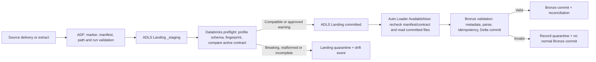

# Today’s Implementation Plan: Source → Landing → Bronze

**Status:** Approved working implementation plan.  
**Repository scope:** Documentation only. No application, infrastructure, pipeline, notebook, or CI/CD code is included in this file.  
**Scope boundary:** This plan ends at successful Delta Bronze commit and reconciliation. Detailed Silver and Gold transformations are outside today’s work.

## 1. Today’s outcome

Complete a controlled, traceable ingestion path for every approved source type:

1. Register versioned source contracts, mappings, schema baselines, and operational control records.
2. Place each public dataset behind its approved controlled source boundary.
3. Land only complete and validated deliveries in immutable ADLS Gen2 Landing.
4. Use Auto Loader to incrementally load committed batch files into Delta Bronze.
5. Use Structured Streaming, rather than Landing or Auto Loader, for Kafka CDC and REES46 replay.
6. Prove recovery from one incomplete delivery, one schema drift event, and one interrupted Bronze run.

Do not claim a source is complete until its manifest or extraction window, Landing commit, Bronze Delta commit, count reconciliation, and control-plane state all succeed. Large historical transfers may continue after today’s working window; their runs must remain restartable without duplicate processing.

## 2. Preconditions from the completed platform setup

The Databricks catalog and schemas already exist. Before extracting data, complete these platform prerequisites:

1. Create a Databricks storage credential through the Databricks Access Connector.
2. Create a Unity Catalog external location for the ADLS Gen2 `landing` container.
3. Create Unity Catalog volumes for source contracts, control files, Landing validation samples, and quarantined payloads.
4. Grant ADF managed identity, Databricks Access Connector, and the deployment identity only the required permissions.
5. Confirm ADF can write only to Landing staging paths and Databricks can read committed Landing and write Bronze/checkpoint paths.
6. Create an Azure Storage SFTP local user, SSH key, and the controlled supplier paths `/_upload` and `/ready`.
7. Confirm an active Databricks job-capable compute configuration exists before running validation or Bronze jobs.

Do not use notebook upload, DBFS upload, or manual ADLS copy as a substitute for a source boundary. A local machine is only a temporary bootstrap location from which public data is seeded into PostgreSQL or the controlled SFTP boundary.

## 3. Authoritative source routing

| Source | Controlled source boundary | Landing path | Bronze Delta table | Ingestion mode |
|---|---|---|---|---|
| H&M `articles.csv` | PostgreSQL `retail_src.articles` | `committed/dev/postgresql_hm/articles/...` | `bronze.hm_articles` | Initial, daily incremental, CDC |
| H&M `customers.csv` | PostgreSQL `retail_src.customers` | `committed/dev/postgresql_hm/customers/...` | `bronze.hm_customers` | Initial, daily incremental, CDC |
| H&M `transactions_train.csv` | PostgreSQL `retail_src.transactions` | `committed/dev/postgresql_hm/transactions/...` | `bronze.hm_transactions` | Initial, hourly incremental, CDC |
| H&M `sample_submission.csv` | PostgreSQL `retail_src.sample_submission` | `committed/dev/postgresql_hm/sample_submission/...` | `bronze.hm_sample_submission` | Initial-only batch |
| REES46 seven monthly archives | Controlled Azure Storage SFTP supplier boundary | `committed/dev/sftp_rees46/events/...` | `bronze.rees46_events_batch` | Batch file |
| Open Food Facts JSONL deliveries | Controlled Azure Storage SFTP supplier boundary | `committed/dev/sftp_off/products_jsonl/...` | `bronze.off_products_jsonl` | Batch file |
| Amazon Electronics Parquet and JSONL | Controlled Azure Storage SFTP supplier boundary | `committed/dev/sftp_amazon/electronics/...` | `bronze.amazon_electronics_reviews` | Batch file |
| `WC_F_2016` DAT/TXT | Controlled Azure Storage SFTP supplier boundary | `committed/dev/sftp_wc/wc_f_2016/...` | `bronze.wc_f_2016_raw` | Batch file |
| Open Prices `proofs_drafts_retrieve` | Open Prices API endpoint | `committed/dev/open_prices/proofs_drafts_retrieve/...` | `bronze.open_prices` | Daily API batch |
| PostgreSQL WAL changes | PostgreSQL logical replication → Debezium → Kafka | No ADLS Landing stage | `bronze.hm_cdc_events` | Continuous CDC |
| REES46 replay | Controlled replay publisher → Kafka | No ADLS Landing stage | `bronze.rees46_events_stream` | Streaming replay |

The Open Food Facts Product API remains registered but disabled. Do not provision credentials, a pipeline, or a Bronze table for it today.

There is no defensible cross-source business key between the H&M, food, review, and event datasets. Do not create cross-domain source-truth joins.

## 4. Controlled availability, extraction, and SLA contract

These are project operating targets. They are not claims that public datasets or public APIs offer these SLAs.

| Source/entity | Controlled availability and trigger | Landing SLA | Bronze SLA | Freshness target |
|---|---|---:|---:|---|
| PostgreSQL articles/customers | Changes available before 00:30 UTC; ADF daily extraction | 30 min | 15 min | 01:15 UTC |
| PostgreSQL transactions | Closed hourly window; ADF at HH:15 UTC | 20 min | 10 min | HH:45 UTC |
| PostgreSQL CDC | Controlled CUD generator every 2 min; Debezium continuously reads WAL | N/A | P95 ≤5 min | P95 ≤5 min from source commit |
| PostgreSQL sample submission | Bootstrap once | 2 hr | 30 min | Within 24 hr of release |
| REES46 SFTP files | Controlled supplier window 00:00–02:00 UTC; ADF polls every 5 min | 30 min after `_READY` | 30 min | Within 2 hr of readiness deadline |
| Open Food Facts JSONL | Supplier window 02:00–03:00 UTC; ADF polls every 5 min | 30 min after `_READY` | 30 min | Within 2 hr of readiness deadline |
| Amazon files | Supplier window 03:00–04:00 UTC; ADF polls every 5 min | 30 min after `_READY` | 30 min | Within 2 hr of readiness deadline |
| DAT/TXT | Supplier window 04:00–05:00 UTC; ADF polls every 5 min | 30 min after `_READY` | 30 min after parser contract is active | Within 2 hr of readiness deadline |
| Open Prices | ADF starts daily at 03:05 UTC for bounded business date/window | 2 hr | 30 min | 05:35 UTC |
| REES Kafka replay | Explicit replay request | N/A | P95 ≤5 min | Per replay-run target |

For today’s bootstrap, run each source through a controlled initial delivery window. Do not wait for production-like clock schedules.

## 5. Landing implementation contract

Use this ADLS Gen2 `landing` container layout:

```text
_staging/{environment}/{source_system}/{entity_name}/run_id={run_id}/

committed/{environment}/{source_system}/{entity_name}/
  business_date={YYYY-MM-DD}/
  delivery_id={delivery_id}/

quarantine/{environment}/{source_system}/{entity_name}/
  reason={reason_code}/
  run_id={run_id}/
```

Landing states are:

```text
STAGING → VALIDATING → COMMITTED
                   └→ QUARANTINED
```

Rules:

- Bronze reads only `committed/` paths.
- `_staging/` is not a consumable data path.
- Committed input is immutable.
- A correction uses a new `delivery_id` and `delivery_revision`; no object is overwritten.
- Landing preserves original bytes, manifest, source identity, contract version, schema fingerprint, checksum, size, and arrival time.
- Kafka CDC and replay intentionally bypass Landing. Kafka offsets/checkpoints are their durable ingress evidence.

## 6. SFTP supplier readiness and manifest contract

Every supplier-style delivery follows this sequence:

```text
/_upload/{delivery_id}/{file}.partial
        ↓
/ready/{delivery_id}/{final-file}
        ↓
manifest.json
        ↓
_READY
```

`_READY` is written last.

`manifest.json` is UTF-8 JSON and contains:

- `contract_version`, `source_id`, `entity_id`.
- `delivery_id`, `delivery_revision`, producer identity, `created_at_utc`.
- `business_date` or bounded source period.
- Exact `files[]` inventory.
- Per-file final relative path, format, compression, byte count, SHA-256, record count when applicable, and schema version/fingerprint.

A file delivery can enter normal committed Landing only if:

1. `_READY` and `manifest.json` exist.
2. Every listed final file exists.
3. No listed file is zero bytes unless explicitly permitted by its contract.
4. Byte count and SHA-256 match the manifest.
5. Record counts match when defined.
6. Contract version and schema fingerprint are valid.
7. The expected file inventory is complete and there are no unexpected files.
8. The delivery has not already committed with conflicting content.

ADF performs marker/path orchestration and copies source data to `_staging`. Databricks performs the authoritative checksum, schema, count, and contract validation. Only a successful validation result permits promotion to `committed`.

## 7. Source contract baseline

Create contract version `1` for every entity before its first ingestion. Each contract must contain:

- Source/entity identifiers, source type, owner, status, sensitivity, retention, and replay policy.
- Format, compression, encoding, delimiter, quote/escape, header, multiline, record-length or fixed-width rules.
- Schema version, canonical schema JSON, and schema fingerprint.
- Required/optional fields and source key policy.
- Availability window, freshness target, expected delivery count, completeness signal, late-arrival policy.
- Extraction method, incremental strategy, CDC/offset strategy, retry policy, timeout, and concurrency limit.
- Quarantine severity and allowed schema-evolution classification.

The following are implementation-time validation items, not invented source facts:

| Source | Validate before activation |
|---|---|
| H&M PostgreSQL | Actual columns, encoding, row counts, candidate keys, nullability, and source schema after controlled load |
| H&M transactions | Project-created `transaction_id` and controlled outbox `change_seq` behavior |
| REES46 | File checksums, headers, timestamps, source month coverage, row counts, compressed/uncompressed size |
| Amazon | Parquet and JSONL schemas, review/product identifier semantics, file inventory, row counts |
| DAT/TXT | Encoding, delimiter/fixed-width layout, record length, and header policy |
| Open Prices | Pagination, terminal page behavior, rate limits, response schema, and request parameters |

The DAT/TXT file may be committed as raw bytes, but must not enter a parsed Bronze table until its layout contract is verified.

## 8. Control-plane tables to create

Create the 22 shared Delta control tables in the existing Unity Catalog schemas before source extraction. `control tables.md` is the canonical table and column catalog; use it for names, columns, logical keys, and table purposes. Do not create per-source copies of these control tables.

### Contracts, mapping, and schema governance

- `metadata.source_config`
- `metadata.entity_config`
- `metadata.source_contract`
- `metadata.source_contract_field`
- `metadata.source_mapping`
- `metadata.schema_version`
- `metadata.schema_drift_event`
- `metadata.quality_rule`

### Ingestion, Landing, and Bronze audit

- `ops.ingestion_run`
- `ops.run_step`
- `ops.run_event`
- `landing_audit.source_delivery`
- `landing_audit.delivery_manifest`
- `landing_audit.delivery_artifact`
- `landing_audit.validation_result`
- `ops.bronze_commit`
- `dq.reconciliation_result`

### Source progress and streaming positions

- `ops.cursor_state`
- `ops.work_lease`

### Quarantine, recovery, and alerting

- `quarantine.quarantine_event`
- `ops.recovery_request`
- `ops.alert_event`

Use the exact column names and logical keys in `control tables.md`. Keep source-dependent payloads and positions in the documented JSON fields until the controlled source schema and extraction behavior are profiled. Enforce idempotency and concurrency in write logic; do not assume Delta enforces logical primary or foreign keys.

## 9. Bronze design

Create one Delta Bronze table per source entity. Do not combine unrelated source domains into one generic table.

Every valid Bronze row includes its original source columns or raw payload plus these platform fields:

```text
_source_system
_source_entity
_source_record_id
_source_run_id
_source_delivery_id
_source_delivery_revision
_source_file_path
_source_file_sha256
_source_contract_version
_schema_fingerprint
_ingestion_mode
_ingested_at_utc
_bronze_batch_id
_record_hash
_source_event_time
_source_change_seq
_cdc_operation
_kafka_topic
_kafka_partition
_kafka_offset
_rescued_data
_parse_status
```

Idempotency is based on the ingestion identity, not on a business key:

- File: `delivery_id + revision + relative_path + sha256`.
- PostgreSQL incremental: `source/entity + change_seq`.
- CDC: `source table + LSN + transaction/order + operation`.
- Kafka transport: `topic + partition + offset`.
- API: request hash plus response checksum.

Legitimate source duplicates are preserved. Only duplicate ingestion of the same source event/file/page/offset is prevented.

## 10. ADF, Landing, Auto Loader, and Bronze schema-drift gate

Schema validation is intentionally repeated at three layers. ADF orchestrates the gate; Databricks is the authoritative schema profiler and metadata comparator; Auto Loader and Bronze provide defense in depth.



### 10.1 ADF responsibility

ADF does not independently make a final nested-schema compatibility decision. It performs these deterministic checks and invokes Databricks preflight validation:

- Read active `source_contract` and expected schema fingerprint.
- Confirm source marker, manifest, expected file inventory, final file paths, byte counts, and declared contract version.
- Copy to Landing `_staging` using a stable `run_id` and `delivery_id`.
- Invoke the Databricks schema/manifest validation task.
- Promote only deliveries receiving a compatible validation decision to `committed`.
- Route blocking failures to `quarantine` and record the terminal ADF/run result.
- Never advance a PostgreSQL, CDC, Kafka, or API committed cursor in `ops.cursor_state`, or mark a delivery consumed, after validation failure.

### 10.2 Databricks preflight responsibility

The preflight validation task runs against staging data before the delivery is committed.

It must:

1. Read the active `metadata.source_contract` and current accepted `metadata.schema_version`.
2. Profile every file in the delivery, not only the first file.
3. Build canonical schema JSON from field name, logical type, nullability, nested children, and ordinal position where the format is positional.
4. Calculate the SHA-256 schema fingerprint.
5. Compare actual versus active schema.
6. Validate manifest SHA-256, bytes, record counts, required file inventory, parser options, and source-contract version.
7. Write schema snapshots and drift events to `metadata.schema_version` and `metadata.schema_drift_event`; write delivery, manifest, artifact, and validation evidence to `landing_audit.source_delivery`, `landing_audit.delivery_manifest`, `landing_audit.delivery_artifact`, and `landing_audit.validation_result`; write execution evidence to `ops.ingestion_run`, `ops.run_step`, and `ops.run_event`.
8. Return one explicit decision: `ALLOW`, `ALLOW_WITH_WARNING`, or `QUARANTINE`.

### 10.3 Auto Loader responsibility

Auto Loader reads only `committed/` Landing paths. It is the incremental file-consumption mechanism, not the final authority for contract approval.

Use this pattern:

- `AvailableNow` trigger after ADF marks `source_delivery = COMMITTED`.
- One normal checkpoint per `environment/source/entity`.
- One schema location per `environment/source/entity`.
- Separate checkpoint and schema location for backfill/reprocessing.
- Explicit source contract schema; Auto Loader inference does not approve a new schema.
- `cloudFiles.schemaEvolutionMode = "rescue"` and `_rescued_data` for nonblocking unexpected data.
- Managed file events where available; directory listing fallback is recorded as degraded discovery.
- Exclude `_staging`, `quarantine`, manifests, and `_READY` from file discovery.

Before processing, the Bronze job rechecks that the Landing delivery is `COMMITTED`, its manifest is valid, its contract version is active, and its recorded schema-drift decision allows Bronze processing.

If a Bronze run fails, restart with the same checkpoint. Auto Loader will process only files whose previous processing has not committed. Never delete/reset a normal checkpoint to repair a failure.

### 10.4 Bronze responsibility

Bronze validates again immediately before Delta commit:

- Verify the delivery/run/contract/schema-drift decision matches the control plane.
- Validate parser result and `_rescued_data` policy.
- Add source and ingestion lineage metadata.
- Apply ingestion-identity idempotency.
- Reconcile expected input count, accepted count, rejected count, and Delta commit version.
- Write `ops.bronze_commit` only after the Delta write succeeds.
- Leave the committed source/API cursor and delivery-consumed state unchanged if the Bronze commit or reconciliation fails.

Bronze does not silently auto-merge a new schema into the accepted contract. It can preserve raw/rescued data for compatible additions, but a new accepted schema version must be registered before the field is treated as approved downstream data.

## 11. Schema-drift decision matrix

Schema authority is `metadata.source_contract` and `metadata.source_contract_field`. Accepted immutable schema snapshots are held in `metadata.schema_version`. A drift record is written to `metadata.schema_drift_event`; validation outcomes are written to `landing_audit.validation_result`. Auto Loader inference is not schema authority.

Schema fingerprint uses SHA-256 over canonical schema JSON and contract version. CSV and DAT/TXT column order is significant. JSON and Parquet object-field order is not significant.

| Drift type | Detection | ADF/Landing decision | Auto Loader/Bronze decision | Recovery |
|---|---|---|---|---|
| Additive column | Actual fingerprint has a new nullable field | `ALLOW_WITH_WARNING`; commit raw delivery and record drift | Preserve in `_rescued_data`; do not auto-add to accepted typed schema | Register new contract/schema version, then isolated reprocess if needed |
| Removed optional column | Expected optional field absent | `ALLOW_WITH_WARNING` if contract confirms optionality | Preserve raw evidence; continue only if no required rule fails | Update contract/version if removal is accepted |
| Removed required column | Required field absent | `QUARANTINE` | No normal Bronze write | Correct source/contract, create new delivery/reprocess request |
| Renamed column | Required old field missing plus unknown new field | `QUARANTINE`; never infer a rename | No normal Bronze write | Explicit mapping and new contract version, then reprocess |
| Datatype widening | Lossless wider logical type detected | `ALLOW_WITH_WARNING` only when raw representation is preserved | Preserve raw/rescued value; no silent typed conversion approval | Register contract version and reprocess when typed use is required |
| Datatype narrowing | Potential loss or incompatible conversion | `QUARANTINE` | No normal Bronze write | Correct source or explicit approved conversion, then reprocess |
| Nullability relaxation | New nulls allowed by source but not previously expected | `ALLOW_WITH_WARNING` only if required-field rules still pass | Preserve and measure null rate | Version contract if accepted; alert if quality threshold breaches |
| Nullability tightening | Source declares non-null where prior contract allowed null | `ALLOW_WITH_WARNING` after validation | Preserve raw; downstream treatment waits for new contract | Register new version if accepted |
| Reordered columns | Ordinal order differs | CSV/DAT: `QUARANTINE`; JSON/Parquet: allowed because order is irrelevant | CSV/DAT parser blocked; JSON/Parquet may proceed | Correct parser contract or register a new order-aware version |
| Nested additive structure | New nullable nested child | `ALLOW_WITH_WARNING` | Preserve/rescue nested data; do not expose as approved typed field | Register schema version and reprocess when required |
| Nested incompatible structure | Nested field removed, renamed, narrowed, or changed incompatibly | `QUARANTINE` | No normal Bronze write | Correct source/contract; isolated reprocessing |
| Unexpected column | Field exists but is absent from contract | `ALLOW_WITH_WARNING` when structurally safe | Store in `_rescued_data`; alert | Add only through a new contract version |
| Missing required column | Contract-required field absent | `QUARANTINE` | No normal Bronze write | Source correction or contract correction with explicit version |
| Malformed schema | Invalid header, duplicate fields, invalid JSON/Parquet structure, incompatible compression/format | `QUARANTINE` | No normal Bronze write | Correct delivery and publish a new revision |
| Incompatible/breaking change | Any non-lossless incompatible contract change | `QUARANTINE` | No normal Bronze write | Preserve raw input, register decision, correct and reprocess |

## 12. Schema-drift states and quarantine handling

Schema-drift lifecycle:

```text
DETECTED
  → CLASSIFIED_COMPATIBLE
  → ALLOW_WITH_WARNING
  → CONTRACT_VERSIONED
  → REPROCESS_ELIGIBLE
  → CLOSED

DETECTED
  → CLASSIFIED_BREAKING
  → QUARANTINED
  → SOURCE_OR_CONTRACT_CORRECTED
  → REPROCESS_REQUESTED
  → REPROCESSED
  → CLOSED
```

Required quarantine reason codes:

```text
MANIFEST_MISSING
MANIFEST_INVALID
CHECKSUM_MISMATCH
BYTE_COUNT_MISMATCH
RECORD_COUNT_MISMATCH
UNLISTED_FILE
ZERO_BYTE_FILE
SCHEMA_MALFORMED
SCHEMA_BREAKING
REQUIRED_FIELD_MISSING
KEY_MISSING
TYPE_INCOMPATIBLE
PARSE_ERROR
DUPLICATE_CONFLICT
AUTHORIZATION_FAILURE
SOURCE_CONTRACT_MISMATCH
POISON_EVENT
API_PAGE_INCOMPLETE
UNKNOWN
```

Quarantine must preserve source URI, run/delivery/request/replay identity, content hash, contract version, old/new schema fingerprint, reason, timestamps, and redacted error details. Do not delete or manually edit rejected source bytes to make them pass.

## 13. PostgreSQL implementation sequence

1. Provision the controlled PostgreSQL instance and database.
2. Create `retail_src.articles`, `retail_src.customers`, `retail_src.transactions`, and `retail_src.sample_submission`.
3. Load the approved H&M CSV data into those tables.
4. Create project-owned `transaction_id` for transactions where the source does not provide a durable unique transaction identifier.
5. Create an append-only transactional `retail_ops.incremental_outbox` with global `change_seq`.
6. Ensure controlled insert/update/delete and its outbox event are committed atomically.
7. Pause the controlled mutation generator, capture `snapshot_id` and outbox high sequence, run a consistent initial extract, reconcile, and load Bronze.
8. Set `ops.cursor_state.committed_position_json` to the captured high sequence only after Bronze reconciliation succeeds.
9. Resume controlled mutations.
10. Enable Debezium only after the snapshot-to-stream handoff is reconciled.

Incremental predicate for the mutable tables:

```text
change_seq > committed_value
AND change_seq <= pending_high_value
```

Re-read the previous 100 `change_seq` values and deduplicate Bronze ingestion by `change_seq`. `sample_submission` is initial-only.

## 14. API and Kafka implementation sequence

### Open Prices API

1. Register the endpoint, parameters, rate limits, timeouts, and page size in the source contract.
2. Store pending and committed API pagination positions in `ops.cursor_state`; record each fetched response page as a `landing_audit.delivery_artifact` and its checks as `landing_audit.validation_result`.
3. Use page size 100, at most two concurrent calls, 10-second connect timeout, and 30-second request timeout.
4. Retry transient network/5xx failures five times using exponential 5-second-to-5-minute backoff plus jitter.
5. Respect `Retry-After` on HTTP 429.
6. Treat nonapproved 4xx responses as permanent failure.
7. Advance `ops.cursor_state.committed_position_json` only after terminal pagination, all expected response pages are durably landed, and Bronze reconciliation succeeds.

### Kafka / Debezium / REES replay

1. Create PostgreSQL CDC topics, REES replay topic, and DLQ topic; track committed topic/partition offsets and PostgreSQL LSN positions in `ops.cursor_state`.
2. Configure PostgreSQL logical replication and Debezium with a separate least-privilege replication identity.
3. Start Structured Streaming with a durable checkpoint; do not use Auto Loader.
4. Write a poison event to the DLQ before committing the source Kafka offset.
5. Use a separate consumer group, checkpoint, and `replay_id` for every REES replay.
6. Never reset the normal consumer checkpoint to replay historical data.

## 15. Today’s execution order

1. Confirm ADLS external location, storage credential, volumes, identity grants, and Databricks compute.
2. Create the 22 control-plane tables listed in Section 8, following `control tables.md` as the canonical column catalog.
3. Register source/entity contracts, mappings, and version-1 schema baselines.
4. Create Bronze target tables with source lineage fields.
5. Configure Azure Storage SFTP and publish one small valid test delivery with manifest and `_READY`.
6. Build the first vertical slice: SFTP → ADF → Landing staging → Databricks preflight → committed Landing → Auto Loader AvailableNow → Bronze → reconciliation.
7. Prove rejection of an incomplete and a schema-drifted SFTP delivery.
8. Expand the same pattern to REES46, Open Food Facts JSONL, Amazon Parquet/JSONL, and DAT/TXT raw delivery.
9. Provision/load PostgreSQL and complete H&M initial snapshot to Bronze.
10. Complete Open Prices raw API Landing and Bronze path.
11. Configure and test Debezium/Kafka/Structured Streaming last.

## 16. Definition of done for today

- All source/entity contract and mapping records exist at version 1.
- Every source path has a registered Landing prefix and Bronze target.
- ADF rejects incomplete, manifest-invalid, checksum-invalid, and breaking-schema deliveries.
- Databricks preflight writes schema fingerprints and drift events before Landing commit.
- Auto Loader reads only committed files and resumes using its normal durable checkpoint.
- Bronze writes carry complete source/run/file/API/Kafka lineage metadata.
- One compatible additive-field scenario reaches Bronze only as rescued/raw data and creates a warning/drift record.
- One breaking schema scenario is quarantined and cannot reach normal Bronze.
- PostgreSQL initial snapshot is reconciled before incremental and CDC progression.
- Open Prices has one terminal paginated request set committed to Landing and Bronze.
- Kafka CDC and replay use Structured Streaming checkpoints, not ADLS Landing or Auto Loader.
